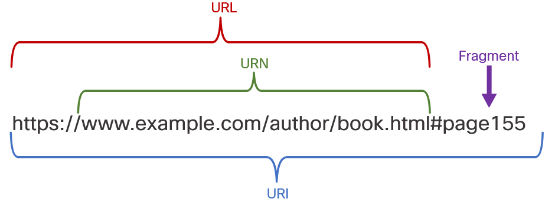
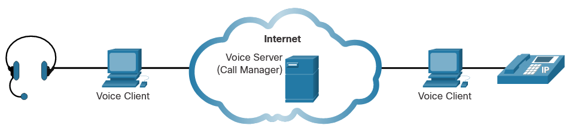

# Application Layer Services

# The Client Server Relationship
The term server refers to a host running a software application that provides information or services to other hosts that are connected to the network, such as a web server. 
## Client and Server Interaction 
The key characteristic of client/server systems is that the client sends a request to a server, and the server responds by carrying out a function, such as sending the requested document back to the client. The combination of a web browser and a web server is perhaps the most commonly used instance of a client/server system.

## URI, URN, and URL 
Web resources and web services such as RESTful APIs are identified using a Uniform Resource Identifier (URI). 

A **URI** is a string of characters that identifies a specific network resource. As shown in the figure, a URI has two specializations:

- **Uniform Resource Name (URN)** - This identifies only the namespace of the resource (web page, document, image, etc.) without reference to the protocol.
- **Uniform Resource Locator (URL)** - This defines the network location of a specific resource on the network. HTTP or HTTPS URLs are typically used with web browsers. Other protocols such as FTP, SFTP, SSH, and others can be used as a URL. A URL using SFTP might look like: sftp://sftp.example.com.

These are the parts of a URI, as shown in the figure:

- Protocol/scheme - HTTPS or other protocols such as FTP, SFTP, mailto, and NNTP
- Hostname - w​ww.example.com
- Path and file name - /author/book.html
- Fragment - #page155

Parts of a URI

# Network Application Services
## Common Network Application Services 
| Protocol                                   | Description                                                                                                                                |
|--------------------------------------------|---------------------------------------------------------------------------------------------------------------------------------------------|
| Domain Name System (DNS)                   | Resolves internet names to IP addresses.                                                                                                    |
| Secure Shell (SSH)                         | Used to provide remote access to servers and networking devices.                                                                            |
| Simple Mail Transfer Protocol (SMTP)       | Sends email messages and attachments from clients to servers and from servers to other email servers.                                       |
| Post Office Protocol (POP)                 | Used by email clients to retrieve email and attachments from a remote server.                                                               |
| Internet Message Access Protocol (IMAP)    | Used by email clients to retrieve email and attachments from a remote server.                                                               |
| Dynamic Host Configuration Protocol (DHCP) | Used to automatically configure devices with IP addressing and other necessary information to enable them to communicate over the internet. |
| Hypertext Transfer Protocol (HTTP)         | Used by web browsers to request web pages and web servers to transfer the files that make up web pages of the World Wide Web.               |
| File Transfer Protocol (FTP)               | Used for interactive file transfer between systems.                                                                                         |

# Domain Name System - DNS

The DNS provides a way for hosts to request the IP address of a specific server. DNS names are registered and organized on the internet within specific high-level groups, or domains. Some of the most common high-level domains on the internet are .com, .edu, and .net.

        10.126.52.20 - example.com

When the DNS server receives the request from a host, it checks its table to determine the IP address associated with that web server. If the local DNS server does not have an entry for the requested name, it queries another DNS server within the domain. When the DNS server learns the IP address, that information is sent back to the host.

### The nslookup Command 
Command **nslookup** is used to discover the IP addresses for any domain name. 

# Web Clients and Servers
## HTTP and HTML 
When a web client receives the IP address of a web server, the client browser uses that IP address and port 80 to request web services. This request is sent to the server using HTTP. The HTTP protocol is not a secure protocol; information could easily be intercepted by other users as data is sent over the network. To provide security for the data, HTTP can be used with secure transport protocols. Requests for secure HTTP are sent to port 443. These requests use https in the site address in the browser, rather than http.

When the server receives a port 80 request, the server responds to the client request and sends the web page to the client. The information content of a web page is encoded using HTML.

# FTP Clients and Servers
##  File Transfer Protocol - FTP
The File Transfer Protocol (FTP) provides an easy method to transfer files from one computer to another. A host running FTP client software can access an FTP server to perform various file management functions including file uploads and downloads.

The FTP server enables a client to exchange files between devices. It also enables clients to manage files remotely by sending file management commands such as delete or rename. To accomplish this, the FTP service uses two different ports to communicate between client and server.

UI Client - FileZilla

# Virtual Terminals
Virtual terminals allow to connect and control PCs remotely
- SSH
- Telnet

## Telnet
Telnet provides a standard method of emulating text-based terminal devices over the data network. Both the protocol itself and the client software that implements the protocol are commonly referred to as Telnet. Telnet servers listen for client requests on TCP port 23. A connection using Telnet is called a vty session, or connection. Rather than using a physical device to connect to the server, Telnet uses software to create a virtual device that provides the same features of a terminal session with access to the server’s CLI.

**Telnet** is not considered to be a secure protocol. Although the Telnet protocol can require a user to login, it does not support transporting encrypted data. All data exchanged during Telnet sessions is transported as plaintext across the network. This means that the data can be easily intercepted and understood.

**SSH** provides the structure for secure remote login and other secure network services. It also provides stronger authentication than Telnet and supports transporting session data using encryption. Network professionals should always use SSH in place of Telnet, whenever possible.

# Email and Messaging
## Email Clients and Servers
Each mail server receives and stores mail for users who have mailboxes configured on the mail server. Each user with a mailbox must then use an email client to access the mail server and read these messages. Many internet messaging systems use a web-based client to access email. 

Mailboxes are identified by the format: user@c​ompany.domain

## Email Protocols 

- **Simple Mail Transfer Protocol (SMTP)**

    SMTP is used by an email client to send messages to its local email server. The local server then decides if the message is destined for a local mailbox or if the message is addressed to a mailbox on another server.

    If the server has to send the message to a different server, SMTP is used between those two servers as well. SMTP requests are sent to port 25.

- **Post Office Protocol (POP3)**

    A server that supports POP clients receives and stores messages addressed to its users. When the client connects to the email server, the messages are downloaded to the client. By default, messages are not kept on the server after they have been accessed by the client. Clients contact POP3 servers on port 110.

- **Internet Message Access Protocol (IMAP4)**

    A server that supports IMAP clients also receives and stores messages addressed to its users. However, unlike POP, IMAP keeps the messages in the mailboxes on the server, unless they are deleted by the user. The most current version of IMAP is IMAP4 which listens for client requests on port 143.

## Text Messaging 
Text messages may also be called instant messages, direct messages, private messages, and chat messages. Text messaging enables users to communicate or chat over the internet in real-time. Text messaging services on a computer are usually accessed through a web-based client that is integrated into a social media or information sharing site. These clients usually only connect to other users of the same site.

There are also a number of standalone text message clients such as Cisco Webex Teams, Microsoft Teams, WhatsApp, Facebook Messenger, and many others. 

## Internet Phone Calls - VOIP - Voice over IP
An internet telephony client uses peer-to-peer technology similar to that used by instant messaging, as shown in the figure. IP telephony makes use of Voice over IP (VoIP) technology, which converts analog voice signals into digital data. The voice data is encapsulated into IP packets which carry the phone call through the network.

When the IP phone software has been installed, the user selects a unique name. This is so that calls can be received from other users. Speakers and a microphone, built-in or separate, are required. A headset is frequently plugged into the computer to serve as a phone.

Calls are made to other users of the same service on the internet, by selecting the username from a list. A call to a regular telephone (landline or cell phone) requires using a gateway to access the Public Switched Telephone Network (PSTN).

