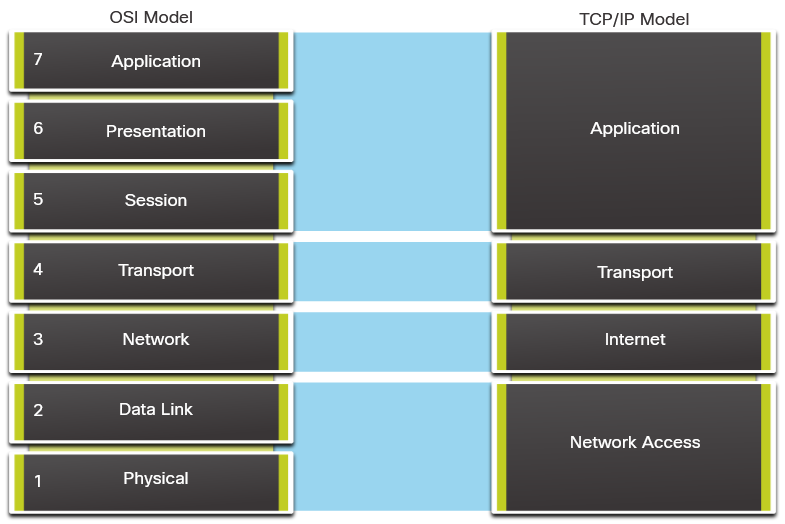

# Comunication Principles

## Communication Protocol
Protocols are required for computers to properly communicate across the network. These include message format, message size, timing, encoding, encapsulation, and message patterns.

- Message format - When a message is sent, it must use a specific format or structure.
- Message size - The rules that govern the size of the pieces communicated across the network are very strict. 
- Timing - Timing determines the speed at which the bits are transmitted across the network. It also affects when an individual host can send data and the total amount of data that can be sent in any one transmission.
- Encoding - Messages sent across the network are first converted into bits by the sending host. 
- Encapsulation - Encapsulation is the process of adding this information to the pieces of data that make up the message.
- Message pattern - Some messages require an acknowledgment before the next message can be sent. This type of request/response pattern is a common aspect of many networking protocols. 

## The Internet and Standards 
A standard is a set of rules that determines how something must be done. Networking and internet standards ensure that all devices connecting to the network implement the same set of rules or protocols in the same manner.

### Network Standards Organizations 
When a new standard is proposed, each stage of the development and approval process is recorded in a numbered Request for Comments (RFC) document so that the evolution of the standard is tracked. RFCs for internet standards are published and managed by the Internet Engineering Task Force (IETF).
- IEEE
- IETF
- IANA
- ICANN 
- ITU
- TIA

# Network Communication Models
- TCP/IP and OSI model
- Protocols for comunication and data handling

## The TCP/IP Model 
A layered model depicts the operation of the protocols occurring within each layer, as well as the interaction with the layers above and below it.

The layered model has many benefits:
- Assists in protocol design, because protocols that operate at a specific layer have defined information that they act upon and a defined interface to the layers above and below.
- Fosters competition because products from different vendors can work together.
- Enables technology changes to occur at one level without affecting the other levels.
- Provides a common language to describe networking functions and capabilities.

| TCP/IP layer         | Description     |
|--------------|-----------|
| Application| Represents data to the user, plus encoding and dialog control. |
| Transport  | Supports communicaiton between various devices across diverse networks  |
| Internet  | Determines the best path throught the network  |
| Network Access (Physical)  | Controls the hardware devices and media that make up the network |

## The OSI Reference Model 
There are two basic types of models that we use to describe the functions that must occur in order for network communications to be successful: protocol models and reference models.

- Protocol model - This model closely matches the structure of a particular protocol suite. A protocol suite includes the set of related protocols that typically provide all the functionality required for people to communicate with the data network. The TCP/IP model is a protocol model because it describes the functions that occur at each layer of protocols within the TCP/IP suite.
- Reference model - This type of model describes the functions that must be completed at a particular layer, but does not specify exactly how a function should be accomplished. A reference model is not intended to provide a sufficient level of detail to define precisely how each protocol should work at each layer. The primary purpose of a reference model is to aid in clearer understanding of the functions and processes necessary for network communications.

The most widely known internetwork reference model was created by the Open Systems Interconnection (OSI) project at the International Organization for Standardization (ISO). It is used for data network design, operation specifications, and troubleshooting. This model is commonly referred to as the OSI model.

| OSI Model layer | Description     |
|-----------------|-----------------|
| 7- Application |  The application layer containst protocols used for process-to-ptocesss communicaitons
| 6 - Presentation |   Provides for common representation of the data transfered between application layer services
| 5 - Session  | Provides services for presentation layer to organize its dialogue and to manage data exchange
| 4 - Transport  | Defines services to segment, transfer and reassemble the data for individual communications
| 3 - Network  | Provides services to exchange the individual pieces of data over the network between identified end devices
| 2 - Data Link  | Describe methods for exchanging data frames between devices over a common media
| 1 - Physical  | Describe the mechanical, electrical, functional, and procedural means to activate, maintain and de-activate physical connections for a bit transmission ot and from a network device

## OSI Model and TCP/IP Model Comparison 

The key similarities are in the transport and network layers; however, the two models differ in how they relate to the layers above and below each layer:

- OSI Layer 3, the network layer, maps directly to the TCP/IP internet layer. This layer is used to describe protocols that address and route messages through an internetwork.
- OSI Layer 4, the transport layer, maps directly to the TCP/IP transport layer. This layer describes general services and functions that provide ordered and reliable delivery of data between source and destination hosts.
- The TCP/IP application layer includes several protocols that provide specific functionality to a variety of end user applications. The OSI model Layers 5, 6, and 7 are used as references for application software developers and vendors to produce applications that operate on networks.
- Both the TCP/IP and OSI models are commonly used when referring to protocols at various layers. Because the OSI model separates the data link layer from the physical layer, it is commonly used when referring to these lower layers.

