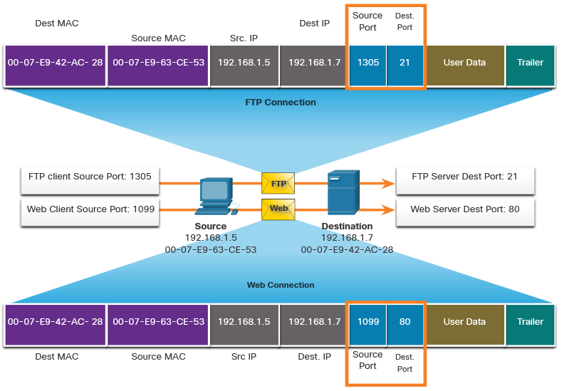

# TCP and UDP
Transport layer protocols

## TCP
TCP packets take a path from the source to the destination. However, each of the packets has a sequence number.

 TCP breaks up a message into small pieces known as segments. The segments are numbered in sequence and passed to the IP process for assembly into packets. 
 
 TCP keeps track of the number of segments that have been sent to a specific host from a specific application. If the sender does not receive an acknowledgment within a certain period of time, it assumes that the segments were lost and retransmits them. 
 
 Only the portion of the message that is lost is resent, not the entire message.

## UDP
UDP is a 'best effort' delivery system that does not require acknowledgment of receipt. UDP is preferable with applications such as streaming audio and VoIP. Acknowledgments would slow down delivery and retransmissions are undesirable. 

Packets take a path from the source to a destination. A few packets may be lost but it is usually not noticeable.

# Ports

## TCP and UDP Port Numbers 
There are many services that we access through the internet in the course of a day. DNS, web, email, FTP, IM and VoIP are just some of these services that are provided by client/server systems around the world. These services may be provided by a single server or by several servers in large data centers.

When a message is delivered using either TCP or UDP, the protocols and services requested are identified by a port number. A port is a numeric identifier within each segment that is used to keep track of specific conversations between a client and server. Every message that a host sends contains both a source and destination port.

Ports are assigned and managed by an organization known as the Internet Corporation for Assigned Names and Numbers (ICANN). Ports are broken into three categories and range in number from 1 to 65,535:

- **Well-Known Ports** - Destination ports that are associated with common network applications are identified as well-known ports. These ports are in the range of 1 to 1023.
- **Registered Ports** - Ports 1024 through 49151 can be used as either source or destination ports. These can be used by organizations to register specific applications such as IM applications.
- **Private Ports** - Ports 49152 through 65535 are often used as source ports. These ports can be used by any application.

The table displays some common well-known port numbers and their associated applications.

| Port Number | Transport | Application Protocol                                |
|-------------|-----------|-----------------------------------------------------|
| 20          | TCP       | File Transfer Protocol (FTP) - Data                 |
| 21          | TCP       | FTP - Control                                       |
| 22          | TCP       | Secure Shell (SSH)                                  |
| 23          | TCP       | Telnet                                              |
| 25          | TCP       | Simple Mail Transfer Protocol (SMTP)                |
| 53          | UDP, TCP  | Domain Name Service (DNS)                           |
| 67          | UDP       | Dynamic Host Configuration Protocol (DHCP) - Server |
| 68          | UDP       | DHCP - Client                                       |
| 69          | UDP       | Trivial File Transfer Protocol (TFTP)               |
| 80          | TCP       | Hypertext Transfer Protocol (HTTP)                  |
| 110         | TCP       | Post Office Protocol version 3 (POP3)               |
| 143         | TCP       | Internet Message Access Protocol (IMAP)             |
| 161         | UDP       | Simple Network Management Protocol (SNMP)           |
| 443         | TCP       | Hypertext Transfer Protocol Secure (HTTPS)          |

## Socket Pairs 
The source and destination ports are placed within the segment. The segments are then encapsulated within an IP packet. The IP packet contains the IP address of the source and destination. The combination of the source IP address and source port number, or the destination IP address and destination port number is known as a socket.

In the example in the figure, the PC is simultaneously requesting FTP and web services from the destination server.

> In the example, the FTP request generated by the PC includes the Layer 2 MAC addresses and the Layer 3 IP addresses. The request also identifies the source port number 1305 (dynamically generated by the host) and destination port, identifying the FTP services on port 21. The host also has requested a web page from the server using the same Layer 2 and Layer 3 addresses. However, it is using the source port number 1099 (dynamically generated by the host) and destination port identifying the web service on port 80.

> The socket is used to identify the server and service being requested by the client. A client socket might look like this, with 1099 representing the source port number: 192.168.1.5:1099

> The socket on a web server might be 192.168.1.7:80

> Together, these two sockets combine to form a socket pair: 192.168.1.5:1099, 192.168.1.7:80

Sockets enable multiple processes, running on a client, to distinguish themselves from each other, and multiple connections to a server process to be distinguished from each other.

The source port number acts as a return address for the requesting application. The transport layer keeps track of this port and the application that initiated the request so that when a response is returned, it can be forwarded to the correct application.

### The netstat Command 
Unexplained TCP connections can pose a major security threat. They can indicate that something or someone is connected to the local host. Sometimes it is necessary to know which active TCP connections are open and running on a networked host. 

**Netstat** is an important network utility that can be used to verify those connections. 

    C:\Users\Filda>netstat

    Active Connections

    Proto  Local Address          Foreign Address        State
    TCP    127.0.0.1:50440        kubernetes:65001       ESTABLISHED
    TCP    127.0.0.1:54816        kubernetes:54817       ESTABLISHED
    TCP    127.0.0.1:54817        kubernetes:54816       ESTABLISHED
    TCP    127.0.0.1:54818        kubernetes:54819       ESTABLISHED
    TCP    127.0.0.1:54819        kubernetes:54818       ESTABLISHED
    TCP    127.0.0.1:65001        kubernetes:50440       ESTABLISHED
    TCP    192.168.10.248:64751   ec2-52-7-188-225:https  TIME_WAIT

    ...

> By default, the netstat command will attempt to resolve IP addresses to domain names and port numbers to well-known applications. The -n option can be used to display IP addresses and port numbers in their numerical form.