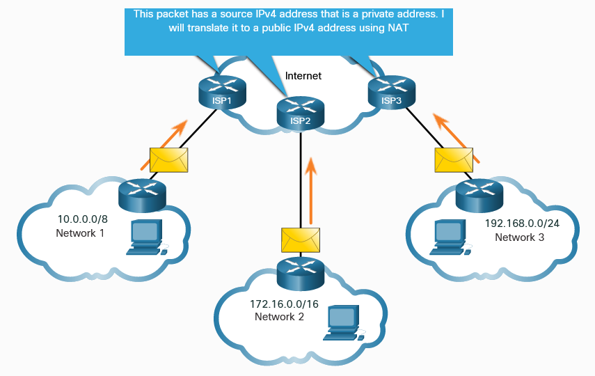
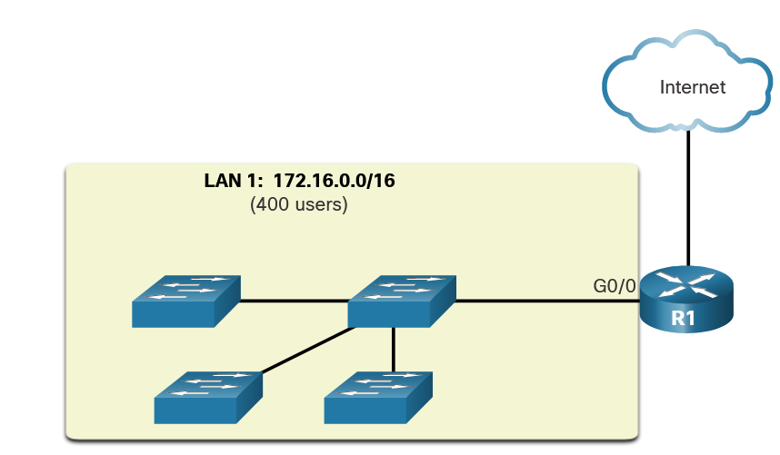
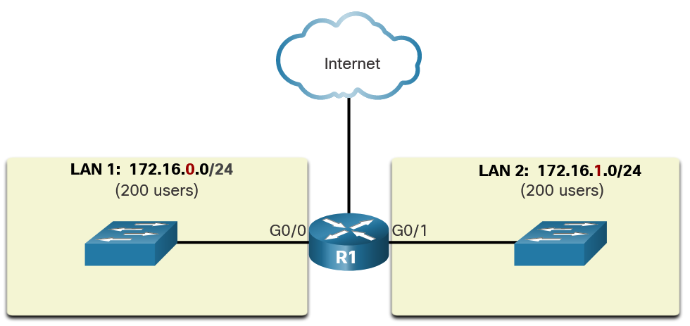
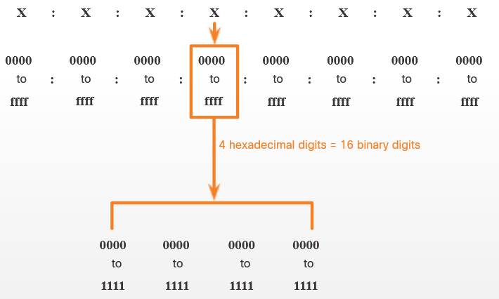

# The Internet protocol - IP
- IPv4 
- IPv6

## The IPv4 Address 
A host needs an IPv4 address to participate on the internet and almost all LANs today.

- Is a logian network address that identifies a host
- Must be unique for each host

The IPv4 address is a logical network address that identifies a particular host. It must be properly configured and unique within the LAN, for local communication. It must also be properly configured and unique in the world, for remote communication.

An IPv4 address is assigned to the network interface connection for a host. This connection is usually a NIC installed in the device.

Every packet sent across the internet has a source and destination IPv4 address. This information is required by networking devices to ensure the information gets to the destination and any replies are returned to the source.

### Octets and Dotted-Decimal Notation 
IPv4 addresses are 32 bits in length. Here is an IPv4 address in binary:
11010001101001011100100000000001

The 32 bits are grouped into four 8-bit bytes called octets like this:
11010001.10100101.11001000.00000001

The above binary IPv4 becomes this dotted-decimal representation:
209.165.200.1 

## Networks and Hosts 
The logical 32-bit IPv4 address is hierarchical and is made up of two parts, the network, and the host. As an example, there is a host with an IPv4 address 192.168.5.11 with a subnet mask of 255.255.255.0. The first three octets, (192.168.5), identify the network portion of the address, and the last octet, (11) identifies the host. This is known as hierarchical addressing because the network portion indicates the network on which each unique host address is located.

Routers only need to know how to reach each network, rather than needing to know the location of each individual host. With IPv4 addressing, multiple logical networks can exist on one physical network if the network portion of the logical network host addresses is different.

# IPv4 Unicast, Broadcast, and Multicast

## Unicast - 1 to 1
Unicast transmission refers to one device sending a message to one other device in one-to-one communications.

IPv4 unicast host addresses are in the address range of 1.1.1.1 to 223.255.255.255.

## Broadcast - 1 to all
Broadcast transmission refers to a device sending a message to all the devices on a network in one-to-all communications.

A broadcast packet has a destination IP address with all ones (1s) in the host portion, or 32 one (1) bits. A broadcast packet must be processed by all devices in the same broadcast domain. A broadcast may be directed or limited. A directed broadcast is sent to all hosts on a specific network. A limited broadcast is sent to 255.255.255.255. By default, routers do not forward broadcasts.

> Note: IPv4 uses broadcast packets. However, there are no broadcast packets with IPv6.

## Multicast - 1 to a group of many
Multicast transmission reduces traffic by allowing a host to send a single packet to a selected set of hosts that subscribe to a multicast group.

 A multicast packet is a packet with a destination IP address that is a multicast address. IPv4 has reserved the 224.0.0.0 to 239.255.255.255 addresses as a multicast range. Each multicast group is represented by a single IPv4 multicast destination address. When an IPv4 host subscribes to a multicast group, the host processes packets addressed to this multicast address, and packets addressed to its uniquely allocated unicast address.

Routing protocols such as OSPF use multicast transmissions. For example, routers enabled with OSPF communicate with each other using the reserved OSPF multicast address 224.0.0.5. Only devices enabled with OSPF will process these packets with 224.0.0.5 as the destination IPv4 address. All other devices will ignore these packets.

# Types of IPv4 Addresses
- **Public**: 
    - Public IPv4 addresses are addresses which are globally routed between internet service provider (ISP) routers.
    - Public IPv4 addresses must be unique. 

- **Private**: 
    - Private IPv4 are used by most organizations to assign IPv4 addresses to internal hosts. 
    
    - Most internal networks, from large enterprises to home networks, use private IPv4 addresses for addressing all internal devices (intranet) including hosts and routers. However, private addresses are not globally routable.

Public IPv4 addresses are addresses which are globally routed over the internet. 

| Network Address and Prefix         | RFC 1919 Private Address Range     |
|--------------|-----------|
| 10.0.0.0/8 | 10.0.0.0 - 10.255.255.255      
| 172.16.0.0/12      | 172.16.0.0 - 172.31.255.255  
| 172.168.0.0/16  | 192.168.0.0 - 192.168.255.255  

> Note: Private addresses are defined in RFC 1918 and sometimes referred to as RFC 1918 address space.

## Routing to the Internet 

Internal network comunicate with the internet using Public IPv4 addreses, ISPs are responsible for translating private to public relation.

### Private IPv4 Addresses and Network Address Translation (NAT)

Before the ISP can forward this packet, it must translate the source IPv4 address, which is a private address, to a public IPv4 address using Network Address Translation (NAT). NAT is used to translate between private IPv4 and public IPv4 addresses. This is usually done on the router that connects the internal network to the ISP network. Private IPv4 addresses in the organization’s intranet will be translated to public IPv4 addresses before routing to the internet.

## Special Use IPv4 Addresses 
There are certain addresses, such as the network address and broadcast address, that cannot be assigned to hosts. There are also special addresses that can be assigned to hosts, but with restrictions on how those hosts can interact within the network.

- **Loopback addresses**:

    Loopback addresses (127.0.0.0 /8 or 127.0.0.1 to 127.255.255.254) are more commonly identified as only 127.0.0.1. These are special addresses used by a host to direct traffic to itself. 

- **Link-Local addresses**:

    Link-local addresses (169.254.0.0 /16 or 169.254.0.1 to 169.254.255.254) are more commonly known as the Automatic Private IP Addressing (APIPA) addresses or self-assigned addresses. They are used by a Windows client to self-configure in the event that the client cannot obtain an IP addressing through other methods. Link-local addresses can be used in a peer-to-peer connection but are not commonly used for this purpose.

## Legacy Classful Addressing 
In 1981, IPv4 addresses were assigned using classful addressing as defined in RFC 790 (https://tools.ietf.org/html/rfc790), Assigned Numbers. Customers were allocated a network address based on one of three classes, A, B, or C. The RFC divided the unicast ranges into specific classes as follows:

- Class A (0.0.0.0/8 to 127.0.0.0/8) - Designed to support extremely large networks with more than 16 million host addresses.
- Class B (128.0.0.0 /16 - 191.255.0.0 /16) - Designed to support the needs of moderate to large size networks with up to approximately 65,000 host addresses.
- Class C (192.0.0.0 /24 - 223.255.255.0 /24) - Designed to support small networks with a maximum of 254 hosts. 

> Note: There is also a Class D multicast block consisting of 224.0.0.0 to 239.0.0.0 and a Class E experimental address block consisting of 240.0.0.0 - 255.0.0.0. 

In the mid-1990s, with the introduction of the World Wide Web (WWW), classful addressing was deprecated to more efficiently allocate the limited IPv4 address space. Classful address allocation was replaced with classless addressing, which is used today. Classless addressing ignores the rules of classes (A, B, C). Public IPv4 network addresses (network addresses and subnet masks) are allocated based on the number of addresses that can be justified.

## Assignment of IP Addresses 
Public IPv4 addresses are addresses which are globally routed over the internet. Public IPv4 addresses must be unique.

BBoth IPv4 and IPv6 addresses are managed by the IANA. The IANA manages and allocates blocks of IP addresses to the RIRs. RIRs are responsible for allocating IP addresses to ISPs who provide IPv4 address blocks to organizations and smaller ISPs. Organizations can also get their addresses directly from an RIR. 

- AfriNIC (African Network Information Centre) - Africa Region
- APNIC (Asia Pacific Network Information Centre) - Asia/Pacific Region
- ARIN (American Registry for Internet Numbers) - North America Region
- LACNIC (Regional Latin-American and Caribbean IP Address Registry) - Latin America and some Caribbean Islands
- RIPE NCC (Réseaux IP Européens Network Coordination Centre) - Europe, the Middle East, and Central Asia

# Network Segmentation
## Broadcast Domains and Segmentation 
In an Ethernet LAN, devices use broadcasts and the Address Resolution Protocol (ARP) to locate other devices. ARP sends Layer 2 broadcasts to a known IPv4 address on the local network to discover the associated MAC address. Devices on Ethernet LANs also locate other devices using services. A host typically acquires its IPv4 address configuration using the Dynamic Host Configuration Protocol (DHCP) which sends broadcasts on the local network to locate a DHCP server.

Switches propagate broadcasts out all interfaces except the interface on which it was received.

Routers do not propagate broadcasts. When a router receives a broadcast, it does not forward it out other interfaces.

## Problems with Large Broadcast Domains 
A large broadcast domain is a network that connects many hosts. A problem with a large broadcast domain is that these hosts can generate excessive broadcasts and negatively affect the network.

**A Large Broadcast Domain**
A large broadcast domain is a network that connects many hosts. 

The solution is to reduce the size of the network to create smaller broadcast domains in a process called subnetting. These smaller network spaces are called subnets.

In the figure, the 400 users in LAN 1 with network address 172.16.0.0 /16 have been divided into two subnets of 200 users each: 172.16.0.0 /24 and 172.16.1.0 /24. Broadcasts are only propagated within the smaller broadcast domains. Therefore, a broadcast in LAN 1 would not propagate to LAN 2.

**Communicating Between Networks**

### Reasons for Segmenting Networks 
- Subnetting reduces overall network traffic and improves network performance
- Enables an administrator to implement security policies such as which subnets are allowed or not allowed to communicate together.
- Reduces the number of devices affected by abnormal broadcast traffic due to misconfigurations, hardware/software problems, or malicious intent.

Subnetting by type:
- Location
- Group of Function
- Device type

# IPv6
Why ? IPv4 is running out of addresses. 

IPv6 is designed to be the successor to IPv4. 
IPv6 has a larger 128-bit address space, however, IPv6 is more than just larger addresses.

IPv6 fixes limitations of IPv4 and include enhancements. 
- **Internet Control Message Protocol version 6 (ICMPv6)**, which includes address resolution and address autoconfiguration not found in ICMP for IPv4 (ICMPv4).

The depletion of IPv4 address space has been the motivating factor for moving to IPv6.

IPv4 has a theoretical maximum of 4.3 billion addresses. Private addresses in combination with Network Address Translation (NAT) have been instrumental in slowing the depletion of IPv4 address space.

## IPv4 and IPv6 Coexistence 
The IETF has created various protocols and tools to help network administrators migrate their networks to IPv6. The migration techniques can be divided into three categories:
- **Dual stack** - Dual stack allows IPv4 and IPv6 to coexist on the same network segment. Dual stack devices run both IPv4 and IPv6 protocol stacks simultaneously. Known as native IPv6, this means the customer network has an IPv6 connection to their ISP and is able to access content found on the internet over IPv6.

- **Tunneling** - Tunneling is a method of transporting an IPv6 packet over an IPv4 network. The IPv6 packet is encapsulated inside an IPv4 packet, similar to other types of data.

- **Translation** - Network Address Translation 64 (NAT64) allows IPv6-enabled devices to communicate with IPv4-enabled devices using a translation technique similar to NAT for IPv4. An IPv6 packet is translated to an IPv4 packet and an IPv4 packet is translated to an IPv6 packet.

> Note: Tunneling and translation are for transitioning to native IPv6 and should only be used where needed. The goal should be native IPv6 communications from source to destination.

## IPv6 Addressing
IPv6 addresses are represented using hexadecimal numbers. This base sixteen number system uses the digits 0 to 9 and the letters A to F:

0 1 2 3 4 5 6 7 8 9 A B C D E F

In IPv6 addresses, these 16 digits are represented as hextets (discussed next) allowing us to represent these massive addresses in a much more readable format.

###  IPv6 Addressing Formats 
IPv6 addresses are 128 bits in length and written as a string of hexadecimal values. Every four bits is represented by a single hexadecimal digit; for a total of 32 hexadecimal values.
 IPv6 addresses are not case-sensitive and can be written in either lowercase or uppercase.

**16-bit Segments or Hextets**

- Preferred Format
    - IPv6 address written using all 32 hexadecimal digits.
    - Examples of IPv6 addresses in the preferred format.

            2001 : 0db8 : 0000 : 1111 : 0000 : 0000 : 0000: 0200
            2001 : 0db8 : 0000 : 00a3 : abcd : 0000 : 0000: 1234
            2001 : 0db8 : 000a : 0001 : c012 : 9aff : fe9a: 19ac

### Reducing notation of IPv6
There are two rules that help to reduce the number of digits needed to represent an IPv6 address:
**Rule 1 – Omit Leading Zeros:**
- Omit any leading 0s (zeros) in any hextet. Here are four examples of ways to omit leading zeros:

        - 01ab can be represented as 1ab
        - 09f0 can be represented as 9f0
        - 0a00 can be represented as a00
        - 00ab can be represented as ab
    
- This rule only applies to leading 0s, NOT to trailing 0s, otherwise the address would be ambiguous. For example, the hextet “abc” could be either “0abc” or “abc0”, but these do not represent the same value.

        Preferred:    2001:0db8:0000:1111:0000:0000:0000:0200
        No leading 0s:              2001:db8:0:1111:0:0:0:200

**Rule 2- Double Colon**: 
- Double colon (::) can replace any single, contiguous string of one or more 16-bit hextets consisting of all zeros. 
    
    For example, 2001:db8:cafe:1:0:0:0:1 (leading 0s omitted) could be represented as 2001:db8:cafe:1::1. The double colon (::) is used in place of the three all-0 hextets (0:0:0).

The double colon (::) can only be used once within an address, otherwise there would be more than one possible resulting address. When used with the omitting leading 0s technique, the notation of IPv6 address can often be greatly reduced. This is commonly known as the compressed format.

Here is an example of the incorrect use of the double colon:        
    
    2001:db8::abcd::1234.

The double colon is used twice in the example above. Here are the possible expansions of this incorrect compressed format address:

    2001:db8::abcd:0000:0000:1234
    2001:db8::abcd:0000:0000:0000:1234
    2001:db8:0000:abcd::1234
    2001:db8:0000:0000:abcd::1234

If an address has more than one contiguous string of all-0 hextets, best practice is to use the double colon (::) on the longest string. If the strings are equal, the first string should use the double colon (::).

    Preferred:                  2001:0db8:0000:1111:0000:0000:0000:0200
    Compressed:                 2001:db8:0:1111::200
