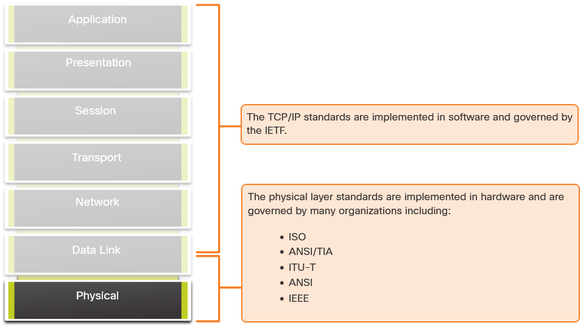
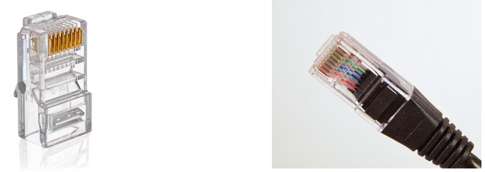

# The Physical Connection 
A physical connection can be a wired connection using a cable or a wireless connection using radio waves. Network Interface Cards (NICs) connect a device to the network. Ethernet NICs are used for a wired connection, whereas WLAN (Wireless Local Area Network) NICs are used for wireless connections.

 
These are the components of an access point:

- The wireless antennas
- Several Ethernet switchports
- An internet port

 

**Network Interface Cards**
**Network interface cards (NICs)** connect a device to the network. Ethernet NICs are used for a wired connection whereas wireless local area network (WLAN) NICs are used for wireless.

# The Physical Layer 
The **OSI physical layer** provides the means to transport the bits that make up a data link layer frame across the network media. This layer accepts a complete frame from the data link layer and encodes it as a series of signals that are transmitted onto the local media. The encoded bits that comprise a frame are received by either an end device or an intermediary device.

## Physical Layer Characteristics

### Physical Layer Standards 

## Physical Components 
The physical layer standards address three functional areas:

- Physical Components
- Encoding
- Signaling

### Physical Components

The physical components are the electronic hardware devices, media, and other connectors that transmit the signals that represent the bits.

### Encoding
Encoding or line encoding is a method of converting a stream of data bits into a predefined "code". Codes are groupings of bits used to provide a predictable pattern that can be recognized by both the sender and the receiver. 

> For example, Manchester encoding represents a 0 bit by a high to low voltage transition, and a 1 bit is represented as a low to high voltage transition.

### Signaling
The physical layer must generate the electrical, optical, or wireless signals that represent the "1" and "0" on the media. The way that bits are represented is called the signaling method. The physical layer standards must define what type of signal represents a "1" and what type of signal represents a "0"

## Bandwith 
> Bandwith is amount of data that can be transmitted and received during a specific perioud of time, measured in bits per second.

Different physical media support the transfer of bits at different rates. Data transfer is usually discussed in terms of bandwidth. Bandwidth is the capacity at which a medium can carry data. Digital bandwidth measures the amount of data that can flow from one place to another in a given amount of time. Bandwidth is typically measured in kilobits per second (kbps), megabits per second (Mbps), or gigabits per second (Gbps).

A combination of factors determines the practical bandwidth of a network:

- The properties of the physical media
- The technologies chosen for signaling and detecting network signals

Physical media properties, current technologies, and the laws of physics all play a role in determining the available bandwidth.

The table shows the commonly used units of measure for bandwidth.

| Unit of Bandwidth        | Abbreviation | Equivalence                              |
|--------------------------|--------------|-----------------------------------------|
| Bits per second          | bps          | 1 bps = fundamental unit of bandwidth   |
| Kilobits per second      | Kbps         | 1 Kbps = 1,000 bps = 10^3 bps           |
| Megabits per second      | Mbps         | 1 Mbps = 1,000,000 bps = 10^6 bps       |
| Gigabits per second      | Gbps         | 1 Gbps = 1,000,000,000 bps = 10^9 bps   |
| Terabits per second      | Tbps         | 1 Tbps = 1,000,000,000,000 bps = 10^12 bps |

## Bandwidth Terminology 
Terms used to measure the quality of bandwidth include:

- **Latency**
- **Throughput**
- **Goodput**

### **Latency**
Latency refers to the amount of time, including delays, for data to travel from one given point to another.

In an internetwork, or a network with multiple segments, throughput cannot be faster than the slowest link in the path from source to destination. Even if all, or most, of the segments have high bandwidth, it will only take one segment in the path with low throughput to create a bottleneck in the throughput of the entire network.

### **Throughput**
Throughput is the measure of the transfer of bits across the media over a given period of time.

Due to a number of factors, throughput usually does not match the specified bandwidth in physical layer implementations. Throughput is usually lower than the bandwidth. There are many factors that influence throughput:

- The amount of traffic
- The type of traffic
- The latency created by the number of network devices encountered between source and destination

### **Goodput**
Goodput is the measure of usable data transferred over a given period of time. Goodput is throughput minus traffic overhead for establishing sessions, acknowledgments, encapsulation, and retransmitted bits. Goodput is always lower than throughput, which is generally lower than the bandwidth.

## Copper Cabling
Copper cabling is the most common type of cabling used in networks today. However, copper media is limited by distance and signal interference.

**Signal attenuation** - the farther the signal travels, the more it deteriorates

 For this reason, all copper media must follow strict distance limitations as specified by the guiding standards.

The timing and voltage values of the electrical pulses are also susceptible to interference from two sources:

- **Electromagnetic interference (EMI) or radio frequency interference (RFI)** - EMI and RFI signals can distort and corrupt the data signals being carried by copper media. Potential sources of EMI and RFI include radio waves and electromagnetic devices, such as fluorescent lights or electric motors.
- **Crosstalk** - Crosstalk is a disturbance caused by the electric or magnetic fields of a signal on one wire to the signal in an adjacent wire. When an electrical current flows through a wire, it creates a small, circular magnetic field around the wire, which can be picked up by an adjacent wire.

To counter the negative effects of EMI and RFI, some types of copper cables are wrapped in metallic shielding and require proper grounding connections.

To counter the negative effects of crosstalk, some types of copper cables have opposing circuit wire pairs twisted together, which effectively cancels the crosstalk.

###  Types of Copper Cabling 

### 1. Unshielded twisted-pair (UTP) 
Most commonly used.

UTP cabling, terminated with RJ-45 connectors, is used for interconnecting network hosts with intermediary networking devices, such as switches and routers.

In LANs, UTP cable consists of four pairs of color-coded wires that have been twisted together and then encased in a flexible plastic sheath that protects the wires from minor physical damage. The twisting of wires helps protect against signal interference from other wires.

1. The outer jacket protects the copper wires from physical damage.
2. Twisted-pairs protect the signal from interference.
3. Color-coded plastic insulation electrically isolates wires from each other and identifies each pair.

### 2. Shielded Twisted-Pair (STP) 
Shielded twisted-pair (STP) provides better noise protection than UTP cabling. Like UTP cable, STP uses an RJ-45 connector.

STP cables combine the techniques of shielding to counter EMI and RFI, and wire twisting to counter crosstalk. To gain the full benefit of the shielding, STP cables are terminated with special shielded STP data connectors. If the cable is improperly grounded, the shield may act as an antenna and pick up unwanted signals.

1. Outer jacket
2. Braided or foil shield
3. Foil shields
4. Twisted pairs

### 3. Coaxial cable 
Coaxial cable, or coax for short.

**Parts of coax:**
1. Outer jacket
2. Braided copper shielding
3. Plastic insulation
4. Copper conductor

Coaxial cable consists of the following:

- A copper conductor is used to transmit the electronic signals.
- A layer of flexible plastic insulation surrounds a copper conductor.
- The insulating material is surrounded in a woven copper braid, or metallic foil, that acts as the second wire in the circuit and as a shield for the inner conductor. This second layer, or shield, also reduces the amount of outside electromagnetic interference.
- The entire cable is covered with a cable jacket to prevent minor physical damage.

There are different types of connectors used with coax cable. The Bayonet Neill–Concelman (BNC), N type, and F type connectors.

Although UTP cable has essentially replaced coaxial cable in modern Ethernet installations, the coaxial cable design is used in the following situations:

- **Wireless installations** - Coaxial cables attach antennas to wireless devices. The coaxial cable carries radio frequency (RF) energy between the antennas and the radio equipment.
- **Cable internet installations** - Cable service providers provide internet connectivity to their customers by replacing portions of the coaxial cable and supporting amplification elements with fiber-optic cable. However, the wiring inside the customer's premises is still coax cable.

## UTP Cabling
UTP cabling consists of four pairs of color-coded copper wires that have been twisted together and then encased in a flexible plastic sheath.

UTP cable does not use shielding to counter the effects of EMI and RFI. Instead, cable designers have discovered other ways that they can limit the negative effect of crosstalk:

- **Cancellation** - Designers now pair wires in a circuit. When two wires in an electrical circuit are placed close together, their magnetic fields are the exact opposite of each other. Therefore, the two magnetic fields cancel each other and also cancel out any outside EMI and RFI signals.
- **Varying the number of twists per wire pair** - To further enhance the cancellation effect of paired circuit wires, designers vary the number of twists of each wire pair in a cable. UTP cable must follow precise specifications governing how many twists or braids are permitted per meter (3.28 feet) of cable. Notice in the figure that the orange/orange white pair is twisted less than the blue/blue white pair. Each colored pair is twisted a different number of times.

UTP cable relies solely on the cancellation effect produced by the twisted wire pairs to limit signal degradation and effectively provide self-shielding for wire pairs within the network media.

### UTP Cabling Standards and Connectors 
UTP cabling conforms to the standards established jointly by the ANSI/TIA. Specifically, ANSI/TIA-568 stipulates the commercial cabling standards for LAN installations:

- Cable types
- Cable lengths
- Connectors
- Cable termination
- Methods of testing cable

> Cables are placed into categories based on their ability to carry higher bandwidth rates. For example, Category 5 cable is used commonly in 100BASE-TX Fast Ethernet installations. Other categories include Enhanced Category 5 cable (5e), Category 6, and Category 6a.

Cables in higher categories are designed and constructed to support higher data rates. 

The figure shows three categories of UTP cable:

- **Category 3** was originally used for voice communication over voice lines, but later used for data transmission.
- **Category 5** and 5e are used for data transmission. Category 5 supports 100Mbps and Category 5e supports 1000 Mbps.
- **Category 6** has an added separator between each wire pair to support higher speeds. Category 6 supports up to 10 Gbps.
- **Category 7** also supports 10 Gbps.
- **Category 8** supports 40 Gbps.

UTP cable is usually terminated with an RJ-45 connector.

#### RJ-45 UTP Plugs

#### RJ-45 UTP Sockets

#### Poorly and Properly Terminated UTP Cable

> Note: Improper cable termination can impact transmission performance.

### Straight-through and Crossover UTP Cables 
Different situations may require UTP cables to be wired according to different wiring conventions. This means that the individual wires in the cable have to be connected in different orders to different sets of pins in the RJ-45 connectors.

The following are the main cable types that are obtained by using specific wiring conventions:

- **Ethernet Straight-through** - The most common type of networking cable. It is commonly used to interconnect a host to a switch and a switch to a router.
- **Ethernet Crossover** - A cable used to interconnect similar devices. For example, to connect a switch to a switch, a host to a host, or a router to a router. However, crossover cables are now considered legacy as NICs use medium-dependent interface crossover (auto-MDIX) to automatically detect the cable type and make the internal connection.

Note: Another type of cable is a **rollover cable**, which is Cisco proprietary. It is used to connect a workstation to a router or switch console port.

**T568A and T568B Standards**

**Cable Types and Standards**

| Cable Type               | Standard                        | Application                                                |
|--------------------------|---------------------------------|------------------------------------------------------------|
| Ethernet Straight-through | Both ends T568A or both ends T568B | Connects a network host to a network device such as a switch or hub |
| Ethernet Crossover       | One end T568A, other end T568B   | Connects two network intermediary devices (switch to switch or router to router) |
| Rollover                 | Cisco proprietary                | Connects a workstation serial port to a router console port using an adapter |

## Fiber-Optic Cabling
Optical fiber cable transmits data over longer distances and at higher bandwidths than any other networking media. Optical fiber is commonly used to interconnect network devices.

### Types of Fiber Media 
Fiber-optic cables are broadly classified into two types:

1. Single-mode fiber (SMF)
2. Multimode fiber (MMF)

#### 1. Single-mode fiber (SMF)
For large distances spanning hundreds of kilometers, such as those required in long haul telephony and cable TV applications.

- Uses single light ray to send data
- Uses lasers and laser LEDs as source of signal

#### 2. Multimode fiber (MMF)
MMFs are popular in LANs because they can be powered by low-cost LEDs. It provides bandwidth up to 10 Gbps over link lengths of up to 550 meters.

- Uses LEDs
- For shorter distances
- Multiple light rays to transfer signal

One of the highlighted differences between MMF and SMF is the amount of dispersion. Dispersion refers to the spreading out of a light pulse over time. Increased dispersion means increased loss of signal strength. MMF has a greater dispersion than SMF. That is why MMF can only travel up to 500 meters before signal loss.

### Fiber-Optic Cabling Usage 
Fiber-optic cabling is now being used in four types of industry:

- Enterprise Networks - This is used for backbone cabling applications and interconnecting infrastructure devices.
- Fiber-to-the-Home (FTTH) - To provide always-on broadband services to homes and small businesses.
- Long-Haul Networks - To connect countries and cities.
- Submarine Cable Networks - High-speed, high-capacity solutions capable of surviving in harsh undersea environments at up to transoceanic distances.

### Fiber-Optic Connectors 

###  Fiber Patch Cords 
Can have different connectors for example: FC-ST, SC-LT.
Depends on the usage.

