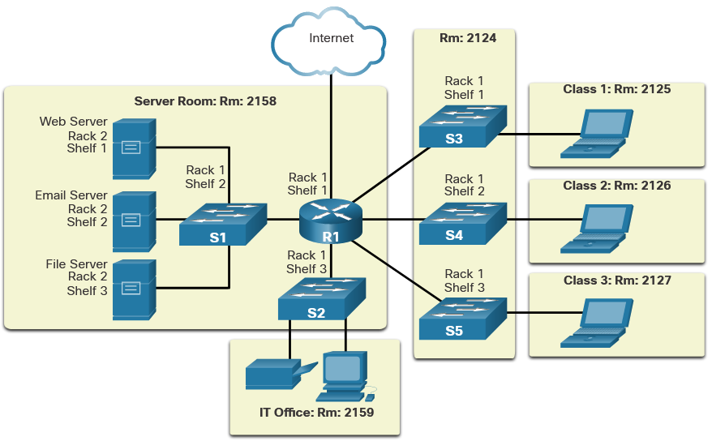
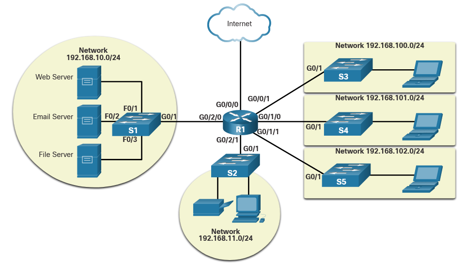
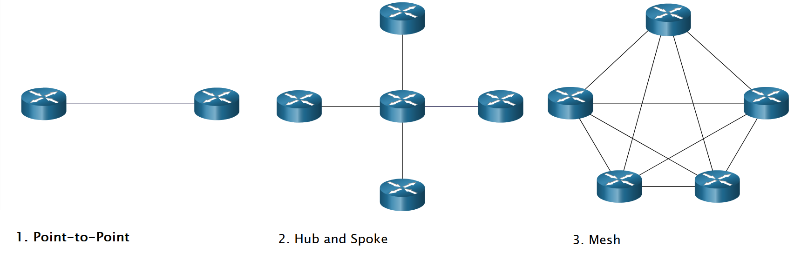
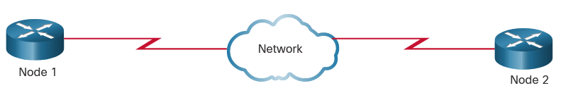
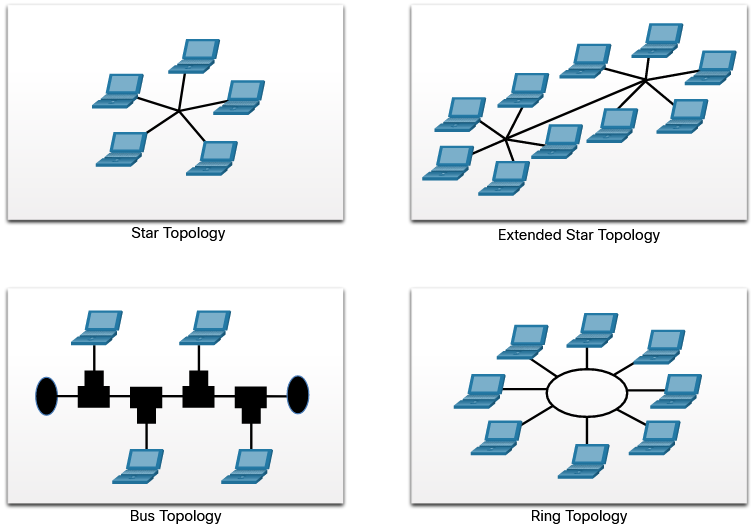
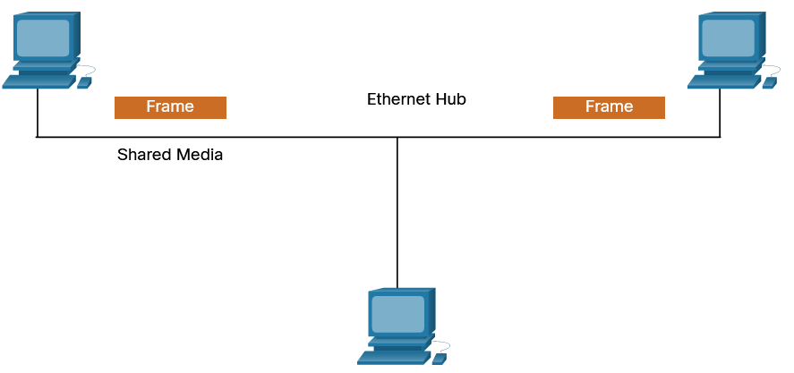
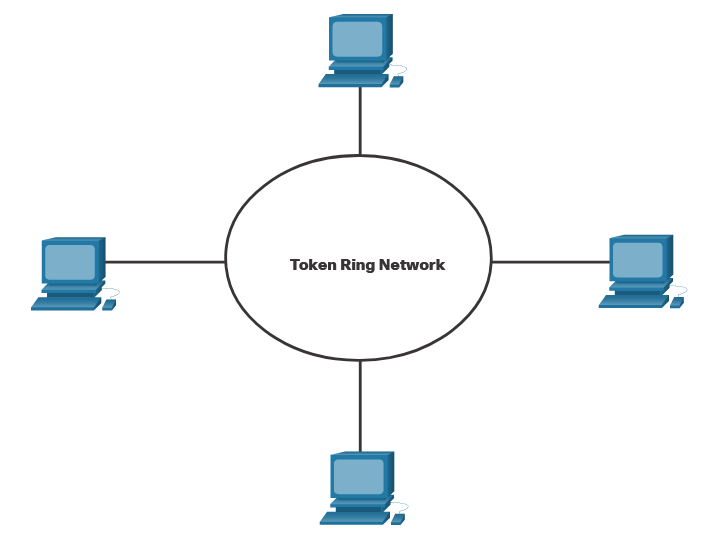

# Data Link Layer
The data link layer prepares network data for the physical network. It must know the logical topology of a network in order to be able to determine what is needed to transfer frames from one device to another.

# Topologies
The topology of a network is the arrangement, or the relationship, of the network devices and the interconnections between them.

## Physical and Logical Topologies 
There are two types of topologies used when describing LAN and WAN networks:

- **Physical topology** – Identifies the physical connections and how end devices and intermediary devices (i.e, routers, switches, and wireless access points) are interconnected. The topology may also include specific device location such as room number and location on the equipment rack. Physical topologies are usually **point-to-point** or **star**.
- **Logical topology** - Refers to the way a network transfers frames from one node to the next. This topology identifies virtual connections using device interfaces and **Layer 3 IP addressing schemes**.

The data link layer "sees" the logical topology of a network when controlling data access to the media. It is the logical topology that influences the type of network framing and media access control used.

**Physical Topology**

**Logical Topology**

## WAN Topologies 

### **1. Point-to-Point** 
Consists of a permanent link between two endpoints.

In this arrangement, two nodes do not have to share the media with other hosts. Additionally, when using a serial communications protocol such as Point-to-Point Protocol (PPP), a node does not have to make any determination about whether an incoming frame is destined for it or another node.

> Note: A point-to-point connection over Ethernet requires the device to determine if the incoming frame is destined for this node.

A source and destination node may be indirectly connected to each other over some geographical distance using multiple intermediary devices. However, the use of physical devices in the network does not affect the logical topology.

### **2. Hub and Spoke** 
This is a WAN version of the star topology in which a central site interconnects branch sites through the use of point-to-point links. Branch sites cannot exchange data with other branch sites without going through the central site.

### **3. Mesh** 
Provides high availability but requires that every end system is interconnected to every other system. 

## LAN Topologies 
In multiaccess LANs, end devices (i.e., nodes) are interconnected using star or extended star topologies.

In this type of topology, end devices are connected to a central intermediary device, in this case, an Ethernet switch. An extended star extends this topology by interconnecting multiple Ethernet switches. The star and extended topologies are easy to install, very scalable (easy to add and remove end devices), and easy to troubleshoot. Early star topologies interconnected end devices using Ethernet hubs.

**Legacy LAN Topologies**

Early Ethernet and legacy Token Ring LAN technologies included two other types of topologies:

- **Bus** - All end systems are chained to each other and terminated in some form on each end. Infrastructure devices such as switches are not required to interconnect the end devices.
- **Ring** - End systems are connected to their respective neighbor forming a ring. The ring does not need to be terminated, unlike in the bus topology. Legacy **Fiber Distributed Data Interface (FDDI)** and **Token Ring** networks used ring topologies.

**Physical Topologies**

> The extended star topology is considered a hybrid topology because it combines multiple star topologies.

# Media Access Control Methods

## Half and Full Duplex Communication 
Refers to the direction of data transmission between two devices. There are two common modes of duplex.

### **Half-duplex communication**
Both devices can transmit and receive on the media but cannot do so simultaneously. WLANs and legacy bus topologies with Ethernet hubs use the half-duplex mode. 

### **Full-duplex communication**
Both devices can simultaneously transmit and receive on the shared media. The data link layer assumes that the media is available for transmission for both nodes at any time. Ethernet switches operate in full-duplex mode by default, but they can operate in half-duplex if connecting to a device such as an Ethernet hub

> It is important that two interconnected interfaces, such as a host NIC and an interface on an Ethernet switch, operate using the same duplex mode. Otherwise, there will be a duplex mismatch creating inefficiency and latency on the link.

## Access Control Methods 
Ethernet LANs and WLANs are examples of multiaccess networks. A multiaccess network is a network that can have two or more end devices attempting to access the network simultaneously.

Some multiaccess networks require rules to govern how devices share the physical media. There are two basic access control methods for shared media:

### **Contention-based access - CSMA/CD**
All nodes are operating in half-duplex, competing for the use of the medium. However, only one device can send at a time. Therefore, there is a process if more than one device transmits at the same time. 

Examples of contention-based access methods include the following:

- **1. Carrier sense multiple access with collision detection (CSMA/CD)** used on legacy bus-topology Ethernet LANs
- **2. Carrier sense multiple access with collision avoidance (CSMA/CA)** used on Wireless LANs

### **1. Contention-Based Access - CSMA/CD**
Examples of contention-based access networks include the following:

- **Wireless LAN (uses CSMA/CA)**
- **Legacy bus-topology Ethernet LAN (uses CSMA/CD)**
- **Legacy Ethernet LAN using a hub (uses CSMA/CD)**

These networks operate in half-duplex mode, meaning only one device can send or receive at a time. This requires a process to govern when a device can send and what happens when multiple devices send at the same time.

If two devices transmit at the same time, a collision will occur. For legacy Ethernet LANs, both devices will detect the collision on the network. This is the collision detection (CD) portion of CSMA/CD. The NIC compares data transmitted with data received, or by recognizing that the signal amplitude is higher than normal on the media. The data sent by both devices will be corrupted and will need to be resent.

**CSMA/CD process in legacy Ethernet LANs that use a hub.**
1. **PC1 Sends a Frame** -
PC1 has an Ethernet frame to send to PC3. The PC1 NIC needs to determine if any device is transmitting on the medium. If it does not detect a carrier signal (in other words, it is not receiving transmissions from another device), it will assume the network is available to send.The PC1 NIC sends the Ethernet Frame when the medium is available

2. **The Hub Receives the Frame** -
The Ethernet hub receives and sends the frame. An Ethernet hub is also known as a multiport repeater. Any bits received on an incoming port are regenerated and sent out all other ports.
If another device, such as PC2, wants to transmit, but is currently receiving a frame, it must wait until the channel is clear

3. **The Hub Sends the Frame** -
All devices attached to the hub will receive the frame. However, because the frame has a destination data link address for PC3, only that device will accept and copy in the entire frame. All other device NICs will ignore the frame.

### **2. Contention-Based Access - CSMA/CA** 
Another form of CSMA used by IEEE 802.11 WLANs is carrier sense multiple access/collision avoidance (CSMA/CA).

CMSA/CA uses a method similar to CSMA/CD to detect if the media is clear. CMSA/CA uses additional techniques. In wireless environments, it may not be possible for a device to detect a collision. CMSA/CA does not detect collisions but attempts to avoid them by waiting before transmitting. Each device that transmits includes the time duration that it needs for the transmission. All other wireless devices receive this information and know how long the medium will be unavailable.

After a wireless device sends an 802.11 frame, the receiver returns an acknowledgment so that the sender knows the frame arrived.

> Note: Ethernet LANs using switches do not use a contention-based system because the switch and the host NIC operate in full-duplex mode.

### **Controlled access**
Each node has its own time to use the medium. These deterministic types of legacy networks are inefficient because a device must wait its turn to access the medium. Examples of multiaccess networks that use controlled access include the following:

- **Legacy Token Ring**
- **Legacy ARCNET**

