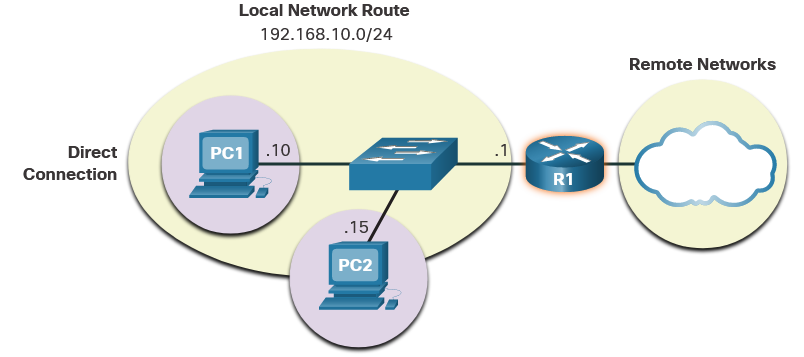
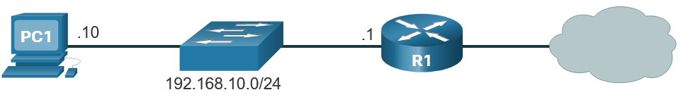
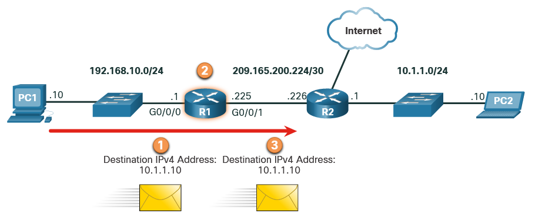
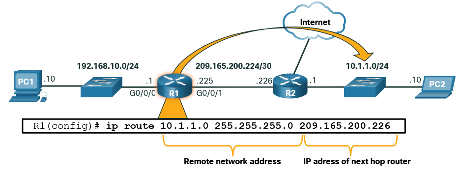
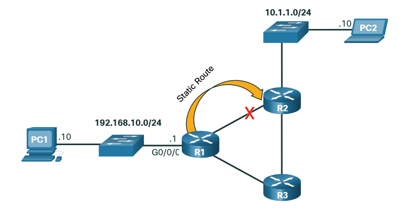
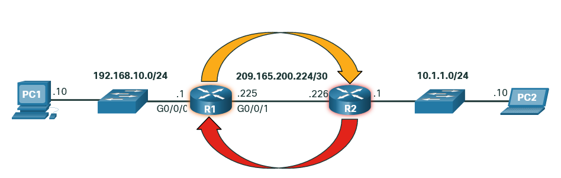
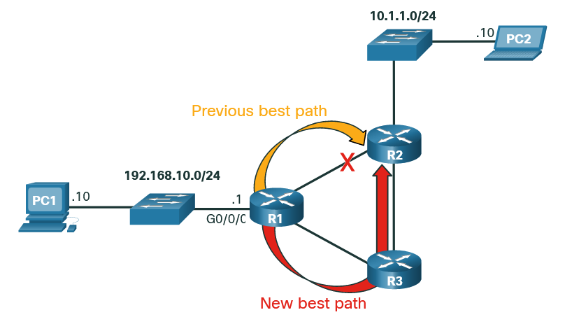
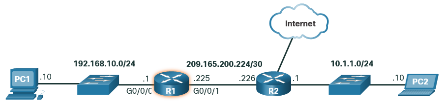

# Routing at the Network Layer

# How a Host routes
## Host Forwarding Decision 
With both IPv4 and IPv6, packets are always created at the source host. The source host must be able to direct the packet to the destination host. To do this, host end devices create their own routing table. 

Another role of the network layer is to direct packets between hosts. A host can send a packet to the following:

- **Itself** - A host can ping itself by sending a packet to a special IPv4 address of 127.0.0.1 or an IPv6 address ::1, which is referred to as the loopback interface. Pinging the loopback interface tests the TCP/IP protocol stack on the host.
- **Local host** - This is a destination host that is on the same local network as the sending host. The source and destination hosts share the same network address.
- **Remote host** - This is a destination host on a remote network. The source and destination hosts do not share the same network address.

Whether a packet is destined for a local host or a remote host is determined by the source end device. The source end device determines whether the destination IP address is on the same network that the source device itself is on. The method of determination varies by IP version:

- In IPv4 - The source device uses its own subnet mask along with its own IPv4 address and the destination IPv4 address to make this determination.
- In IPv6 - The local router advertises the local network address (prefix) to all devices on the network.

Home or business network, may have several wired and wireless devices interconnected together using an intermediary device, such as a LAN switch or a wireless access point (WAP).  Local hosts can reach each other and share information without the need for any additional devices. If a host is sending a packet to a device that is configured with the same IP network as the host device, the packet is simply forwarded out of the host interface, through the intermediary device, and to the destination device directly.

Devices that are beyond the local network segment are known as remote hosts. When a source device sends a packet to a remote destination device, then the help of routers and routing is needed. Routing is the process of identifying the best path to a destination. The router connected to the local network segment is referred to as the default gateway.

## Default Gateway 
The default gateway is the network device (i.e. router or Layer 3 switch) that can route traffic to other networks.

On a network, a default gateway is usually a router with these features:

- It has a local IP address in the same address range as other hosts on the local network.
- It can accept data into the local network and forward data out of the local network.
- It routes traffic to other networks.

A default gateway is required to send traffic outside of the local network.

## A Host Routes to the Default Gateway 
A host routing table will typically include a default gateway. In IPv4, the host receives the IPv4 address of the default gateway either dynamically from Dynamic Host Configuration Protocol (DHCP) or configured manually. In IPv6, the router advertises the default gateway address or the host can be configured manually.

In the figure, PC1 and PC2 are configured with the IPv4 address of 192.168.10.1 as the default gateway.

Having a default gateway configured creates a default route in the routing table of the PC. A default route is the route or pathway your computer will take when it tries to contact a remote network.

Both PC1 and PC2 will have a default route to send all traffic destined to remote networks to R1.

## Host Routing Tables 
On a Windows host, the **route print** or **netstat -r** command can be used to display the host routing table.

**IPv4 Routing Table for PC1**

    C:\Users\PC1> netstat -r
    (output omitted)
    IPv4 Route Table
    ===========================================================================
    Active Routes:
    Network Destination         Netmask       Gateway       Interface    Metric
            0.0.0.0           0.0.0.0   192.168.10.1   192.168.10.10       25
            127.0.0.0         255.0.0.0       On-link        127.0.0.1      306
            127.0.0.1   255.255.255.255       On-link        127.0.0.1      306
    127.255.255.255   255.255.255.255       On-link        127.0.0.1      306
        192.168.10.0     255.255.255.0       On-link    192.168.10.10      281
        192.168.10.10   255.255.255.255       On-link    192.168.10.10      281
    192.168.10.255   255.255.255.255       On-link    192.168.10.10      281
            224.0.0.0         240.0.0.0       On-link        127.0.0.1      306
            224.0.0.0         240.0.0.0       On-link    192.168.10.10      281
    255.255.255.255   255.255.255.255       On-link        127.0.0.1      306
    255.255.255.255   255.255.255.255       On-link    192.168.10.10      281
    (output omitted)

Entering the **netstat -r** command or the equivalent route print command displays three sections related to the current TCP/IP network connections:

- **Interface List** - Lists the Media Access Control (MAC) address and assigned interface number of every network-capable interface on the host, including Ethernet, Wi-Fi, and Bluetooth adapters.
- **IPv4 Route Table** - Lists all known IPv4 routes, including direct connections, local network, and local default routes.
- **IPv6 Route Table** - Lists all known IPv6 routes, including direct connections, local network, and local default routes.

# Routing Tables 
## Router Packet Forwarding Decision 
Routers contain routing tables. 
When a host sends a packet to another host, it consults its routing table to determine where to send the packet. If the destination host is on a remote network, the packet is forwarded to the default gateway, which is usually the local router.

**What happens when a packet arrives on a router interface?**

The router examines the destination IP address of the packet and searches its routing table to determine where to forward the packet. The routing table contains a list of all known network addresses (prefixes) and where to forward the packet. These entries are known as route entries or routes. The router will forward the packet using the best (longest) matching route entry.

1. Packet arrives on the Gigabit Ethernet 0/0/0 interface of router R1. R1 de-encapsulates the Layer 2 Ethernet header and trailer.
2. Router R1 examines the destination IPv4 address of the packet and searches for the best match in its IPv4 routing table. The route entry indicates that this packet is to be forwarded to router R2.
3. Router R1 encapsulates the packet into a new Ethernet header and trailer, and forwards the packet to the next hop router R2.

**R1 Routing Table**
| Route                   | Next Hop or Exit Interface |
|-------------------------|---------------------------|
| 192.168.10.0 /24        | G0/0/0                    |
| 209.165.200.224/30     | G0/0/1                    |
| 10.1.1.0/24            | via R2                    |
| Default Route 0.0.0.0/0| via R2                    |

##  IP Router Routing Table 

The routing table of the router contains network route entries listing all the possible known network destinations.

The routing table stores three types of route entries:

- **Directly-connected networks** - These network route entries are active router interfaces. Routers add a directly connected route when an interface is configured with an IP address and is activated. Each router interface is connected to a different network segment. 

- **Remote networks** - These network route entries are connected to other routers. Routers learn about remote networks either by being explicitly configured by an administrator or by exchanging route information using a dynamic routing protocol. 

- **Default route** – Like a host, most routers also include a default route entry, a gateway of last resort. The default route is used when there is no better (longer) match in the IP routing table.

A router can learn about remote networks in one of two ways:

- **Manually** - Remote networks are manually entered into the route table using static routes.
- **Dynamically** - Remote routes are automatically learned using a dynamic routing protocol.

## Static Routing 
Static routes are route entries that are manually configured. The static route includes the remote network address and the IP address of the next hop router.

R1 is manually configured with a static route to reach the 10.1.1.0/24 network. If this path changes, R1 will require a new static route.

If there is a change in the network topology, the static route is not automatically updated and must be manually reconfigured. 

For example, in the figure R1 has a static route to reach the 10.1.1.0/24 network via R2. If that path is no longer available, R1 would need to be reconfigured with a new static route to the 10.1.1.0/24 network via R3. Router R3 would therefore need to have a route entry in its routing table to send packets destined for 10.1.1.0/24 to R2.

If the route from R1 via R2 is no longer available, a new static route via R3 would need to be configured. A static route does not automatically adjust for topology changes.

Static routing has the following characteristics:

- A static route must be configured manually.
- The administrator needs to reconfigure a static route if there is a change in the topology and the static route is no longer viable.
- A static route is appropriate for a small network and when there are few or no redundant links.

##  Dynamic Routing 
A dynamic routing protocol allows the routers to automatically learn about remote networks, including a default route, from other routers. Routers that use dynamic routing protocols automatically share routing information with other routers and compensate for any topology changes without involving the network administrator. If there is a change in the network topology, routers share this information using the dynamic routing protocol and automatically update their routing tables.

Dynamic routing protocols include **Open Shortest Path First (OSPF)** and **Enhanced Interior Gateway Routing Protocol (EIGRP)**. The figure shows an example of routers R1 and R2 automatically sharing network information using the routing protocol OSPF.

- R1 is using the routing protocol OSPF to let R2 know about the 192.168.10.0/24 network.
- R2 is using the routing protocol OSPF to let R1 know about the 10.1.1.0/24 network.

The dynamic routing protocol will automatically do as follows:

- Discover remote networks
- Maintain up-to-date routing information
- Choose the best path to destination networks
- Attempt to find a new best path if the current path is no longer available

When a router is manually configured with a static route or learns about a remote network dynamically using a dynamic routing protocol, the remote network address and next hop address are entered into the IP routing table. If there is a change in the network topology, the routers will automatically adjust and attempt to find a new best path.

> Note: It is common for some routers to use a combination of both static routes and a dynamic routing protocol.

## Introduction to an IPv4 Routing Table 
R2 is connected to the internet. Therefore, the administrator configured R1 with a default static route sending packets to R2 when there is no specific entry in the routing table that matches the destination IP address. R1 and R2 are also using OSPF routing to advertise directly connected networks.

    R1# show ip route
    Codes: L - local, C - connected,
    S - static , R - RIP, M - mobile, B - BGP
        D - EIGRP, EX - EIGRP external, O - OSPF, IA - OSPF inter area
        N1 - OSPF NSSA external type 1, N2 - OSPF NSSA external type 2
        E1 - OSPF external type 1, E2 - OSPF external type 2
        i - IS-IS, su - IS-IS summary, L1 - IS-IS level-1, L2 - IS-IS level-2
        ia - IS-IS inter area, * - candidate default, U - per-user static route
        o - ODR, P - periodic downloaded static route, H - NHRP, l - LISP
        a - application route
        + - replicated route, % - next hop override, p - overrides from PfR

    Gateway of last resort is 209.165.200.226 to network 0.0.0.0
    S*    0.0.0.0/0 [1/0] via 209.165.200.226, GigabitEthernet0/0/1
        10.0.0.0/24 is subnetted, 1 subnets
    O        10.1.1.0 [110/2] via 209.165.200.226, 00:02:45, GigabitEthernet0/0/1
        192.168.10.0/24 is variably  subnetted, 2 subnets, 2 masks
    C        192.168.10.1/24 is directly connected, GigabitEthernet0/0/0
    L        192.168.10.1/32 is directly connected, GigabitEthernet0/0/0
        209.165.200.0/24 is variably  subnetted, 2 subnets, 2 masks
    C        209.165.200.224/30 is  directly connected, GigabitEthernet0/0/1
    L        209.165.200.225/32 is  directly connected, GigabitEthernet0/0/1
    R1#

The **show ip route** privileged EXEC mode command is used to view the IPv4 routing table on a Cisco IOS router.

Common route sources (codes) include these:

- L - Directly connected local interface IP address
- C – Directly connected network
- S – Static route was manually configured by an administrator
- O - OSPF
- D - EIGRP

The routing table displays all of the known IPv4 destination routes for R1.

A directly connected route is automatically created when a router interface is configured with IP address information and is activated. The router adds two route entries with the codes C (i.e., the connected network) and L (i.e., the local interface IP address of the connected network). The route entries also identify the exit interface to use to reach the network. 

A default route has a network address of all zeroes. For example, the IPv4 network address is 0.0.0.0. A static route entry in the routing table begins with a code of S*.
