# IPv6 Addressing

# IPv6 Addreess Type

## Unicast, Multicast, Anycast 
There are three broad categories of IPv6 addresses:

- **Unicast** - An IPv6 unicast address uniquely identifies an interface on an IPv6-enabled device.
- **Multicast** - An IPv6 multicast address is used to send a single IPv6 packet to multiple destinations.
- **Anycast** - An IPv6 anycast address is any IPv6 unicast address that can be assigned to multiple devices. A packet sent to an anycast address is routed to the nearest device having that address.

Unlike IPv4, IPv6 does not have a broadcast address. However, there is an **IPv6 all-nodes multicast address** that essentially gives the same result.

## IPv6 Prefix Length 
The prefix, or network portion, of an IPv4 address can be identified by a dotted-decimal subnet mask or prefix length (slash notation). For example, an IPv4 address of 192.168.1.10 with dotted-decimal subnet mask 255.255.255.0 is equivalent to 192.168.1.10/24.

In IPv6 it is only called the prefix length. IPv6 does not use the dotted-decimal subnet mask notation. Like IPv4, the prefix length is represented in slash notation and is used to indicate the network portion of an IPv6 address.

The prefix length can range from 0 to 128. The recommended IPv6 prefix length for LANs and most other types of networks is /64, as shown in the figure.
IPv6 Prefix Length

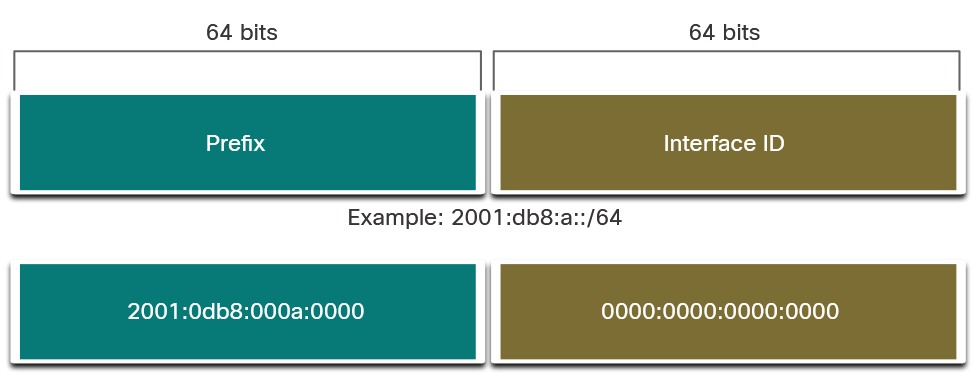

The prefix or network portion of the address is 64 bits in length, leaving another 64 bits for the interface ID (host portion) of the address.

> It is strongly recommended to use a 64-bit Interface ID for most networks. This is because stateless address autoconfiguration (SLAAC) uses 64 bits for the Interface ID. 

## Types of IPv6 Unicast Addresses 
An IPv6 unicast address uniquely identifies an interface on an IPv6-enabled device. A packet sent to a unicast address is received by the interface which is assigned that address. Similar to IPv4, a source IPv6 address must be a unicast address. The destination IPv6 address can be either a unicast or a multicast address. 

IPv6 Unicast Addresses:
- Global Unicast
- Link-local
- Loopback -  **::1/128**
- Unspecified Address - **::**
- Unique Local - **fc00::/7-fdff::/7**
- Embedded IPv4

IPv6 addresses typically have two unicast addresses:

- **Global Unicast Address (GUA)** - Similar to a public IPv4 address. These are globally unique, internet-routable addresses. GUAs can be configured statically or assigned dynamically.
- **Link-Local Address (LLA)** - Required for every IPv6-enabled device. LLAs are used to communicate with other devices on the same local link. With IPv6, the term link refers to a subnet. LLAs are confined to a single link. Their uniqueness must only be confirmed on that link because they are not routable beyond the link. In other words, routers will not forward packets with a link-local source or destination address.

#### A Note About the Unique Local Address 
Unique local addresses (range fc00::/7 to fdff::/7) are not yet commonly implemented.
However, unique local addresses may eventually be used to address devices that should not be accessible from the outside, such as internal servers and printers.

The IPv6 unique local addresses have some similarity to RFC 1918 private addresses for IPv4, but there are significant differences:

- **Unique local addresses** are used for local addressing within a site or between a limited number of sites.
- **Unique local addresses** can be used for devices that will never need to access another network.
- **Unique local addresses** are not globally routed or translated to a global IPv6 address.

## IPv6 GUA 
IPv6 global unicast addresses (GUAs) are globally unique and routable on the IPv6 internet. These addresses are equivalent to public IPv4 addresses.

> Currently, only GUAs with the first three bits of 001 or 2000::/3 are being assigned.

**IPv6 Address with a /48 Global Routing Prefix and /64 Prefix**
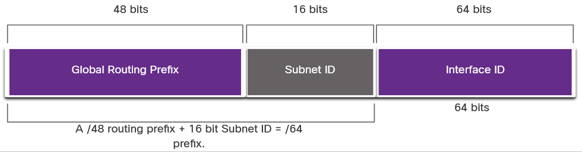

A GUA has three parts:

- Global Routing Prefix
- Subnet ID
- Interface ID

### Global Routing Prefix
The global routing prefix is the prefix, or network, portion of the address that is assigned by the provider, such as an ISP, to a customer or site.

    For example, the IPv6 address 2001:db8:acad::/48 has a global routing prefix that indicates that the first 48 bits (3 hextets) (2001:db8:acad) is how the ISP knows of this prefix (network). The double colon (::) following the /48 prefix length means the rest of the address contains all 0s. The size of the global routing prefix determines the size of the subnet ID.

### Subnet ID
The subnet ID field is the area between the global routing prefix and the interface ID. IPv6 was designed with subnetting in mind. The subnet ID is used by an organization to identify subnets within its site. The larger the subnet ID, the more subnets available.

### Interface ID
The IPv6 interface ID is equivalent to the host portion of an IPv4 address. The term interface ID is used because a single host may have multiple interfaces, each having one or more IPv6 addresses. 

A /64 subnet or prefix (global routing prefix + subnet ID) leaves 64 bits for the interface ID. This is recommended to allow **SLAAC-enabled** devices to create their own 64-bit interface ID.

Note: Unlike IPv4, in IPv6, the all-0s and all-1s host addresses can be assigned to a device. The all-1s address can be used because broadcast addresses are not used within IPv6. The all-0s address can also be used, but is reserved as a subnet-router anycast address, and should be assigned only to routers.

## IPv6 LLA 
An IPv6 link-local address (LLA) enables a device to communicate with other IPv6-enabled devices on the same link and only on that link (subnet). Packets with a source or destination LLA cannot be routed beyond the link from which the packet originated.

The GUA is not a requirement. However, every IPv6-enabled network interface must have an LLA.

If an LLA is not configured manually on an interface, the device will automatically create its own without communicating with a DHCP server. IPv6-enabled hosts create an IPv6 LLA even if the device has not been assigned a global unicast IPv6 address. This allows IPv6-enabled devices to communicate with other IPv6-enabled devices on the same subnet. This includes communication with the default gateway (router).

> IPv6 LLAs are in the fe80::/10 range. The /10 indicates that the first 10 bits are 1111 1110 10xx xxxx. The first hextet has a range of 1111 1110 1000 0000 (fe80) to 1111 1110 1011 1111 (febf).

The figure shows an example of communication using IPv6 LLAs. The PC is able to communicate directly with the printer using the LLAs.

**IPv6 Link-Local Communications**
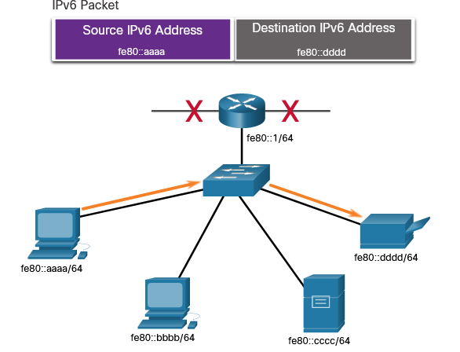

The next picutre shows some of the uses for IPv6 LLAs.
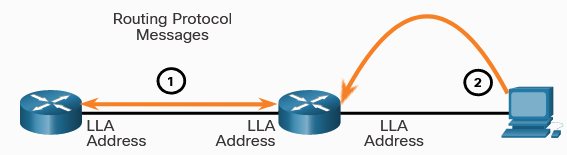

1. Routers use the LLA of neighbor routers to send routing updates.
2. Hosts use the LLA of a local router as the default-gateway.

> Note: Typically, it is the LLA of the router, and not the GUA, that is used as the default gateway for other devices on the link.

There are two ways that a device can obtain an LLA:
- **Statically** - This means the device has been manually configured.
- **Dynamically** - This means the device creates its own interface ID by using randomly generated values or using the Extended Unique Identifier (EUI) method, which uses the client media access control (MAC) address along with additional bits.

# GUA and LLA Static Configuration
## Static GUA Configuration on a Router 
IPv6 GUAs are the same as public IPv4 addresses. They are globally unique and routable on the IPv6 internet. An IPv6 LLA lets two IPv6-enabled devices communicate with each other on the same link (subnet).

For example, the Cisco IOS command to configure an IPv4 address on an interface is **ip address ip-address subnet-mask**. In contrast, the command to configure an IPv6 GUA on an interface is **ipv6 address ipv6-address/prefix-length**.

**Example Topology**
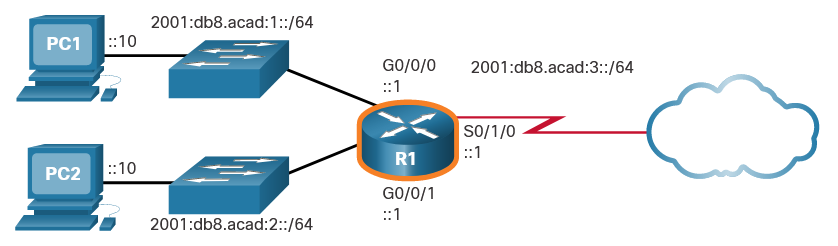

The commands required to configure the IPv6 GUA on GigabitEthernet 0/0/0, GigabitEthernet 0/0/1, and the Serial 0/1/0 interface of R1.

    R1(config)# interface gigabitethernet 0/0/0
    R1(config-if)# ipv6 address 2001:db8:acad:1::1/64
    R1(config-if)# no shutdown
    R1(config-if)# exit
    R1(config)# interface gigabitethernet 0/0/1
    R1(config-if)# ipv6 address 2001:db8:acad:2::1/64
    R1(config-if)# no shutdown
    R1(config-if)# exit
    R1(config)# interface serial 0/1/0
    R1(config-if)# ipv6 address 2001:db8:acad:3::1/64
    R1(config-if)# no shutdown

## Static GUA Configuration on a Windows Host 
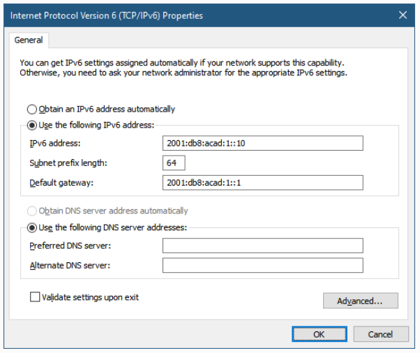

There are two ways in which a device can obtain an IPv6 GUA automatically:

- Stateless address autoconfiguration (SLAAC)
- Stateful DHCPv6

> Note: When DHCPv6 or SLAAC is used, the LLA of the router will automatically be specified as the default gateway address.

## Static Configuration of a Link-Local Unicast Address 
LLAs can be configured manually using the **ipv6 address ipv6-link-local-address link-local** command. When an address begins with this hextet within the range of fe80 to febf, the link-local parameter must follow the address.
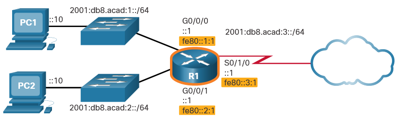

Examples:

Configure and activate IPv6 on the GigabitEthernet 0/0/0 interface with the following addresses:

    Use g0/0/0 as the interface name
    LLA - fe80::1:1
    GUA - 2001:db8:acad:1::1/64
    Activate the interface
    Exit interface configuration mode
    -------------------------------------------------------
    R1(config)#interface g0/0/0
    R1(config-if)#ipv6 address fe80::1:1 link-local
    R1(config-if)#ipv6 address 2001:db8:acad:1::1/64
    R1(config-if)#no shutdown

    %LINK-3-UPDOWN: Interface GigabitEthernet0/0/0, changed state to up

    R1(config-if)#exit
    R1(config)#

Configure and activate IPv6 on the serial 0/1/0 interface with the following addresses:

    Use s0/1/0 as the interface name
    LLA - fe80::3:1
    GUA - 2001:db8:acad:3::1/64
    Activate the interface
    Exit interface configuration mode
    -------------------------------------------------------
    R1(config)#interface s0/1/0
    R1(config-if)#ipv6 address fe80::3:1 link-local
    R1(config-if)#ipv6 address 2001:db8:acad:3::1/64
    R1(config-if)#no shutdown

    %LINK-3-UPDOWN: Interface Serial0/1/0, changed state to up

    R1(config-if)#exit
    R1(config)#

# Dynamic Addressing for IPv6 GUAs
 Most devices obtain their IPv6 GUAs dynamically.

## RS and RA Messages 
For the GUA, a device obtains the address dynamically through Internet Control Message Protocol version 6 (ICMPv6) messages. IPv6 routers periodically send out ICMPv6 RA messages, every 200 seconds, to all IPv6-enabled devices on the network. An RA message will also be sent in response to a host sending an ICMPv6 RS message, which is a request for an RA message. Both messages are shown in the figure.

**ICMPv6 RS and RA Messages**
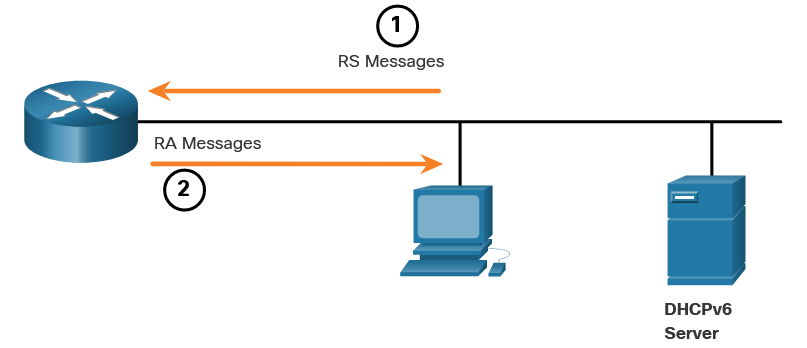

1. RS messages are sent to all IPv6 routers by hosts requesting addressing information.
2. RA messages are sent to all IPv6 nodes. If Method 1 (SLAAC only) is used, the RA includes network prefix, prefix-length, and default-gateway information.

RA messages are on IPv6 router Ethernet interfaces. The router must be enabled for IPv6 routing.

The **ICMPv6 RA message** is a suggestion to a device on how to obtain an IPv6 GUA. The ultimate decision is up to the device operating system. The **ICMPv6 RA message** includes the following:

- Network prefix and prefix length - This tells the device which network it belongs to.
- Default gateway address - This is an IPv6 LLA, the source IPv6 address of the RA message.
- DNS addresses and domain name - These are the addresses of DNS servers and a domain name.

There are three methods for RA messages:

### Method 1: **SLAAC** 
> “I have everything you need including the prefix, prefix length, and default gateway address.”

SLAAC is a method that allows a device to create its own GUA without the services of DHCPv6. Using SLAAC, devices rely on the ICMPv6 RA messages of the local router to obtain the necessary information.

By default, the RA message suggests that the receiving device use the information in the RA message to create its own IPv6 GUA and all other necessary information. The services of a DHCPv6 server are not required.

SLAAC is stateless, which means there is no central server (for example, a stateful DHCPv6 server) allocating GUAs and keeping a list of devices and their addresses. With SLAAC, the client device uses the information in the RA message to create its own GUA. As shown in the figure, the two parts of the address are created as follows:

- Prefix - This is advertised in the RA message.
- Interface ID - This uses the EUI-64 process or by generating a random 64-bit number, depending on the device operating system.

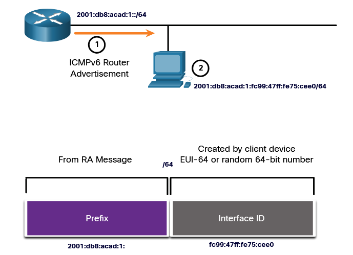

1. The router sends an RA message with the prefix for the local link.
2. The PC uses SLAAC to obtain a prefix from the RA message and creates its own Interface ID.

### Method 2: **SLAAC with a stateless DHCPv6 server** 
> “Here is my information but you need to get other information such as DNS addresses from a stateless DHCPv6 server.”

A router interface can be configured to send a router advertisement using SLAAC and stateless DHCPv6.

As shown in the figure, with this method, the RA message suggests devices use the following:

- SLAAC to create its own IPv6 GUA
- The router LLA, which is the RA source IPv6 address, as the default gateway address
- A stateless DHCPv6 server to obtain other information such as a DNS server address and a domain name

> Note: A stateless DHCPv6 server distributes DNS server addresses and domain names. It does not allocate GUAs.

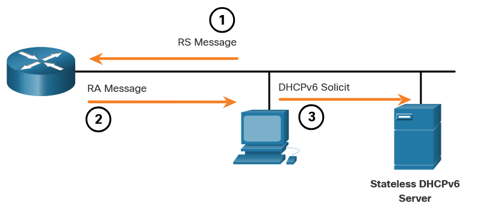

1. The PC sends an RS to all IPv6 routers, “I need addressing information.”
2. The router sends an RA message to all IPv6 nodes with Method 2 (SLAAC and DHCPv6) specified. “Here is your prefix, prefix-length, and default gateway information. But you will need to get DNS information from a DHCPv6 server.”
3. The PC sends a DHCPv6 Solicit message to all DHCPv6 servers. "I used SLAAC to create my IPv6 address and get my default gateway address, but I need other information from a stateless DHCPv6

### Method 3: **Stateful DHCPv6 (no SLAAC)**
“I can give you your default gateway address. You need to ask a stateful DHCPv6 server for all your other information.”

A router interface can be configured to send an RA using stateful DHCPv6 only.

Stateful DHCPv6 is similar to DHCP for IPv4. A device can automatically receive its addressing information including a GUA, prefix length, and the addresses of DNS servers from a stateful DHCPv6 server.

As shown in the figure, with this method, the RA message suggests devices use the following:

- The router LLA, which is the RA source IPv6 address, for the default gateway address.
- A stateful DHCPv6 server to obtain a GUA, DNS server address, domain name and other necessary information.

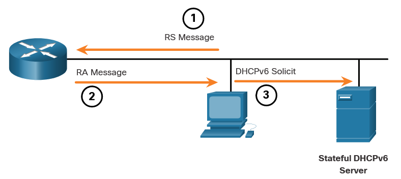

1. The PC sends an RS to all IPv6 routers, “I need addressing information.”
2. The router sends an RA message to all IPv6 nodes with Method 3 (Stateful DHCPv6) specified, “I am your default gateway, but you need to ask a stateful DHCPv6 server for your IPv6 address and other addressing information."
3. The PC sends a DHCPv6 Solicit message to all DHCPv6 servers, "I received my default gateway address from the RA message, but I need an IPv6 address and all other addressing information from a stateful DHCPv6 server."

A stateful DHCPv6 server allocates and maintains a list of which device receives which IPv6 address. DHCP for IPv4 is stateful.

> Note: The default gateway address can only be obtained dynamically from the RA message. The stateless or stateful DHCPv6 server does not provide the default gateway address.

## EUI-64 Process vs. Randomly Generated 
When the RA message is either SLAAC or SLAAC with stateless DHCPv6, the client must generate its own interface ID. 

The client knows the prefix portion of the address from the RA message, but must create its own interface ID. The interface ID can be created using the EUI-64 process or a randomly generated 64-bit number.

**Dynamically Creating an Interface ID**
1. The router sends an RA message.
2.  The PC uses the prefix in the RA message and uses either EUI-64 or a random 64-bit number to generate an interface ID.

### EUI-64 Process 
**Extended Unique Identifier (EUI)** or **modified EUI-64 process**. This process uses the 48-bit Ethernet MAC address of a client, and inserts another 16 bits in the middle of the 48-bit MAC address to create a 64-bit interface ID.

Ethernet MAC addresses are usually represented in hexadecimal and are made up of two parts:

- Organizationally Unique Identifier (OUI) - The OUI is a 24-bit (6 hexadecimal digits) vendor code assigned by IEEE.
- Device Identifier - The device identifier is a unique 24-bit (6 hexadecimal digits) value within a common OUI.

An EUI-64 interface ID is represented in binary and is made up of three parts:

- 24-bit OUI from the client MAC address, but the 7th bit (the Universally/Locally (U/L) bit) is reversed. This means that if the 7th bit is a 0, it becomes a 1, and vice versa.
- The inserted 16-bit value fffe (in hexadecimal).
- 24-bit device identifier from the client MAC address.

The EUI-64 process is illustrated in the figure, using the R1 GigabitEthernet MAC address of fc99:4775:cee0.

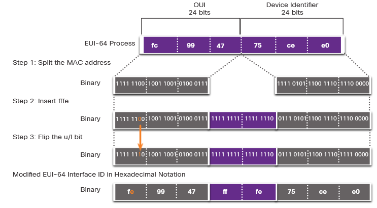

Step 1: Divide the MAC address between the OUI and device identifier.

Step 2: Insert the hexadecimal value fffe, which in binary is: 1111 1111 1111 1110.

Step 3: Convert the first 2 hexadecimal values of the OUI to binary and flip the U/L bit (bit 7). In this example, the 0 in bit 7 is changed to a 1.

The result is an EUI-64 generated interface ID of fe99:47ff:fe75:cee0.

The advantage of EUI-64 is that the Ethernet MAC address can be used to determine the interface ID.

**EUI-64 Generated Interface ID**

    C:\> ipconfig
    Windows IP Configuration
    Ethernet adapter Local Area Connection:
    Connection-specific DNS Suffix . :
    IPv6 Address. . . . . . . . . . . : 
    2001:db8:acad:1:
    fc99:47
    ff:fe
    75:cee0
    Link-local IPv6 Address . . . . . : fe80::fc99:47ff:fe75:cee0
    Default Gateway . . . . . . . . . : fe80::1
    C:\>

### Randomly Generated Interface IDs 
Depending upon the operating system, a device may use a randomly generated interface ID instead of using the MAC address and the EUI-64 process.

After the interface ID is established, either through the EUI-64 process or through random generation, it can be combined with an IPv6 prefix in the RA message to create a GUA, as shown in the figure.

**Random 64-Bit Generated Interface ID**

    C:\> ipconfig
    Windows IP Configuration
    Ethernet adapter Local Area Connection:
    Connection-specific DNS Suffix  . :
    IPv6 Address. . . . . . . . . . . : 
    2001:db8:acad:1:
    50a5:8a35:a5bb:66e1
    Link-local IPv6 Address . . . . . : fe80::50a5:8a35:a5bb:66e1
    Default Gateway . . . . . . . . . : fe80::1
    C:\>

# Dynamic Addressing for IPv6 LLAs
All IPv6 devices must have an IPv6 LLA. Like IPv6 GUAs, you can also create LLAs dynamically.

## Dynamic LLAs 
The figure shows the LLA is dynamically created using the fe80::/10 prefix and the interface ID using the EUI-64 process, or a randomly generated 64-bit number.

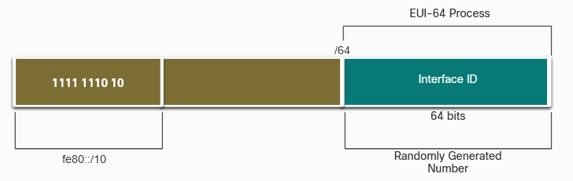

### Dynamic LLAs on Windows 
Operating systems, such as Windows, will typically use the same method for both a SLAAC-created GUA and a dynamically assigned LLA.

**EUI-64 Generated Interface ID**

    C:\> ipconfig
    Windows IP Configuration
    Ethernet adapter Local Area Connection:
    Connection-specific DNS Suffix . :
    IPv6 Address. . . . . . . . . . . : 2001:db8:acad:1:
    -> fc99:47
    ff:fe
    -> 75:cee0
    Link-local IPv6 Address . . . . . : fe80::
    -> fc99:47
    ff:fe
    -> 75:cee0
    Default Gateway . . . . . . . . . : fe80::1
    C:\>

**Random 64-Bit Generated Interface ID**

    C:\> ipconfig
    Windows IP Configuration
    Ethernet adapter Local Area Connection:
    Connection-specific DNS Suffix  . :
    IPv6 Address. . . . . . . . . . . : 2001:db8:acad:1:
    Link-local IPv6 Address . . . . . : fe80::
    Default Gateway . . . . . . . . . : fe80::1
    C:\>

### Dynamic LLAs on Cisco Routers 
Cisco routers automatically create an IPv6 LLA whenever a GUA is assigned to the interface. By default, Cisco IOS routers use EUI-64 to generate the interface ID for all LLAs on IPv6 interfaces. For serial interfaces, the router will use the MAC address of an Ethernet interface. LLA must be unique only on that link or network.

To make it easier to recognize and remember these addresses on routers, it is common to statically configure IPv6 LLAs on routers.

**IPv6 LLA Using EUI-64 on Router R1**

    R1# show interface gigabitEthernet 0/0/0
    GigabitEthernet0/0/0 is up, line protocol is up
    Hardware is ISR4221-2x1GE, address is 
    -> 7079.b392.3640
    (bia 7079.b392.3640)
    (Output omitted)
    R1# show ipv6 interface brief
    GigabitEthernet0/0/0   [up/up]
        FE80::
    -> 7279:B3
    FF:FE
    -> 92:3640
        2001:DB8:ACAD:1::1
    GigabitEthernet0/0/1   [up/up]
        FE80::
    -> 7279:B3
    FF:FE
    -> 92:3641
        2001:DB8:ACAD:2::1
    Serial0/1/0            [up/up]
        FE80::
    -> 7279:B3
    FF:FE
    -> 92:3640
        2001:DB8:ACAD:3::1
    Serial0/1/1            [down/down]
        unassigned
    R1#

## Verify IPv6 Address Configuration 
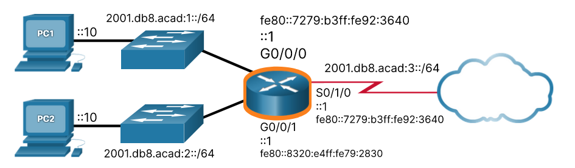

### **show ipv6 interface brief**
Displays the IPv6 address of the Ethernet interfaces. EUI-64 uses this MAC address to generate the interface ID for the LLA. Additionally, the show ipv6 interface brief command displays abbreviated output for each of the interfaces. 

The [up/up] output on the same line as the interface indicates the Layer 1/Layer 2 interface state. This is the same as the Status and Protocol columns in the equivalent IPv4 command.
              
Each interface has two IPv6 addresses. The second address for each interface is the GUA that was configured. The first address, the one that begins with fe80, is the link-local unicast address for the interface. Recall that the LLA is automatically added to the interface when a GUA is assigned.

Also, notice that the R1 Serial 0/1/0 LLA is the same as its GigabitEthernet 0/0/0 interface. Serial interfaces do not have Ethernet MAC addresses, so Cisco IOS uses the MAC address of the first available Ethernet interface. This is possible because link-local interfaces only have to be unique on that link.

**The show ipv6 interface brief Command on R1**

    R1# show ipv6 interface brief
    GigabitEthernet0/0/0   [up/up]
        FE80::1:1
        2001:DB8:ACAD:1::1
    GigabitEthernet0/0/1   [up/up]
        FE80::1:2
        2001:DB8:ACAD:2::1
    Serial0/1/0            [up/up]
        FE80::1:3
        2001:DB8:ACAD:3::1
    Serial0/1/1            [down/down]
    unassigned
    R1#

              
### **show ipv6 route**
Can be used to verify that IPv6 networks and specific IPv6 interface addresses have been installed in the IPv6 routing table. The show ipv6 route command will only display IPv6 networks, not IPv4 networks.

Within the route table, a C next to a route indicates that this is a directly connected network. When the router interface is configured with a GUA and is in the “up/up” state, the IPv6 prefix and prefix length is added to the IPv6 routing table as a connected route.

Note: The L indicates a local route, the specific IPv6 address assigned to the interface. This is not an LLA. LLAs are not included in the routing table of the router because they are not routable addresses.

    R1# show ipv6 route
    IPv6 Routing Table - default - 7 entries
    Codes: C - Connected, L - Local, S - Static, U - Per-user Static route
    
    C   2001:DB8:ACAD:1::/64 [0/0]
        via GigabitEthernet0/0/0, directly connected
    L   2001:DB8:ACAD:1::1/128 [0/0]
        via GigabitEthernet0/0/0, receive
    C   2001:DB8:ACAD:2::/64 [0/0]
        via GigabitEthernet0/0/1, directly connected
    L   2001:DB8:ACAD:2::1/128 [0/0]
        via GigabitEthernet0/0/1, receive
    C   2001:DB8:ACAD:3::/64 [0/0]
        via Serial0/1/0, directly connected
    L   2001:DB8:ACAD:3::1/128 [0/0]
        via Serial0/1/0, receive
    L   FF00::/8 [0/0]
        via Null0, receive
    R1#

                
### **ping** 
Is identical to the command used with IPv4, except that an IPv6 address is used. As shown in the example, the command is used to verify Layer 3 connectivity between R1 and PC1. When pinging an LLA from a router, Cisco IOS will prompt the user for the exit interface. Because the destination LLA can be on one or more of its links or networks, the router needs to know which interface to send the ping to.

The ping Command on R1
            
    R1# ping 2001:db8:acad:1::10
    Type escape sequence to abort.
    Sending 5, 100-byte ICMP Echos to 2001:DB8:ACAD:1::10, timeout is 2 seconds:
    !!!!!
    Success rate is 100 percent (5/5), round-trip min/avg/max = 1/1/1 ms
    R1#

                
# IPv6 Multicast Addresses
## Assigned IPv6 Multicast Addresses 
IPv6 multicast addresses are similar to IPv4 multicast addresses. Multicast address is used to send a single packet to one or more destinations (multicast group). IPv6 multicast addresses have the prefix ff00::/8.

Note: Multicast addresses can only be destination addresses and not source addresses.

There are two types of IPv6 multicast addresses:

- Well-known multicast addresses
- Solicited-node multicast addresses

### Well-Known IPv6 Multicast Addresses 
Well-known IPv6 multicast addresses are assigned and are reserved for predefined groups of devices. Assigned multicast addresses are used in context with specific protocols such as DHCPv6.

These are two common IPv6 assigned multicast groups:

- **ff02::1 All-nodes multicast group** - Multicast group that all IPv6-enabled devices join. 

    A packet sent to this group is received and processed by all IPv6 interfaces on the link or network. An IPv6 router sends ICMPv6 RA messages to the all-node multicast group.
- **ff02::2 All-routers multicast group** - Multicast group that all IPv6 routers join. A router becomes a member of this group when it is enabled as an IPv6 router with the ipv6 unicast-routing global configuration command. A packet sent to this group is received and processed by all IPv6 routers on the link or network.

**IPv6 All-Nodes Multicast: RA Message**
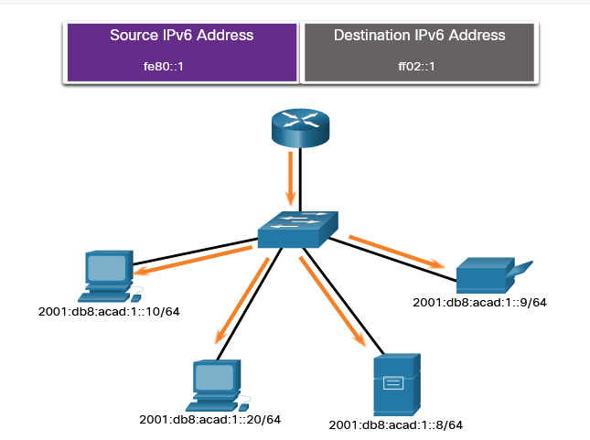

IPv6-enabled devices send ICMPv6 RS messages to the all-routers multicast address. The RS message requests an RA message from the IPv6 router to assist the device in its address configuration. 

### Solicited-Node IPv6 Multicast Addresses 
The advantage of a solicited-node multicast address is that it is mapped to a special Ethernet multicast address. This allows the Ethernet NIC to filter the frame by examining the destination MAC address without sending it to the IPv6 process to see if the device is the intended target of the IPv6 packet.

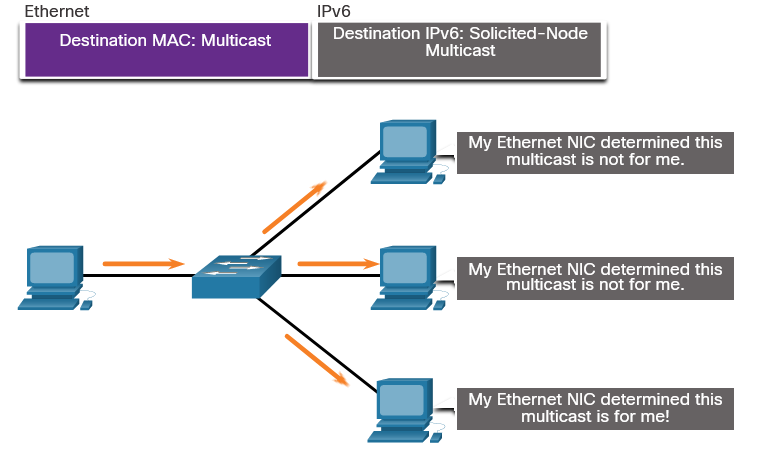
