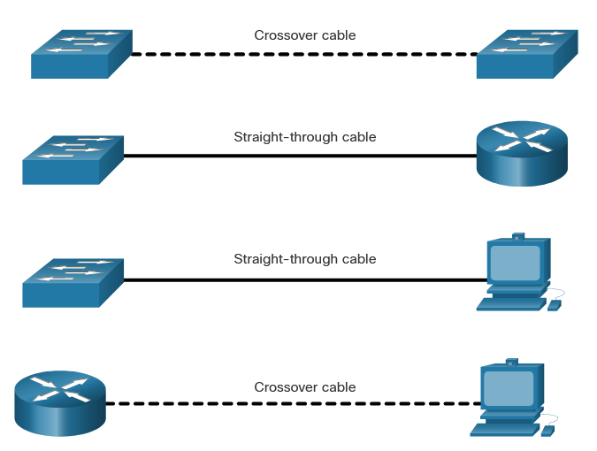

# Cisco Switches and Routers

# Cisco Switches
A general rule is that the higher the device is in the OSI model, the more intelligent it is. What this means is that a higher level device can better analyze the data traffic and forward it based on information not available at lower layers. As an example, a Layer 2 switch can filter the data and send it only out of the port that is connected to the destination, based on the MAC address.

LAN switches provide connectivity within the local-area networks of the organization, while routers interconnect local networks and are needed in a wide area network (WAN) environment. In other words, a switch is used to connect devices on the same network. A router is used to connect multiple networks to each other.

 Firewalls guard against network threats and provide security, network control, and containment.

## Cisco LAN Switches 
A switch can provide connectivity at the access layer of a network, connecting devices to a LAN.

When choosing a switch, there are a number of factors to consider, including the following:

- **Type of ports**

     Choosing the appropriate number and type of ports is critical. Most lower-cost switches support only copper twisted-pair interface ports. Higher priced switches may have fiber-optic connections. 

- **Speed required**

    Ethernet twisted-pair interfaces on a switch have defined speeds. A 10/100 Ethernet port can only function at either 10 megabits per second (Mbps), or at 100 Mbps. 

    If your internet connection is more than 100 Mbps, then a gigabit port is necessary to take advantage of the higher internet bandwidth. Gigabit Ethernet ports will also operate at 10/100 Mbps. Gigabit Ethernet is sometimes represented as 1000 Mbps.

    Similar to a switch port, Ethernet NICs operate at specific bandwidths such as 10/100 or 10/100/1000 Mbps. The actual bandwidth of the attached device will be the highest common bandwidth between the NIC on the device and the switch port.

- **Expandability**

    Fixed configurations have a specific type and number of ports or interfaces. Modular devices have expansion slots that provide the flexibility to add new modules as required. 

- **Manageability**

    A managed switch that uses a Cisco operating system enables control over individual ports or over the switch as a whole.

## LAN Switch Components 
The Cisco Catalyst 9300 switch shown in the figure is suitable for small and medium-sized networks. It provides 24 1 Gbps data ports with Power over Ethernet (PoE) so that some device types can be directly powered from the switch. It also has two modular 40 Gbps uplink ports. The LEDs indicate the port and system status of the switch. The switch is equipped with a console and storage ports for device management.

**Cisco Catalyst 9300 24 UPOE Switch**

# Switch Speeds and Forwarding Methods

## Frame Forwarding Methods on Cisco Switches
Switches use their MAC address tables to determine which port to use to forward frames. With Cisco switches, there are  two frame forwarding methods.

Switches use one of the following forwarding methods for switching data between network ports:

- **Store-and-forward switching** - This frame forwarding method receives the entire frame and computes the CRC. CRC uses a mathematical formula, based on the number of bits (1s) in the frame, to determine whether the received frame has an error. If the CRC is valid, the switch looks up the destination address, which determines the outgoing interface. Then the frame is forwarded out of the correct port.
- **Cut-through switching** - This frame forwarding method forwards the frame before it is entirely received. At a minimum, the destination address of the frame must be read before the frame can be forwarded.

A big advantage of store-and-forward switching is that it determines if a frame has errors before propagating the frame. When an error is detected in a frame, the switch discards the frame. Discarding frames with errors reduces the amount of bandwidth consumed by corrupt data.

### Cut-Through Switching 
In cut-through switching, the switch acts upon the data as soon as it is received, even if the transmission is not complete. The switch buffers just enough of the frame to read the destination MAC address so that it can determine to which port it should forward out the data. The destination MAC address is located in the first 6 bytes of the frame following the preamble. The switch looks up the destination MAC address in its switching table, determines the outgoing interface port, and forwards the frame onto its destination through the designated switch port. The switch does not perform any error checking on the frame.

There are two variants of **cut-through switching**:

- **Fast-forward switching** - Offers the lowest level of latency. Fast-forward switching immediately forwards a packet after reading the destination address. The NIC discards the faulty packet upon receipt. 
- **Fragment-free switching** - The switch stores the first 64 bytes of the frame before forwarding. The reason fragment-free switching stores only the first 64 bytes of the frame is that most network errors and collisions occur during the first 64 bytes. Fragment-free switching tries to enhance fast-forward switching by performing a small error check on the first 64 bytes of the frame to ensure that a collision has not occurred before forwarding the frame. 

### Memory Buffering on Switches 
An Ethernet switch may use a buffering technique to store frames before forwarding them. Buffering may also be used when the destination port is busy because of congestion. The switch stores the frame until it can be transmitted.

As shown in the table, there are two methods of memory buffering:
| Method                | Description|
|-----------------------|-------|
| Port-based memory     | Frames are stored in queues that are linked to specific incoming and outgoing ports. A frame is transmitted to the outgoing port only when all the frames ahead in the queue have been successfully transmitted. It is possible for a single frame to delay the transmission of all the frames in memory because of a busy destination port. This delay occurs even if the other frames could be transmitted to open destination ports.
| Shared memory         | Deposits all frames into a common memory buffer shared by all switch ports, and the amount of buffer memory required by a port is dynamically allocated. The frames in the buffer are dynamically linked to the destination port, enabling a packet to be received on one port and then transmitted on another port, without moving it to a different queue.

> Shared memory buffering also results in the ability to store larger frames with potentially fewer dropped frames.

## Duplex and Speed Settings 
Two of the most basic settings on a switch are the bandwidth (sometimes referred to as “speed”) and duplex settings for each individual switch port. It is critical that the duplex and bandwidth settings match between the switch port and the connected devices, such as a computer or another switch.

There are two types of duplex settings used for communications on an Ethernet network:

- **Full-duplex** - Both ends of the connection can send and receive simultaneously.
- **Half-duplex** - Only one end of the connection can send at a time.

Autonegotiation is an optional function found on most Ethernet switches and NICs. It enables two devices to automatically negotiate the best speed and duplex capabilities. Full-duplex is chosen if both devices have the capability along with their highest common bandwidth.

> Note: Most Cisco switches and Ethernet NICs default to autonegotiation for speed and duplex. Gigabit Ethernet ports only operate in full-duplex.

Duplex mismatch is one of the most common causes of performance issues on 10/100 Mbps Ethernet links. It occurs when one port on the link operates at half-duplex while the other port operates at full-duplex.

## Auto-MDIX 
Connections between devices once required the use of either a crossover or straight-through cable. The type of cable required depended on the type of interconnecting devices.

> Note: A direct connection between a router and a host requires a cross-over connection.

Most switch devices now support the automatic medium-dependent interface crossover (auto-MDIX) feature. When enabled, the switch automatically detects the type of cable attached to the port and configures the interfaces accordingly.

The auto-MDIX feature is enabled by default on switches running Cisco IOS Release 12.2(18)SE or later.

Auto-MDIX can be re-enabled using the **mdix auto**

## Switch Boot Process
The three basic steps for powering up a switch are as follows:

- Step 1. Check the components.
- Step 2. Connect the cables to the switch.
- Step 3. Power up the switch.

When the switch is on, the **power-on self-test (POST)** begins. During POST, the LEDs blink while a series of tests determine that the switch is functioning properly.

POST is completed when the SYST LED rapidly blinks green. If the switch fails POST, the SYST LED turns amber. When a switch fails POST, it is necessary to return the switch for repairs.

When all startup procedures are finished, the Cisco switch is ready to configure.

##  IOS Startup Files 
Cisco device loads the following two files into RAM when it is booted:

- **IOS image file** - The IOS facilitates the basic operation of the device’s hardware components. The IOS image file is stored in flash memory.
- **Startup configuration file** - The startup configuration file contains commands that are used to initially configure a router and switch and create the running configuration file stored in RAM. The startup configuration file is stored in NVRAM. All configuration changes are stored in the running configuration file and are implemented immediately by the IOS.

The running configuration file is modified when the network administrator performs device configuration. When changes are made to the running-config file, it should be saved to NVRAM as the startup configuration file in case the router is restarted or loses power.

# Cisco Routers
Routers also require the following:

- Operating system (OS)
- Central processing unit (CPU)
- Random-access memory (RAM)
- Read-only memory (ROM)
- Nonvolatile random-access memory (NVRAM)

The CPU requires an OS to provide routing and switching functions. **The Cisco Internetwork Operating System (IOS)** is the system software used for most Cisco devices

## Router Interface Ports 
Avery Cisco router has the same general hardware components.

The figure shows a Cisco 4321 Integrated Services Router (ISR). The router includes the following connections:

- **Console ports** - Two console ports for the initial configuration and command-line interface (CLI) management access using a regular RJ-45 port and a USB Type-B (mini-B USB) connector.
- **Two LAN interfaces** - Two Gigabit Ethernet interfaces for LAN access labeled GE 0/0/0 and GE 0/0/1. The GE 0/0/0 port can be accessed through an RJ-45 connection or by using a small form-factor pluggable (SFP) attachment to provide a fiber-optics connection.
- **Network Interface Modules (NIMs)** - Two NIM expansion slots that provide modularity and flexibility by enabling the router to support different types of interface modules, including serial, digital subscriber line (DSL), switch ports, and wireless.

The Cisco 4321 ISR also has a USB port, a management interface, and an auxiliary port. The USB port can be use for file transfers. The management port can be used for remote management access when the two Gigabit Ethernet interfaces are unavailable. The auxiliary port provides legacy support for a method for connecting a dial-up modem to the router for remote access. The auxiliary port is rarely used in networks today.

##  Router Boot Process
1. Mount the device
2. Ground the device
3. Connect power cable
4. Connect a console cable
5. Power up
6. Observe the startup messages on the laptop as the router boots up.

**Router Bootup Messages**

    Located isr4200-universalk9_ias.16.09.04.SPA.bin
    #################################################....
    (output omitted)
    
    Package header rev 3 structure detected
    IsoSize = 486723584
    Calculating SHA-1 hash...Validate package: SHA-1 hash:
            calculated 4155409B:CC0DB23E:6D72A6AE:EA887F82:AC94DC6A
            expected   4155409B:CC0DB23E:6D72A6AE:EA887F82:AC94DC6A
    RSA Signed RELEASE Image Signature Verification Successful.
    Image validated
    
                Restricted Rights Legend
    
    Use, duplication, or disclosure by the Government is
    subject to restrictions as set forth in subparagraph
    (c) of the Commercial Computer Software - Restricted
    Rights clause at FAR sec. 52.227-19 and subparagraph
    (c) (1) (ii) of the Rights in Technical Data and Computer
    Software clause at DFARS sec. 252.227-7013.
    
            Cisco Systems, Inc.
            170 West Tasman Drive
            San Jose, California 95134-1706
    
    
    
    Cisco IOS Software [Fuji], ISR Software (X86_64_LINUX_IOSD-UNIVERSALK9_IAS-M), Version 16.9.4, RELEASE
    SOFTWARE (fc2)
    Technical Support: http://www.cisco.com/techsupport
    Copyright (c) 1986-2019 by Cisco Systems, Inc.
    Compiled Thu 22-Aug-19 18:09 by mcpre
    
    (output omitted)

## Management Ports 
There are several ways to access the command line interface on a Cisco router. The most common methods are as follows:

- **Console** - Uses a low speed serial or USB connection to provide direct connect, out-of-band management access to a Cisco device.
- **SSH** - Method for remotely accessing a CLI session across an active network interface, including the management interface.
- **AUX port** - Used for remote management of the router using a dial-up telephone line and modem.

The console port is a physical port located on the router. When using SSH, there must be an active network interface that is configured with a valid IP address for the network. This can be one of the active network interfaces used for network traffic or it can be the management interface.

**Management Configuration Access**

Routers also have network interfaces to receive and forward IP packets. Most routers have multiple interfaces that are used to connect to multiple networks. Typically, the interfaces connect to various types of networks.

**LAN and WAN Interfaces**

