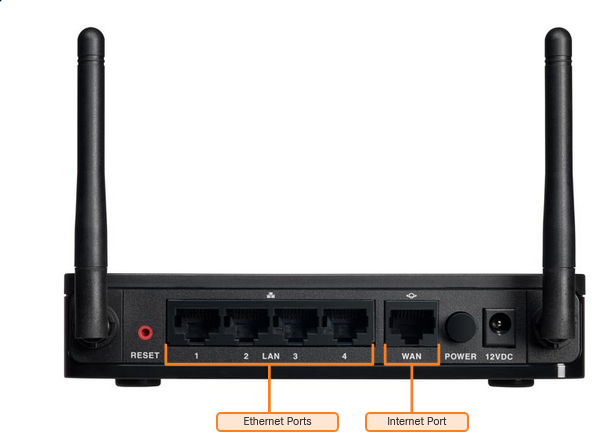

# HOME NETWORK

## COMPONENTS OF HOME NETWORK
- End devices -> Scanners, PCs, Tablets ...
- Intermediate devices -> Router, Hub, Switch ...

## TYPICAL HOME NETWORK ROUTERS

**ETHERNET PORTS**
-   These ports connect to the internal switch portion of the router. These ports are usually labeled “Ethernet” or “LAN”

**INTERNET PORT**
-   This port is used to connect the device to another network. The internet port connects the router to a different network than the Ethernet ports. This port is often used to connect to the cable or DSL modem in order to access the internet.

In addition to the wired ports, many home routers include a radio antenna and a built-in wireless access point. By default, the wireless devices are on the same local network as the devices that are physically plugged into the LAN switch ports. The internet port is the only port that is on a different network in the default configuration.

## LAN WIRELESS FREQUENCIES
The wireless technologies most frequently used in home networks are in the unlicensed 2.4 GHz and 5 GHz frequency ranges.

- **BLUETOOTH**
    -   2.4 GHz
    -   Low speed, short range
    -   Can comunicate with multiple devices at the same time
    -   One to many comunication type

Other technologies that use the 2.4 GHz and 5 GHz bands are the modern wireless LAN technologies that conform to the various **IEEE 802.11** standards. Unlike Bluetooth technology, 802.11 devices transmit at a much higher power level giving them a great range and improved throughput. 

### Wired Network Technologies 
The most commonly implemented wired protocol is the **Ethernet protocol**. Ethernet uses a suite of protocols that allow network devices to communicate over a wired LAN connection. An Ethernet LAN can connect devices using many different types of wiring media.

#### Cable types
- Category 5e cable with RJ45 connector
- Coaxial cable
- Fiber-Optic cable with ST, SC, LT connectors ....

## Wireless Standards
A number of standards have been developed to ensure that wireless devices can communicate. They specify the RF spectrum used, data rates, how the information is transmitted, and more. The main organization responsible for the creation of wireless technical standards is the **Institute of Electrical and Electronics Engineers (IEEE)**.

- The IEEE 802.11 - governs the WLAN environment.
- Wi-Fi Alliance - responsible for testing wireless LAN devices from different manufacturers.

### Wireless Settings 
Wireless routers using the 802.11 standards have multiple settings that have to be configured. These settings include the following:

- Network mode - Determines the type of technology that must be supported. For example, 802.11b, 802.11g, 802.11n or Mixed Mode.
- Network Name (SSID) - Used to identify the WLAN. All devices that wish to participate in the WLAN must have the same SSID.
- Standard Channel - Specifies the channel over which communication will occur. By default, this is set to Auto to allow the access point (AP) to determine the optimum channel to use.
- SSID Broadcast - Determines if the SSID will be broadcast to all devices within range. By default, set to Enabled.

Note: SSID stands for **Service Set Identifier**.

The 802.11 protocol can provide increased throughput based on the wireless network environment. If all wireless devices connect with the same 802.11 standard, maximum speeds can be obtained for that standard. If the access point is configured to accept only one 802.11 standard, devices that do not use that standard cannot connect to the access point. A mixed mode wireless network environment can include devices that use any of the existing Wi-Fi standards.

When building a wireless network, it is important that the wireless components connect to the appropriate WLAN. This is done using the SSID. The SSID is used to tell wireless devices, called STAs, which WLAN they belong to and with which other devices they can communicate. The SSID broadcast allows other devices and wireless clients to automatically discover the name of the wireless network. When the SSID broadcast is disabled, you must manually enter the SSID on wireless devices.