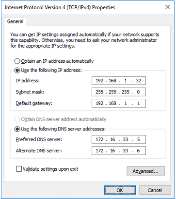
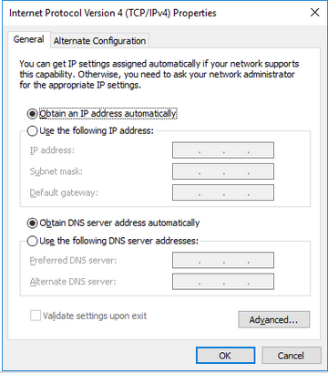
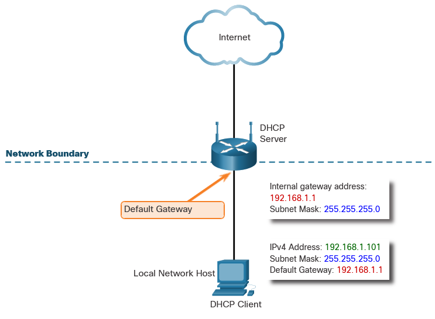
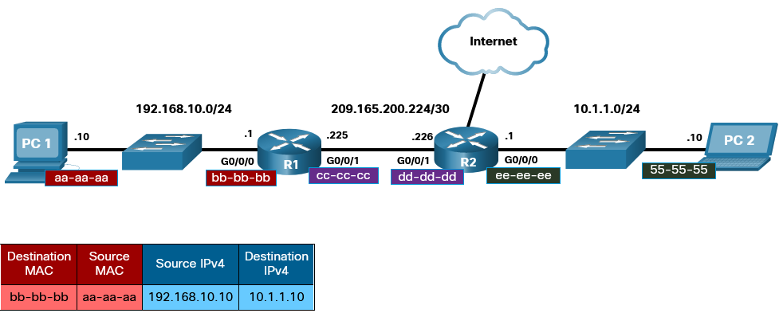
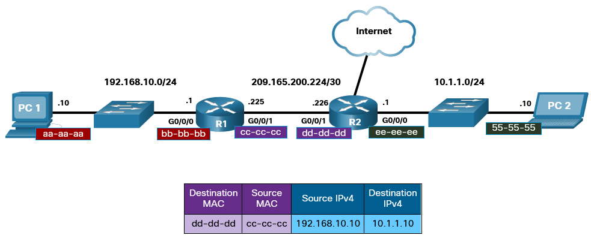
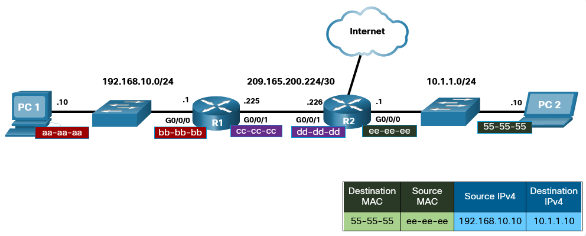

# Dynamic Addressing with DHCP

## Static and Dynamic Addressing
IPv4 addresses can be assigned either statically or dynamically.

### Static IPv4 Address Assignment 

With a static assignment, the network administrator must manually configure the network information for a host. At a minimum, this includes the following:

 - IP address - This identifies the host on the network.
 - Subnet mask - This is used to identify the network on which the host is connected.
 - Default gateway - This identifies the networking device that the host uses to access the internet or another remote network. 

Static assignment of addressing information can provide increased control of network resources, but it can be time consuming to enter the information on each host. 

### Dynamic IPv4 Address Assignment 
Rather than have the network administrator assign IPv4 addresses for each device, it is easier to have IPv4 addresses assigned automatically. This is done using a protocol known as **Dynamic Host Configuration Protocol (DHCP)**.

DHCP automatically assigns addressing information such as IPv4 address, subnet mask, default gateway, and other configuration information.

Another benefit of DHCP is that an address is not permanently assigned to a host but is only leased for a period of time. If the host is powered down or taken off the network, the address is returned to the pool for reuse. This is especially helpful with mobile users that come and go on a network.

## DHCP Servers and DHCPv4 Configuration
The DHCP server is configured with a range, or pool, of IPv4 addresses that can be assigned to DHCP clients. 

1. A client that needs an IPv4 address will send a **DHCP Discover message** which is a broadcast with a destination IPv4 address of 255.255.255.255 (32 ones) and a destination MAC address of FF-FF-FF-FF-FF-FF (48 ones). 
2. All hosts on the network will receive this broadcast **DHCP frame**, but only a DHCP server will reply. 
3. The server will respond with a **DHCP Offer**, suggesting an IPv4 address for the client. 
4. The host then sends a **DHCP Request** asking to use the suggested IPv4 address. 
5. The server responds with a **DHCP Acknowledgment**.

For most home and small business networks, a wireless router provides DHCP services to the local network clients. To configure a home wireless router, access its graphical web interface by opening the browser and entering the router default IPv4 address. The IPv4 address of 192.168.0.1 and subnet mask of 255.255.255.0 are the defaults for the internal router interface. This is the default gateway for all hosts on the local network and also the internal DHCP server IPv4 address. Most home wireless routers have DHCP Server enabled by default.

Various types of devices can be DHCP servers as long as they are running DHCP service software. With most medium to large networks, the DHCP server is usually a local dedicated PC-based server.

With home networks, the DHCP server may be located at the ISP and a host on the home network receives its IPv4 configuration directly from the ISP.

# Network boundaries - Gateway
Gateways are a way for a trafic to leave network and enter another.

## Routers as Gateways 
The router provides a gateway through which hosts on one network can communicate with hosts on different networks. Each interface on a router is connected to a separate network.

The IPv4 address assigned to the interface identifies which local network is connected directly to it.

Every host on a network must use the router as a gateway to other networks. Therefore, each host must know the IPv4 address of the router interface connected to the network where the host is attached. This address is known as the default gateway address. It can be either statically configured on the host or received dynamically by DHCP.

When a wireless router is configured to be a DHCP server for the local network, it automatically sends the correct interface IPv4 address to the hosts as the default gateway address. In this manner, all hosts on the network can use that IPv4 address to forward messages to hosts located at the ISP and get access to hosts on the internet. Wireless routers are usually set to be DHCP servers by default.

The IPv4 address of that local router interface becomes the default gateway address for the host configuration. The default gateway is provided, either statically or by DHCP.

When a wireless router is configured as a DHCP server, it provides its own internal IPv4 address as the default gateway to DHCP clients. It also provides them with their respective IPv4 address and subnet mask.

###  Routers as Boundaries Between Networks 
The wireless router acts as a DHCP server for all local hosts attached to it, either by Ethernet cable or wirelessly. These local hosts are referred to as being located on an internal, or inside, network. When a wireless router is connected to the ISP, it acts like a DHCP client to receive the correct external network IPv4 address for the internet interface. ISPs usually provide an internet-routable address, which enables hosts connected to the wireless router to have access to the internet. The wireless router serves as the boundary between the local internal network and the external internet.

### NAT - Network Addressed Translation
**Network Address Translation (NAT)** is a service that operates on a router or edge platform to connect private networks to public networks like the internet. NAT is often implemented at the WAN edge router to enable internet access in core, campus, branch, and colocation sites.

With NAT, an organization needs one IP address or one limited public IP address to represent an entire group of devices as they connect outside their network. Port Address Translation (PAT) enables one single IP to be shared by multiple hosts using IP and port address translation.

The wireless router receives a public address from the ISP, which allows it to send and receive packets on the internet. It, in turn, provides private addresses to local network clients.

The process used to convert private addresses to internet-routable addresses is called NAT. With NAT, a private (local) source IPv4 address is translated to a public (global) address. The process is reversed for incoming packets. The wireless router is able to translate many internal IPv4 addresses to the same public address, by using NAT.

Only packets destined for other networks need to be translated. These packets must pass through the gateway, where the wireless router replaces the private IPv4 address of the source host with its own public IPv4 address.

# MAC and IP

## Destination on Same Network 
TO send a message to other hosts/clients the sender needs to know the MAC adress in order to comunicate on network, this is done via the ARP (Address Resolution Protocol)

There are two primary addresses assigned to a device on an Ethernet LAN:

- **Physical address (the MAC address)** – Used for NIC-to-NIC communications on the same Ethernet network.
- **Logical address (the IP address)** – Used to send the packet from the source device to the destination device. The destination IP address may be on the same IP network as the source, or it may be on a remote network.

**Layer 2 physical addresses** (i.e., Ethernet MAC addresses) are used to deliver the data link frame with the encapsulated IP packet from one NIC to another NIC that is on the same network. If the destination IP address is on the same network, the destination MAC address will be that of the destination device.

## Destination on Remote Network 
When the destination IP address (IPv4 or IPv6) is on a remote network, the destination MAC address will be the address of the host default gateway (i.e., the router interface).

Routers examine the destination IPv4 address to determine the best path to forward the IPv4 packet. When the router receives the Ethernet frame, it de-encapsulates the Layer 2 information. Using the destination IPv4 address, it determines the next-hop device, and then encapsulates the IPv4 packet in a new data link frame for the outgoing interface. Along each link in a path, an IP packet is encapsulated in a frame. The frame is specific to the data link technology that is associated with that link, such as Ethernet. If the next-hop device is the final destination, the destination MAC address will be that of the device Ethernet NIC. 

> PC1 sends a message to PC2, the message is send to the router, which gets send to second router and it travels until it hits PC2

# Broadcast Containment

## Broadcast Domains 
When a host receives a message addressed to the broadcast address, it accepts and processes the message as though the message was addressed directly to it. When a host sends a broadcast message, switches forward the message to every connected host within the same local network. For this reason, a local area network, a network with one or more Ethernet switches, is also referred to as a broadcast domain.

Too many hosts connected to the same broadcast domain slow down the network, in this case network is divided into multiple networks, or broadcast domains.
Routers are used to divide the network into multiple broadcast domains.

## Access Layer Communication 
On a local Ethernet network, a NIC only accepts a frame if the destination address is either the broadcast MAC address, or else corresponds to the MAC address of the NIC.

Most network applications, however, rely on the logical destination IP address to identify the location of the servers and clients. 

The sending host can use an IPv4 protocol called address resolution protocol **(ARP)** to discover the MAC address of any host on the same local network. IPv6 uses a similar method known as **Neighbor Discovery**.

## ARP
ARP uses a three-step process to discover and store the MAC address of a host on the local network when only the IPv4 address of the host is known:

1. The sending host creates and sends a frame addressed to a broadcast MAC address. Contained in the frame is a message with the IPv4 address of the intended destination host.
2. Each host on the network receives the broadcast frame and compares the IPv4 address inside the message with its configured IPv4 address. The host with the matching IPv4 address sends its MAC address back to the original sending host.
3. The sending host receives the message and stores the MAC address and IPv4 address information in a table called an ARP table. 

IPv6 uses a similar method known as Neighbor Discovery. 