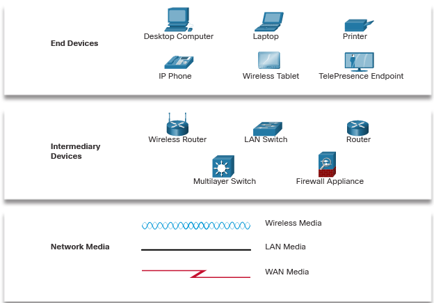
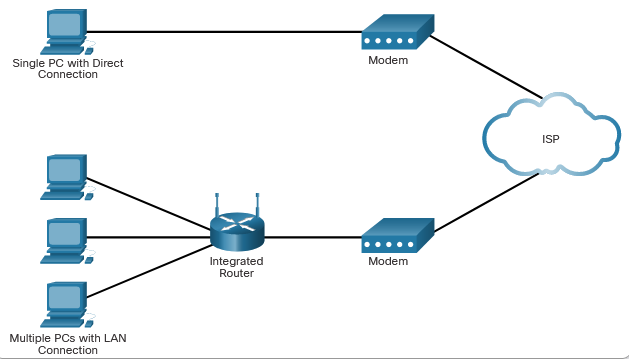

# NETWORK COMPONENTS, TYPES AND CONNECTIONS

## CLIENTS AND SERVERS

### Client and Server Roles
- All computers connected to a network that participate directly in network communication are classified as hosts.

- Hosts can send and receive messages on the network.
- Hosts can serve as Client, Server or Both.

### Peer-to-Peer Networks
- One computer can be both Server and Client at the same time. In small businesses and homes, many PCs function as the servers and clients on the network => **Peer-to-Peer (P2P) Network**

- The simplest type of **P2P** Network consists of two connected computers using either a wired or wireless connection.

- Multiple PCs can be connected to form larger P2P Network using **Switches**

- Main disadvantage of P2P is the performance of a host can be slowed down if it is acting as both a client and server at the same time.

The advantages of peer-to-peer networking:

    - Easy to set up
    - Less complex
    - Lower cost because network devices and dedicated servers may not be required
    - Can be used for simple tasks such as transferring files and sharing printers

The disadvantages of peer-to-peer networking:

    - No centralized administration
    - Not as secure
    - Not scalable
    - All devices may act as both clients and servers which can slow their performance

### Peer-to-Peer Applications
A P2P application allows a device to act as both a client and a server within the same communication. In this model, every client is a server and every server is a client. P2P applications require that each end device provide a user interface and run a background service.

Some P2P applications use a hybrid system where resource sharing is decentralized, but the indexes that point to resource locations are stored in a centralized directory. In a hybrid system, each peer accesses an index server to get the location of a resource stored on another peer.

### Multiple Roles in the Network
A computer with server software can provide services simultaneously to one or many clients.

# NETWORK COMPONENTS
## NETWORK INFRASTRUCTURE
A computer with server software can provide services simultaneously to one or many clients

## END DEVICES
- Also known as hosts
    - PCs
    - Network printers
    - Telephones and teleconferencing equipment
    - Security cameras
    - Mobile devices
- And end device (or host) is either the source or destination of message transmited over the network
    

# ISP CONECTIVITY OPTIONS
## ISP SERVICES
An Internet Service Provider (ISP) provides the link between the home network and the internet. An ISP can be the local cable provider, a landline telephone service provider, the cellular network that provides your smartphone service, or an independent provider who leases bandwidth on the physical network infrastructure of another company.

Each ISP connects to other ISPs to form a network.

## ISP CONNECTIONS
The top portion of the figure displays the simplest ISP connection option. It consists of a modem that provides a direct connection between a computer and the ISP. This option should not be used though, because your computer is not protected on the internet.

As shown in the bottom portion of the figure, a router is required to securely connect a computer to an ISP. This is the most common connection option. It consists of using a wireless integrated router to connect to the ISP. The router includes a switch to connect wired hosts and a wireless AP to connect wireless hosts. The router also provides client IP addressing information and security for inside hosts.

## CABLE AND DSL CONNECTIONS
Most home network users do not connect to their service providers with fiber-optic cables.

The two most common methods are as follows:
- **Cable** 
    - Typically offered by cable television service providers, the internet data signal is carried on the same coaxial cable that delivers cable television. It provides a high bandwidth, always on, connection to the internet. A special cable modem separates the internet data signal from the other signals carried on the cable and provides an Ethernet connection to a host computer or LAN.
- **DSL** 
    - Digital Subscriber Line provides a high bandwidth, always on, connection to the internet. It requires a special high-speed modem that separates the DSL signal from the telephone signal and provides an Ethernet connection to a host computer or LAN. 
    - DSL runs over a telephone line, with the line split into three channels. One channel is used for voice telephone calls. This channel allows an individual to receive phone calls without disconnecting from the internet. A second channel is a faster download channel, used to receive information from the internet. The third channel is used for sending or uploading information. This channel is usually slightly slower than the download channel. The quality and speed of the DSL connection depends mainly on the quality of the phone line and the distance from the central office of your phone company The farther you are from the central office, the slower the connection.

    ## ADDITIONAL CONNECTIVITY OPTIONS
    Other ISP connection options for home users include the following: 
    - Cellular
    - Satellite
    - Dial-up Telephone

    