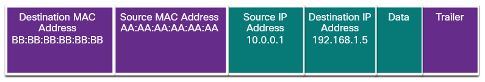
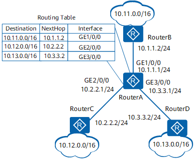
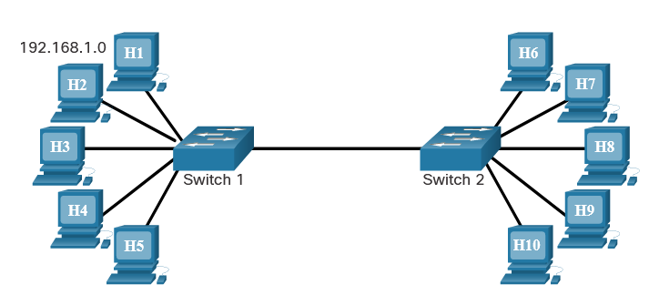
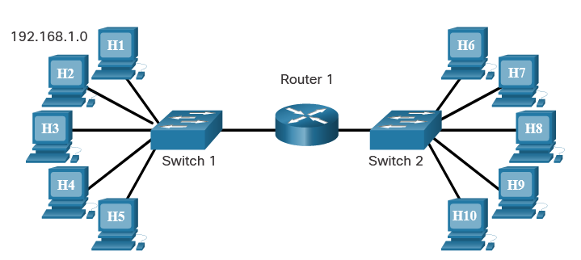

# Routing
Routing is the process of identifying the best path to a destination.

As networks grow, it is often necessary to divide one access layer network into multiple access layer networks. There are many ways to divide networks based on different criteria:

- Broadcast containment - Routers in the distribution layer can limit broadcasts to the local network where they need to be heard.
- Security requirements - Routers in the distribution layer can separate and protect certain groups of computers where confidential information resides.
- Physical locations - Routers in the distribution layer can be used to interconnect local networks at various locations of an organization that are geographically separated.
- Logical grouping - Routers in the distribution layer can be used to logically group users, such as departments within a company, who have common needs or for access to resources.

## The need for routing
In most situations we want our devices to be able to connect beyond our local network.

- **Remote hosts** - Devices that are beyond the local network segment 

The distribution layer connects these independent local networks and controls the traffic flowing between them. It is responsible for ensuring that traffic between hosts on the local network stays local.

A router is a networking device that connects multiple Layer 3, IP networks. At the distribution layer of the network, routers direct traffic and perform other functions critical to efficient network operation. Routers, like switches, are able to decode and read the messages that are sent to them. Unlike switches, which make their forwarding decision based on the Layer 2 MAC address, routers make their forwarding decision based on the Layer 3 IP address.

Anytime the network portion of the IP addresses of the source and destination hosts do not match, a router must be used to forward the message. 

**IP Packet Encapsulated in an Ethernet Frame**

## Routing table
Every router contains a table of all locally connected networks and the interfaces that connect to them.

When a router receives a frame, it decodes the frame to get to the packet containing the destination IP address. It matches the network portion of the destination IP address to the networks that are listed in the routing table. If the destination network address is in the table, the router encapsulates the packet in a new frame in order to send it out. It forwards the new frame out of the interface associated with the path, to the destination network. The process of forwarding the packets toward their destination network is called routing.

Routers use the routing tables to determine which interface to use to forward a message to its intended destination.

A router forwards a packet to one of two places: a directly connected network containing the actual destination host, or to another router on the path to reach the destination host. When a router encapsulates the frame to forward it out a routed interface, it must include a destination MAC address. If the router must forward the packet to another router through a routed interface, it will use the MAC address of the connected router. Routers obtain these MAC addresses from ARP tables.

## The Default Gateway 

A host is given the IPv4 address of the router through the default gateway address configured in its TCP/IP settings. The default gateway address is the address of the router interface connected to the same local network as the source host. All hosts on the local network use the default gateway address to send messages to the router.

Routing tables contain the addresses of networks, and the best path to reach those networks. Entries can be made to the routing table in two ways: dynamically updated by information received from other routers in the network, or manually entered by a network administrator.

> A default route is the interface through which the router forwards a packet containing a destination IP network address that is not in the routing table of the router 

# LAN (Local Area Network)
The term local area network (LAN) refers to a local network, or a group of interconnected local networks that are under the same administrative control. 

> The important thing to remember is that all the local networks within a LAN are under one administrative control. Other common characteristics of LANs are that they typically use Ethernet or wireless protocols, and they support high data rates.

## Local and Remote Network Segments 
Within a LAN, it is possible to place all hosts on a single local network or divide them up between multiple networks connected by a distribution layer device. How this placement is determined depends on desired results.

### All hosts in One Local Segment
Placing all hosts on a single local network allows them to be seen by all other hosts. This is because there is one broadcast domain and hosts use ARP to find each other.

- **Advantages of a single local segment:**

        Appropriate for simpler networks
        Less complexity and lower network cost
        Allows devices to be "seen" by other devices
        Faster data transfer - more direct communication
        Ease of device access

- **Disadvantages of a single local segment:**

        All hosts are in one broadcast domain which causes more traffic on the segment and may slow network performance
        Harder to implement QoS
        Harder to implement security

### Hosts on a Remote Segment
Placing additional hosts on a remote network will decrease the impact of traffic demands. However, hosts on one network will not be able to communicate with hosts on the other network without the use of routing. Routers increase the complexity of the network configuration and can introduce latency, or time delay, on packets sent from one local network to the other.

- **Advantages:**

        More appropriate for larger, more complex networks
        Splits up broadcast domains and decreases traffic
        Can improve performance on each segment
        Makes the machines invisible to those on other local network segments
        Can provide increased security
        Can improve network organization

- **Disadvantages:**

        Requires the use of routing (distribution layer)
        Router can slow traffic between segments
        More complexity and expense (requires a router)

