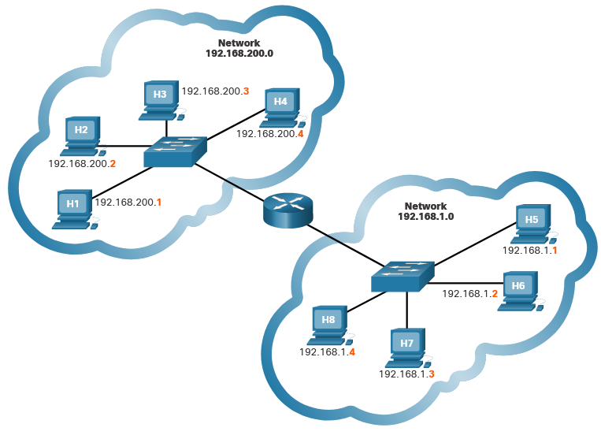
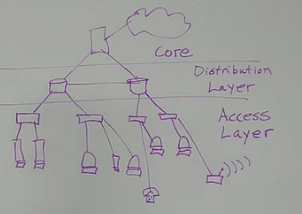

# Network Design
For networks to function efficiently and grow in this type of environment, the network must be built upon a standard network architecture.

# Network architecture
There are four basic characteristics that network architects must address to meet user expectations:

1. **Fault Tolerance**
2. **Scalability**
3. **Quality of Service (QoS)**
4. **Security**

### **Fault tolerant Network**
Network that can continue operations without interruption when one or more network components fail.

## 1. Fault Tolerance 
A fault tolerant network is one that limits the number of affected devices during a failure. 

It is built to allow quick recovery when such a failure occurs. These networks depend on multiple paths between the source and destination of a message. 

If one path fails, the messages are instantly sent over a different link. Having multiple paths to a destination is known as redundancy.

### Packet-switched network
Is one way that reliable networks provide redundancy.
Packet switching splits traffic into packets that are routed over a shared network. 

This means that all the packets in a single message take different paths to the same destination. 

## 2 Scalability 
A scalable network expands quickly to support new users and applications. It does this without degrading the performance of services that are being accessed by existing users.

> Networks can be scalable because the designers follow accepted standards and protocols. 

## 3. Quality of Service (QoS)
QoS is an increasing requirement of networks today. As data, voice, and video content continue to converge onto the same network, QoS becomes a primary mechanism for managing congestion and ensuring reliable delivery of content to all users. 

Network bandwidth is measured in bps. When simultaneous communications are attempted across the network, the demand for network bandwidth can exceed its availability, creating network congestion. The focus of QoS is to prioritize time-sensitive traffic. The type of traffic, not the content of the traffic, is what is important. 

> The focus of QoS is to prioritize time-sensitive traffic. The type of traffic, not the content of the traffic, is what is important.

Different services (Depending on type of network and communications) have different priority for example:
- Text messages have priority over Videocalls
- Videogames have priority over Text and Videocalls

## 4. Network Security 
Securing the network infrastructure includes physically securing devices that provide network connectivity and preventing unauthorized access to the management software that resides on them.

Network administrators must also protect the information contained within the packets being transmitted over the network, and the information stored on network attached devices. In order to achieve the goals of network security, there are three primary requirements.

1. **Confidentiality** - Data confidentiality means that only the intended and authorized recipients can access and read data.
2.  **Integrity** - Data integrity assures users that the information has not been altered in transmission, from origin to destination.
3. **Availability** - Data availability assures users of timely and reliable access to data services for authorized users.

# Hierarchical Network Design 
Hierarchical networks scale well. 

## Physical and Logical Addresses 
Both the physical MAC and logical IP addresses are required for a computer to communicate on a hierarchical network.

### **Physical address - MAC** 
The MAC address does not change; it is physically assigned to the host NIC and is known as the physical address. 

### **Logical address - IP** 
It is assigned logically based on where the host is located. The IP address, or network address, is assigned to each host by a network administrator based on the local network.

IP addresses contain two parts. One part identifies the network portion. The network portion of the IP address will be the same for all hosts connected to the same local network. The second part of the IP address identifies the individual host on that network.

## Hierarchical Analogy 
Large Ethernet networks consisting of many hosts are not efficient. It is better to divide larger networks into smaller, more manageable pieces. One way to divide larger networks is to use a **hierarchical design model**.

**Advantages**
- Organizes and splits network into pieces related to its usage
- Easier to scale

IP traffic is managed based on the characteristics and devices associated with each of the three layers of the hierarchical network design model: Access, Distribution and Core:

### **Access Layer** 
The access layer provides a connection point for end user devices to the network and allows multiple hosts to connect to other hosts through a network device, usually a switch.

If a message is destined for a local host, based on the network portion of the IP address, the message remains local. If it is destined for a different network, it is passed up to the distribution layer. 

>Switches provide the connection to the distribution layer devices, usually a Layer 3 device such as a router or Layer 3 switch.

### **Distribution Layer**
The distribution layer provides a connection point for separate networks and controls the flow of information between the networks.

Distribution layer devices control the type and amount of traffic that flows from the access layer to the core layer.
### **Core Layer** 
The core layer is a high-speed backbone layer with redundant (backup) connections. It is responsible for transporting large amounts of data between multiple end networks. 

Core layer devices typically include very powerful, high-speed switches and routers

> The main goal of the core layer is to transport data quickly.