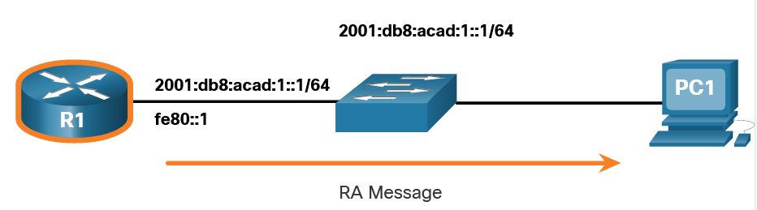

# ICMP - Internet Control Message Protocols
IP is only a best-effort protocol, the TCP/IP suite does provide for error messages and informational messages when communicating with another IP device. These messages are sent using the services of ICMP. The purpose of these messages is to provide feedback about issues related to the processing of IP packets under certain conditions, not to make IP reliable. 
ICMP messages are not required and are often not allowed within a network for security reasons.

ICMP is available for both **IPv4** and **IPv6**. **ICMPv4** is the messaging protocol for **IPv4**. **ICMPv6** provides these same services for **IPv6** but includes additional functionality.

The types of **ICMP** messages, and the reasons why they are sent, are extensive. The ICMP messages common to both *ICMPv4** and **ICMPv6** and discussed in this module include:

- Host reachability
- Destination or Service Unreachable
- Time exceeded

## Host Reachability
An **ICMP Echo Message** can be used to test the reachability of a host on an IP network. The local host sends an **ICMP Echo Request** to a host. If the host is available, the destination host responds with an Echo Reply. 

## Destination or Service Unreachable 
When a host or gateway receives a packet that it cannot deliver, it can use an **ICMP Destination Unreachable message** to notify the source that the destination or service is unreachable. The message will include a code that indicates why the packet could not be delivered.

Some of the Destination Unreachable codes for ICMPv4 are as follows:

    0 - Net unreachable
    1 - Host unreachable
    2 - Protocol unreachable
    3 - Port unreachable

Some of the Destination Unreachable codes for ICMPv6 are as follows:

    0 - No route to destination
    1 - Communication with the destination is administratively prohibited (e.g., firewall)
    2 – Beyond scope of the source address
    3 - Address unreachable
    4 - Port unreachable

> Note: ICMPv6 has similar but slightly different codes for Destination Unreachable messages.

## Time Exceeded 
An **ICMPv4 Time Exceeded message** is used by a router to indicate that a packet cannot be forwarded because the Time to Live (TTL) field of the packet was decremented to 0. If a router receives a packet and decrements the TTL field in the IPv4 packet to zero, it discards the packet and sends a Time Exceeded message to the source host.

ICMPv6 also sends a Time Exceeded message if the router cannot forward an IPv6 packet because the packet has expired. Instead of the IPv4 TTL field, ICMPv6 uses the IPv6 Hop Limit field to determine if the packet has expired.

> Note: Time Exceeded messages are used by the traceroute tool.

## ICMPv6 Messages 
The informational and error messages found in ICMPv6 are very similar to the control and error messages implemented by ICMPv4. 
ICMPv6 messages are encapsulated in IPv6.

ICMPv6 includes four new protocols as part of the Neighbor Discovery Protocol (ND or NDP).

Messaging between an IPv6 router and an IPv6 device, including dynamic address allocation are as follows:

- **Router Solicitation (RS) message**
- **Router Advertisement (RA) message**

Messaging between IPv6 devices, including duplicate address detection and address resolution are as follows:

- **Neighbor Solicitation (NS) message**
- **Neighbor Advertisement (NA) message**

Note: ICMPv6 ND also includes the redirect message, which has a similar function to the redirect message used in ICMPv4.

### Explanation of ICMPv6 messages.

#### RA message - Router Advertisement 
RA messages are sent by IPv6-enabled routers every 200 seconds to provide addressing information to IPv6-enabled hosts. The RA message can include addressing information for the host such as the prefix, prefix length, DNS address, and domain name. A host using **Stateless Address Autoconfiguration (SLAAC)** will set its default gateway to the link-local address of the router that sent the RA.

#### RS message - Router Solicitation
An IPv6-enabled router will also send out an RA message in response to an RS message. 

R1 replies to the RS with an RA message.

1. PC1 sends an RS message, "Hi, I just booted up. Is there an IPv6 router on the network? I need to know how to get my IPv6 address information dynamically."
2. R1 replies with an RA message. "Hi all IPv6-enabled devices. I’m R1 and you can use SLAAC to create an IPv6 global unicast address. The prefix is 2001:db8:acad:1::/64. By the way, use my link-local address fe80::1 as your default gateway."

#### NS message - Neighbor solicitation
When a device is assigned a global IPv6 unicast or link-local unicast address, it may perform duplicate address detection (DAD) to ensure that the IPv6 address is unique. To check the uniqueness of an address, the device will send an NS message with its own IPv6 address as the targeted IPv6 address, as shown in the figure.

If another device on the network has this address, it will respond with an NA message. This NA message will notify the sending device that the address is in use. If a corresponding NA message is not returned within a certain amount of time, the unicast address is unique and acceptable for use.

> Note: DAD is not required, but RFC 4861 recommends that DAD is performed on unicast addresses.

#### NA message - Neighbor advertisement
Address resolution is used when a device on the LAN knows the IPv6 unicast address of a destination but does not know its Ethernet MAC address. To determine the MAC address for the destination, the device will send an NS message to the solicited node address. The message will include the known (targeted) IPv6 address. The device that has the targeted IPv6 address will respond with an NA message containing its Ethernet MAC address.

In the figure, R1 sends a NS message to 2001:db8:acad:1::10 asking for its MAC address.

1. R1 sends an address resolution NS message. "Will whoever has the IPv6 address 2001:db8:acad:1::10, send me your MAC address?"
2. PC1 replies with an NA message. "I’m 2001:db8:acad:1::10 and my MAC address is 00:aa:bb:cc:dd:ee."

# Ping and Traceroute Testing

## Ping - Test Connectivity 
To test connectivity to another host on a network, an echo request is sent to the host address using the ping command. If the host at the specified address receives the echo request, it responds with an echo reply. As each echo reply is received, ping provides feedback on the time between when the request was sent and when the reply was received. This can be a measure of network performance. Ping has a timeout value for the reply. If a reply is not received within the timeout, ping provides a message indicating that a response was not received.

Type of connectivity tests performed with ping include the following:

- **Pinging the local loopback** - Ping can be used to test the internal configuration of IPv4 or IPv6 on the local host. To perform this test, ping the local loopback address.
- **Pinging the default gateway** - This is generally done by pinging the IP address of the default gateway of the host. A successful ping to the default gateway indicates that the host and the router interface serving as the default gateway are both operational on the local network.
- **Pinging the remote host** - A successful ping across the internetwork confirms communication on the local network, the operation of the router serving as the default gateway, and the operation of all other routers that might be in the path between the local network and the network of the remote host. 

## Traceroute - Test the Path 
Traceroute (tracert) is a utility that generates a list of hops that were successfully reached along the path. This list can provide important verification and troubleshooting information. 
If the data fails at some hop along the way, the address of the last router that responded to the trace can provide an indication of where the problem or security restrictions are found.

**Round Trip Time (RTT)**
The round-trip time is the time a packet takes to reach the remote host and for the response from the host to return. An asterisk (*) is used to indicate a lost or unreplied packet.

**IPv4 TTL and IPv6 Hop Limit**

Traceroute makes use of a function of the **TTL** field in IPv4 and the **Hop Limit** field in IPv6 in the Layer 3 headers, along with the **ICMP Time Exceeded message**.

#### How Traceroute works
The first sequence of messages sent from traceroute will have a TTL field value of 1. This causes the TTL to time out the IPv4 packet at the first router. This router then responds with an ICMPv4 Time Exceeded message. Traceroute now has the address of the first hop.

Traceroute then progressively increments the TTL field (2, 3, 4...) for each sequence of messages. This provides the trace with the address of each hop as the packets time out further down the path. The TTL field continues to be increased until the destination is reached, or it is incremented to a predefined maximum.

After the final destination is reached, the host responds with either an ICMP Port Unreachable message or an ICMP Echo Reply message instead of the ICMP Time Exceeded message.
