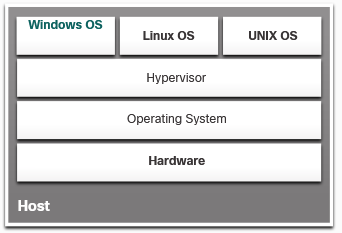

# Cloud and Virtualization

# Cloud
Ddata centers, cloud computing, and virtualization.

### Types of Clouds 
There are four primary cloud models:

- **Public clouds** - Cloud-based applications and services offered in a public cloud are made available to the general population.
- **Private clouds** - Cloud-based applications and services offered in a private cloud are intended for a specific organization or entity, such as the government. A private cloud can be set up using the private network of an organization. 
- **Hybrid clouds** - A hybrid cloud is made up of two or more clouds (example: part private, part public), where each part remains a separate object, but both are connected using a single architecture. Individuals on a hybrid cloud would be able to have degrees of access to various services based on user access rights.
- **Community clouds** - A community cloud is created for exclusive use by a specific community. The differences between public clouds and community clouds are the functional needs that have been customized for the community. For example, healthcare organizations must remain compliant with policies and laws (e.g., HIPAA) that require special authentication and confidentiality.

### Cloud Services
- **SaaS** - Software as a Service
- **PaaS** - PLatform as a Service
- **IaaS** - Infrastructure as a Service

### Cloud Computing and Virtualization 
**Virtualization** is the foundation of cloud computing. Without it, cloud computing, as it is most-widely implemented, would not be possible.

> **Virtualization** means creating a virtual rather than physical version of something, such as a computer. An example would be running a "Linux computer" on Windows PC

Historically, enterprise servers consisted of a server OS, such as Windows Server or Linux Server, installed on specific.
The major problem with this configuration is that when a component fails, the service that is provided by this server becomes unavailable. This is known as a **single point of failure**. Another problem was that dedicated servers were underused.

# Virtualization

**Advantages:**

- **Less equipment is required** - Virtualization enables server consolidation, which requires fewer physical devices and lowers maintenance costs.
- **Less energy is consumed** - Consolidating servers lowers the monthly power and cooling costs.
- **Less space is required** - Server consolidation reduces the amount of required floor space.
- **Easier prototyping** - Self-contained labs, operating on isolated networks, can be rapidly created for testing and prototyping network deployments.
- **Faster server provisioning** - Creating a virtual server is far faster than provisioning a physical server.
- **Increased server uptime** - Most server virtualization platforms now offer advanced redundant fault tolerance features.
- **Improved disaster recovery** - Most enterprise server virtualization platforms have software that can help test and automate failover before a disaster happens.
- **Legacy support** - Virtualization can extend the life of OSs and applications providing more time for organizations to migrate to newer solutions.

## Hypervisors
The hypervisor is a program, firmware, or hardware that adds an abstraction layer on top of the physical hardware. The abstraction layer is used to create virtual machines which have access to all the hardware of the physical machine such as CPUs, memory, disk controllers, and NICs. Each of these virtual machines runs a complete and separate operating system. 

### Type 1 Hypervisors - “Bare Metal” Approach
Hypervisor is installed directly on the hardware. Type 1 hypervisors are usually used on enterprise servers and data center networking devices.

Type 1 hypervisors have direct access to the hardware resources; therefore, they are more efficient than hosted architectures. Type 1 hypervisors improve scalability, performance, and robustness.

### Type 2 Hypervisors - “Hosted” Approach 
Hypervisor is installed on top of the existing OS, such as macOS, Windows, or Linux. Then, one or more additional OS instances are installed on top of the hypervisor

A big advantage of Type 2 hypervisors is that management console software is not required.

> Note: It is important to make sure that the host machine is robust enough to install and run the VMs, so that it does not run out of resources.

