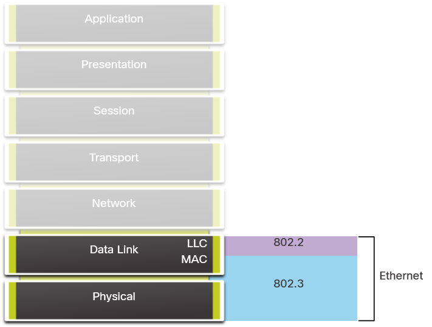
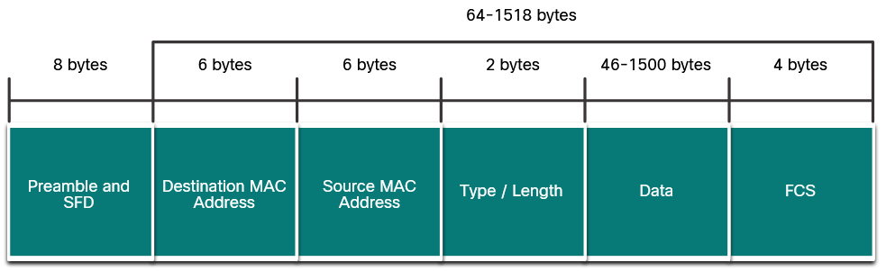

# Ethernet switching

# Ethernet
As networks became more widespread, standards were developed that defined rules by which network equipment from different vendors operated. Standards are beneficial to networking in many ways:

- Facilitate design
- Simplify product development
- Promote competition
- Provide consistent interconnections
- Facilitate training
- Provide more vendor choices for customers

Ethernet protocols define how data is formatted and how it is transmitted over the wired network. The Ethernet standards specify protocols that operate at Layer 1 and Layer 2 of the OSI model.

IEEE maintains the networking standards, including Ethernet and wireless standards. Each technology standard is assigned a number that refers to the committee that is responsible for approving and maintaining the standard. The 802.3 Ethernet standard has improved over time.

Each version of Ethernet has an associated standard. For example, **802.3 100BASE-T** represents the 100 Megabit Ethernet using twisted-pair cable standards.

# Ethernet Frames
Ethernet is defined by data link layer 802.2 and 802.3 protocols.

## Ethernet Encapsulation 
Ethernet operates in the data link layer and the physical layer. It is a family of networking technologies defined in the **IEEE 802.2** and **802.3** standards. Ethernet supports data bandwidths of the following:

- 10 Mbps
- 100 Mbps
- 1000 Mbps (1 Gbps)
- 10,000 Mbps (10 Gbps)
- 40,000 Mbps (40 Gbps)
- 100,000 Mbps (100 Gbps)

## Data Link Sublayers 
IEEE 802 LAN/MAN protocols, including Ethernet, use the following two separate sublayers of the data link layer to operate. 

They are the Logical Link Control (LLC) and the Media Access Control (MAC)

### **LLC Sublayer** 
This IEEE 802.2 sublayer communicates between the networking software at the upper layers and the device hardware at the lower layers. It places information in the frame that identifies which network layer protocol is being used for the frame. This information allows multiple Layer 3 protocols, such as IPv4 and IPv6, to use the same network interface and media.

### **MAC Sublayer**
This sublayer (IEEE 802.3, 802.11, or 802.15 for example) is implemented in hardware and is responsible for data encapsulation and media access control. It provides data link layer addressing and is integrated with various physical layer technologies. Data encapsulation includes the Ethernet frame, Ethernet Addressing, and Ethernet error detection.

Ethernet LANs of today use switches that operate in full-duplex. Full-duplex communications with Ethernet switches do not require access control through CSMA/CD. 

**Data Encapsulation :**

IEEE 802.3 data encapsulation includes the following:
- **Ethernet frame** - This is the internal structure of the Ethernet frame.
- **Ethernet Addressing** - The Ethernet frame includes both a source and destination MAC address to deliver the Ethernet frame from Ethernet NIC to Ethernet NIC on the same LAN.
- **Ethernet Error detection** - The Ethernet frame includes a frame check sequence (FCS) trailer used for error detection.

## Ethernet Frame Fields 
Minimum Ethernet frame size is 64 bytes and the expected maximum is 1518 bytes, including destination MAC address field through the frame check sequence (FCS) field. The preamble field is not included when describing the size of the frame.

> Note: The frame size may be larger if additional requirements are included, such as VLAN tagging. VLAN tagging is beyond the scope of this course.

- **Collision fragment/Runt frame** - Any frame less than 64 bytes, automatically discarded by receiving stations.
- **Jumbo/Baby giant frames** - Frames with more than 1500 bytes of data

If the size of a transmitted frame is less than the minimum, or greater than the maximum, the receiving device drops the frame. Dropped frames are likely to be the result of collisions or other unwanted signals. They are considered invalid. Jumbo frames are usually supported by most Fast Ethernet and Gigabit Ethernet switches and NICs.

| Field                                   | Description                                                                                                    |
|-----------------------------------------|----------------------------------------------------------------------------------------------------------------|
| Preamble and Start Frame Delimiter Fields | The Preamble (7 bytes) and Start Frame Delimiter (SFD), also called the Start of Frame (1 byte), fields are used for synchronization between the sending and receiving devices. These first eight bytes of the frame are used to get the attention of the receiving nodes. Essentially, the first few bytes tell the receivers to get ready to receive a new frame. |
| Destination MAC Address Field            | This 6-byte field is the identifier for the intended recipient. As you will recall, this address is used by Layer 2 to assist devices in determining if a frame is addressed to them. The address in the frame is compared to the MAC address in the device. If there is a match, the device accepts the frame. Can be a unicast, multicast or broadcast address. |
| Source MAC Address Field                 | This 6-byte field identifies the originating NIC or interface of the frame.                                     |
| Type / Length                            | This 2-byte field identifies the upper layer protocol encapsulated in the Ethernet frame. Common values are, in hexadecimal, 0x800 for IPv4, 0x86DD for IPv6 and 0x806 for ARP. You may also see this field referred to as EtherType, Type, or Length. |
| Data Field                               | This field (46 - 1500 bytes) contains the encapsulated data from a higher layer, which is a generic Layer 3 PDU, or more commonly, an IPv4 packet. All frames must be at least 64 bytes long. If a small packet is encapsulated, additional bits called a pad are used to increase the size of the frame to this minimum size. |
| Frame Check Sequence Field               | The Frame Check Sequence (FCS) field (4 bytes) is used to detect errors in a frame. It uses a cyclic redundancy check (CRC). The sending device includes the results of a CRC in the FCS field of the frame. The receiving device receives the frame and generates a CRC to look for errors. If the calculations match, no error occurred. Calculations that do not match are an indication that the data has changed; therefore, the frame is dropped. A change in the data could be the result of a disruption of the electrical signals that represent the bits. |

# Ethernet MAC Address
An Ethernet MAC address consists of a 48-bit binary value.
## MAC Address and Hexadecimal 
- IPv4 addresses are represented using the decimal base ten number system and the binary base 2 number system. 
- IPv6 addresses and Ethernet addresses are represented using the hexadecimal base sixteen number system. 

An Ethernet MAC address consists of a 48-bit binary value. Hexadecimal is used to identify an Ethernet address because a single hexadecimal digit represents four binary bits. Therefore, a 48-bit Ethernet MAC address can be expressed using only 12 hexadecimal values.

## Unicast MAC Address 
In Ethernet, different MAC addresses are used for Layer 2 unicast, broadcast, and multicast communications.

A unicast MAC address is the unique address that is used when a frame is sent from a single transmitting device to a single destination device.

> 00-07-E9-42-AC-28 is unicast MAC address.

## Broadcast MAC Address 
An Ethernet broadcast frame is received and processed by every device on the Ethernet LAN. The features of an Ethernet broadcast are as follows:

- It has a destination MAC address of FF-FF-FF-FF-FF-FF in hexadecimal (48 ones in binary).
- It is flooded out all Ethernet switch ports except the incoming port.
- It is not forwarded by a router.

If the encapsulated data is an IPv4 broadcast packet, this means the packet contains a destination IPv4 address that has all ones (1s) in the host portion. This numbering in the address means that all hosts on that local network (broadcast domain) will receive the packet.

> The IPv4 destination address is a broadcast address, 192.168.1.255. When the IPv4 broadcast packet is encapsulated in the Ethernet frame, the destination MAC address is the broadcast MAC address of FF-FF-FF-FF-FF-FF in hexadecimal (48 ones in binary).

> DHCP for IPv4 is an example of a protocol that uses Ethernet and IPv4 broadcast addresses.

> ARP Requests do not use IPv4, but the ARP message is sent as an Ethernet broadcast.

## Multicast MAC Address 
An Ethernet multicast frame is received and processed by a group of devices on the Ethernet LAN that belong to the same multicast group. The features of an Ethernet multicast are as follows:

---
For example:
- **01-00-5E-....** is an IPv4 multicast MAC address.
- **33-33-....** is an IPv6 multicast MAC address.

---
- There is a destination MAC address of **01-00-5E** when the encapsulated data is an IPv4 multicast packet and a destination MAC address of 33-33 when the encapsulated data is an IPv6 multicast packet.
- There are other reserved multicast destination MAC addresses for when the encapsulated data is not IP, such as Spanning Tree Protocol (STP) and Link Layer Discovery Protocol (LLDP).
- It is flooded out all Ethernet switch ports except the incoming port, unless the switch is configured for multicast snooping.
- It is not forwarded by a router, unless the router is configured to route multicast packets.

If the encapsulated data is an IP multicast packet, the devices that belong to a multicast group are assigned a multicast group IP address. The range of IPv4 multicast addresses is 224.0.0.0 to 239.255.255.255. The range of IPv6 multicast addresses begins with ff00::/8. Because multicast addresses represent a group of addresses (sometimes called a host group), they can only be used as the destination of a packet. The source will always be a unicast address.

> Routing protocols and other network protocols use multicast addressing.

# The MAC Address Table
## Switch Fundamentals 
A **Layer 2 Ethernet** switch uses **Layer 2 MAC** addresses to make forwarding decisions. It is completely unaware of the data (protocol) being carried in the data portion of the frame.

The switch makes its forwarding decisions based solely on the **Layer 2 Ethernet MAC addresses**.

An Ethernet switch examines its **MAC address table** to make a forwarding decision for each frame, unlike legacy Ethernet hubs that repeat bits out all ports except the incoming port.

> Note: The MAC address table is sometimes referred to as a **content addressable memory (CAM) table**.

## Switch Learning and Forwarding 
The switch dynamically builds the MAC address table by examining the source MAC address of the frames received on a port. The switch forwards frames by searching for a match between the destination MAC address in the frame and an entry in the MAC address table.

### Learn
1. PC-A sends an Ethernet frame.
2. The switch adds the port number and MAC address for PC-A to the MAC Address Table.

> If the source MAC address does exist, the switch updates the refresh timer for that entry in the table. By default, most Ethernet switches keep an entry in the table for 5 minutes.

> Note: If the source MAC address does exist in the table but on a different port, the switch treats this as a new entry

### Forward

1. The destination MAC address is not in the table.
2. The switch forwards the frame out all other ports except the incoming port. - This is called an **unknown unicast**

> Note: If the destination MAC address is a broadcast or a multicast, the frame is also flooded out all ports except the incoming port.

## Filtering Frames 
As a switch receives frames from different devices, it is able to populate its MAC address table by examining the source MAC address of every frame. When the MAC address table of the switch contains the destination MAC address, it is able to filter the frame and forward out a single port.

### **How a switch filters frames:**

### 1. PC-D to Switch
PC-D is replying back to PC-A. The switch sees the MAC address of PC-D in the incoming frame on port 4. The switch then puts the MAC address of PC-D into the MAC Address Table associated with port 4.

The switch adds the port number and MAC address for PC-D to its MAC address table.

### 2. Switch to PC-A
1. The switch has a MAC address entry for the destination.
2. The switch filters the frame, sending it only out port 1.

### 3. PC-A to Switch to PC-D
1. The switch receives another frame from PC-A and refreshes the timer for the MAC address entry for port 1.
2. The switch has a recent entry for the destination MAC address and filters the frame, forwarding it only out port 4.

## MAC Address Tables on Connected Switches
A switch can have multiple MAC addresses associated with a single port. This is common when the switch is connected to another switch. The switch will have a separate MAC address table entry for each frame received with a different source MAC address.

## Send the Frame to the Default Gateway 
When a device has an IP address that is on a remote network, the Ethernet frame cannot be sent directly to the destination device. Instead, the Ethernet frame is sent to the MAC address of the default gateway, the router.