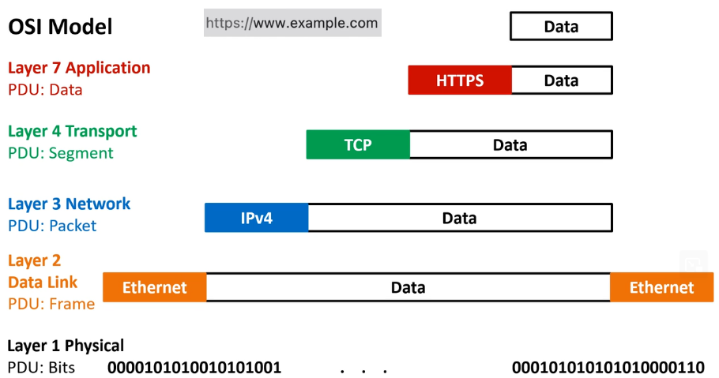
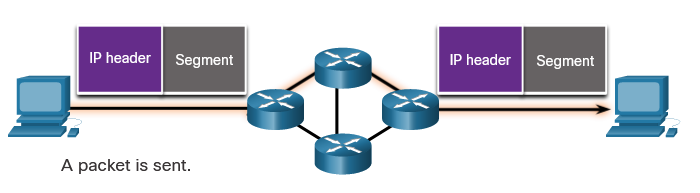
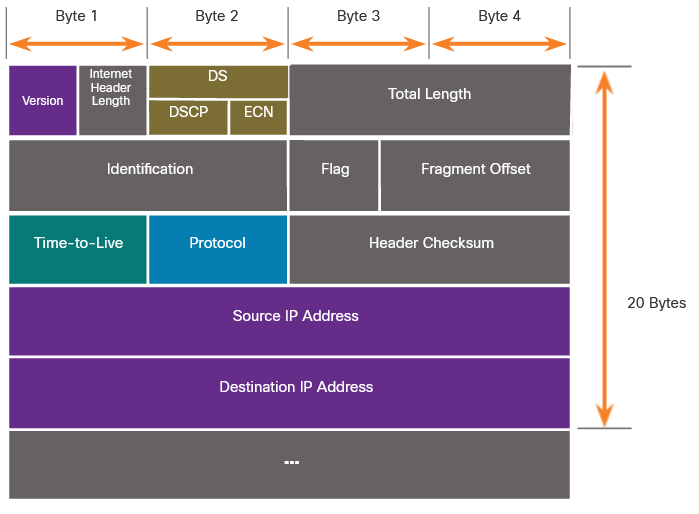
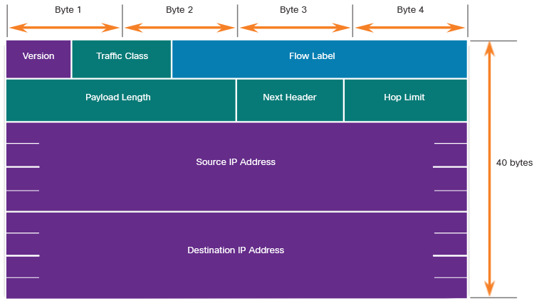

# Network layer

# Network Layer Characteristics

# The Network Layer 
The network layer, or OSI Layer 3, provides services to allow end devices to exchange data across networks.

### Network Layer Protocols
To accomplish end-to-end communications across network boundaries, network layer protocols perform four basic operations:

- **Addressing end devices** - End devices must be configured with a unique IP address for identification on the network.
- **Encapsulation** - The network layer encapsulates the protocol data unit (PDU) from the transport layer into a packet. The encapsulation process adds IP header information, such as the IP address of the source (sending) and destination (receiving) hosts. The encapsulation process is performed by the source of the IP packet.
- **Routing** - The network layer provides services to direct the packets to a destination host on another network. To travel to other networks, the packet must be processed by a router. The role of the router is to select the best path and direct packets toward the destination host in a process known as routing. A packet may cross many routers before reaching the destination host. Each router a packet crosses to reach the destination host is called a hop.
- **De-encapsulation** - When the packet arrives at the network layer of the destination host, the host checks the IP header of the packet. If the destination IP address within the header matches its own IP address, the IP header is removed from the packet. After the packet is de-encapsulated by the network layer, the resulting Layer 4 PDU is passed up to the appropriate service at the transport layer. The de-encapsulation process is performed by the destination host of the IP packet.

Unlike the transport layer (OSI Layer 4), which manages the data transport between the processes running on each host, network layer communication protocols (i.e., IPv4 and IPv6) specify the packet structure and processing used to carry the data from one host to another host. 

### The Maximum Transmission Unit (MTU) 
Is primarily determined and set at the data link layer. The network layer relies on this MTU value to ensure that packets are appropriately sized for transmission over the network. If a packet's size exceeds the MTU of the data link layer, it may need to be fragmented by the network layer to fit within the MTU size, or in some cases, the network layer may request the higher-level layers to split data into smaller packets. The network layer does not ignore the MTU; instead, it works in conjunction with the data link layer to ensure efficient and error-free transmission of data.

## IP Encapsulation 
IP encapsulates the transport layer segment or other data by adding an IP header. The IP header is used to deliver the packet to the destination host.

The IP header is examined by **Layer 3 devices (i.e., routers and Layer 3 switches)** as it travels across a network to its destination. It is important to note, that the IP addressing information remains the same from the time the packet leaves the source host until it arrives at the destination host, except when translated by the device performing Network Address Translation (NAT) for IPv4.

## Characteristics of IP 
IP was designed as a protocol with low overhead. It provides only the functions that are necessary to deliver a packet from a source to a destination over an interconnected system of networks.

Basic characteristics of IP:

- **Connectionless** - There is no connection with the destination established before sending data packets.
- **Best Effort** - IP is inherently unreliable because packet delivery is not guaranteed.
- **Media Independent** - Operation is independent of the medium (i.e., copper, fiber-optic, or wireless) carrying the data.

### Connectionless
IP is connectionless, meaning that no dedicated end-to-end connection is created by IP before data is sent.

IP requires no initial exchange of control information to establish an end-to-end connection before packets are forwarded.

#### Connectionless - Network

### Best Effort 
IP also does not require additional fields in the header to maintain an established connection. This process greatly reduces the overhead of IP. However, with no pre-established end-to-end connection, senders are unaware whether destination devices are present and functional when sending packets

As an unreliable network layer protocol, IP does not guarantee that all sent packets will be received. Other protocols manage the process of tracking packets and ensuring their delivery.

### Media Independent 
IP does not have the capability to manage and recover from undelivered or corrupt packets. Packets may arrive at the destination corrupted, out of sequence, or not at all. IP provides no capability for packet retransmissions if errors occur.

If out-of-order packets are delivered, or packets are missing, then applications using the data, or upper layer services, must resolve these issues. This allows IP to function very efficiently. In the TCP/IP protocol suite, reliability is the role of the TCP protocol at the transport layer.

IP operates independently of the media that carry the data at lower layers of the protocol stack. 

> The OSI data link layer is responsible for taking an IP packet and preparing it for transmission over the communications medium. This means that the delivery of IP packets is not limited to any particular medium.

# IPv4 Packet
IPv4 is one of the primary network layer communication protocols. The IPv4 packet header is used to ensure that this packet is delivered to its next stop on the way to its destination end device.

An IPv4 packet header consists of fields containing important information about the packet. These fields contain binary numbers which are examined by the Layer 3 process.

## IPv4 Packet Header Fields 

**Fields in the IPv4 Packet Header**

Significant fields in the IPv4 header include the following:

- **Version** - Contains a 4-bit binary value set to 0100 that identifies this as an IPv4 packet.
- **Differentiated Services or DiffServ (DS)** - Formerly called the type of service (ToS) field, the DS field is an 8-bit field used to determine the priority of each packet. The six most significant bits of the DiffServ field are the differentiated services code point (DSCP) bits and the last two bits are the explicit congestion notification (ECN) bits.
- **Time to Live (TTL)** – TTL contains an 8-bit binary value that is used to limit the lifetime of a packet. The source device of the IPv4 packet sets the initial TTL value. It is decreased by one each time the packet is processed by a router. If the TTL field decrements to zero, the router discards the packet and sends an Internet Control Message Protocol (ICMP) Time Exceeded message to the source IP address. Because the router decrements the TTL of each packet, the router must also recalculate the Header Checksum.
- **Protocol** – This field is used to identify the next level protocol. This 8-bit binary value indicates the data payload type that the packet is carrying, which enables the network layer to pass the data to the appropriate upper-layer protocol. Common values include ICMP (1), TCP (6), and UDP (17).
- **Header Checksum** – This is used to detect corruption in the IPv4 header.
- **Source IPv4 Address** – This contains a 32-bit binary value that represents the source IPv4 address of the packet. The source IPv4 address is always a unicast address.
- **Destination IPv4 Address** – This contains a 32-bit binary value that represents the destination IPv4 address of the packet. The destination IPv4 address is a unicast, multicast, or broadcast address.

> The Internet Header Length (IHL), Total Length, and Header Checksum fields are used to identify and validate the packet.
> The IPv4 packet uses Identification, Flags, and Fragment Offset fields to keep track of the fragments.

# IPv6 Packet
IPv4 still has three major issues:

- **IPv4 address depletion** - IPv4 has a limited number of unique public addresses available.
- **Lack of end-to-end connectivity** - Network Address Translation (NAT) is a technology commonly implemented within IPv4 networks. NAT provides a way for multiple devices to share a single public IPv4 address. However, because the public IPv4 address is shared, the IPv4 address of an internal network host is hidden. 
This can be problematic for technologies that require end-to-end connectivity.
- **Increased network complexity** – NAT in its various implementation creates additional complexity in the network, creating latency and making troubleshooting more difficult.

IPv6 overcomes the limitations of IPv4 and is a powerful enhancement with features that better suit current and foreseeable network demands.

Improvements that IPv6 provides include the following:

- **Increased address space** - IPv6 addresses are based on 128-bit hierarchical addressing.
- **Improved packet handling** - The IPv6 header has been simplified with fewer fields.
- **Eliminates the need for NAT** - With such a large number of public IPv6 addresses, NAT between a private IPv4 address and a public IPv4 is not needed. 

## IPv6 Packet Header 
The IPv6 simplified header allows for more efficient processing of IPv6 headers.

The fields in the IPv6 packet header include the following:

- **Version** - This field contains a 4-bit binary value set to 0110 that identifies this as an IP version 6 packet.
- **Traffic Class** - This 8-bit field is equivalent to the IPv4 Differentiated Services (DS) field.
- **Flow Label** - This 20-bit field suggests that all packets with the same flow label receive the same type of handling by routers.
- **Payload Length** - This 16-bit field indicates the length of the data portion or payload of the IPv6 packet. This does not include the length of the IPv6 header, which is a fixed 40-byte header.
- **Next Header** - This 8-bit field is equivalent to the IPv4 Protocol field. It indicates the data payload type that the packet is carrying, enabling the network layer to pass the data to the appropriate upper-layer protocol.
- **Hop Limit** - This 8-bit field replaces the IPv4 TTL field. This value is decremented by a value of 1 by each router that forwards the packet. When the counter reaches 0, the packet is discarded, and an ICMPv6 Time Exceeded message is forwarded to the sending host,. This indicates that the packet did not reach its destination because the hop limit was exceeded. Unlike IPv4, IPv6 does not include an IPv6 Header Checksum, because this function is performed at both the lower and upper layers. This means the checksum does not need to be recalculated by each router when it decrements the Hop Limit field, which also improves network performance.
- **Source IPv6 Address** - This 128-bit field identifies the IPv6 address of the sending host.
- **Destination IPv6 Address** - This 128-bit field identifies the IPv6 address of the receiving host.

An IPv6 packet may also contain extension headers (EH), which provide optional network layer information. Extension headers are optional and are placed between the IPv6 header and the payload. EHs are used for fragmentation, security, to support mobility and more.

Unlike IPv4, routers do not fragment routed IPv6 packets.
