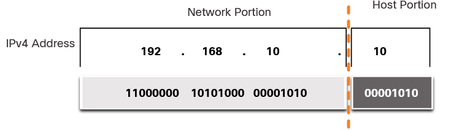
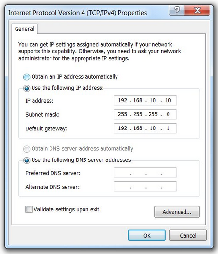

# IPv4 Address Structure
An IPv4 address is a 32-bit hierarchical address that is made up of a network portion and a host portion.

## Network and Host Portions 
An IPv4 address is made up of a network portion and a host portion. 

- Network portion must be same for all devices on the same network
- Host portion must be unique for every device

## The Subnet Mask 
Assigning an IPv4 address to a host requires the following:

- **IPv4 address** - Unique IPv4 address of the host.
- **Subnet mask** - Used to identify the network/host portion of the IPv4 address.

**IPv4 Configuration on a Windows**

> Note: A default gateway IPv4 address is required to reach remote networks and DNS server IPv4 addresses are required to translate domain names to IPv4 addresses.

The IPv4 subnet mask is used to differentiate the network portion from the host portion of an IPv4 address. When an IPv4 address is assigned to a device, the subnet mask is used to determine the network address of the device. The network address represents all the devices on the same network. 

The actual process used to identify the network portion and host portion is called **ANDing** (Binary AND operation).

## The Prefix Length 
The prefix length is the number of bits set to 1 in the subnet mask. It is written in “slash notation”, which is noted by a forward slash (/) followed by the number of bits set to 1. Therefore, count the number of bits in the subnet mask and prepend it with a slash.

| Subnet Mask     | 32-bit Address                              | Prefix Length |
|-----------------|--------------------------------------------|---------------|
| 255.0.0.0       | 11111111.00000000.00000000.00000000       | /8           |
| 255.255.0.0     | 11111111.11111111.00000000.00000000       | /16          |
| 255.255.255.0   | 11111111.11111111.11111111.00000000       | /24          |
| 255.255.255.128 | 11111111.11111111.11111111.10000000       | /25          |
| 255.255.255.192 | 11111111.11111111.11111111.11000000       | /26          |
| 255.255.255.224 | 11111111.11111111.11111111.11100000       | /27          |
| 255.255.255.240 | 11111111.11111111.11111111.11110000       | /28          |
| 255.255.255.248 | 11111111.11111111.11111111.11111000       | /29          |
| 255.255.255.252 | 11111111.11111111.11111111.11111100       | /30          |

> Note: A network address is also referred to as a prefix or network prefix.

When representing an IPv4 address using a prefix length, the IPv4 address is written as for example:

     192.168.10.10 255.255.255.0 -> 192.168.10.10/24