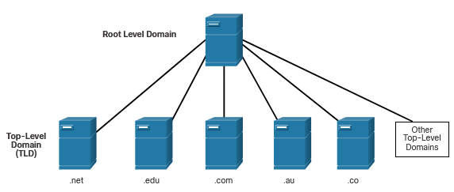
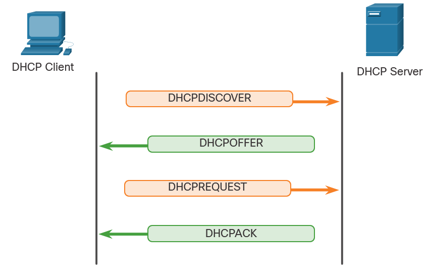

# IP Addressing Services

# DNS - Domain Name System
In data networks, devices are labeled with numeric IP addresses to send and receive data over networks. Domain names were created to convert the numeric address into a simple, recognizable name.

> On the internet, **fully-qualified domain names (FQDNs)**, such as http://www.google.com, are much easier for people to remember than 64.233.191.255, which is the actual numeric address for this server. If Google  decides to change the numeric address of www.google.com, it is transparent to the user because the domain name remains the same. The new address is simply linked to the existing domain name and connectivity is maintained.

The DNS protocol defines an automated service that matches resource names with the required numeric network address. It includes the format for queries, responses, and data. The DNS protocol communications use a single format called a message. This message format is used for all types of client queries and server responses, error messages, and the transfer of resource record information between servers.

**Steps of DNS:**

1. The user types an **FQDN** into a browser application Address field - for example www.google.com
2. A DNS query is sent to the designated DNS server for the client computer.
3. The DNS server matches the FQDN with its IP address.
4. The DNS query response is sent back to the client with the IP address for the FQDN.
5. The client computer uses the IP address to make requests of the server.

##  DNS Message Format 
The **DNS server** stores different types of resource records that are used to resolve names. These records contain the name, address, and type of record. Some of these record types are as follows:

- **A** - An end device IPv4 address
- **NS** - An authoritative name server
- **AAAA** - An end device IPv6 address (pronounced quad-A)
- **MX** - A mail exchange record

When a client makes a query, the server DNS process first looks at its own records to resolve the name. If it is unable to resolve the name by using its stored records, it contacts other servers to resolve the name. After a match is found and returned to the original requesting server, the server temporarily stores the numbered address in the event that the same name is requested again.

> The **ipconfig /displaydns** command displays all of the cached DNS entries.

|   Question   |   The question for the name server   |
|----------------------------------------------|-----------------------------------------------------------------------------------------------|
|   Answer     |   Resource Records answering the question   |
|   Authority  |   Resource Records pointing toward an authority   |
|   Additional |   Resource Records holding additional information   |

## DNS Hierarchy 
The DNS protocol uses a hierarchical system to create a database to provide name resolution.
DNS uses domain names to form the hierarchy.

The naming structure is broken down into small, manageable zones. Each DNS server maintains a specific database file and is only responsible for managing name-to-IP mappings for that small portion of the entire DNS structure. When a DNS server receives a request for a name translation that is not within its DNS zone, the DNS server forwards the request to another DNS server within the proper zone for translation. DNS is scalable because hostname resolution is spread across multiple servers.

The different top-level domains represent either the type of organization or the country of origin. Examples of top-level domains are the following:

    .com - a business or industry
    .org - a non-profit organization

## The **nslookup** Command 
When configuring a network device, one or more DNS server addresses are provided that the DNS client can use for name resolution. Usually, the ISP provides the addresses to use for the DNS servers. 

By issuing the nslookup command, the default DNS server that is configured is displayed.

    C:\Users\Filda>nslookup
    Default Server:  UnKnown
    Address:  192.168.10.1

    > www.google.com
    Server:  UnKnown
    Address:  192.168.10.1

    Non-authoritative answer:
    Name:    www.google.com
    Addresses:  2a00:1450:4014:80b::2004
            142.251.36.100

# DHCP - Dynamic Host Configuration Protocol 
The **Dynamic Host Configuration Protocol (DHCP)** for IPv4 service automates the assignment of IPv4 addresses, subnet masks, gateways, and other IPv4 networking parameters. This is referred to as dynamic addressing.

When a host connects to the network, the DHCP server is contacted, and an address is requested. The DHCP server chooses an address from a configured range of addresses called a pool and assigns (leases) it to the host.

DHCP can allocate IP addresses for a configurable period of time, called a lease period. The lease period is an important DHCP setting, When the lease period expires or the DHCP server gets a DHCPRELEASE message the address is returned to the DHCP pool for reuse. Users can freely move from location to location and easily re-establish network connections through DHCP.

> DHCP for IPv6 (DHCPv6) provides similar services for IPv6 clients. One important difference is that DHCPv6 does not provide a default gateway address. This can only be obtained dynamically from the Router Advertisement message of the router.

## DHCP Messages 
When an IPv4, DHCP-configured device boots up or connects to the network, the client broadcasts a **DHCPDISCOVER** message to identify any available DHCP servers on the network.

A DHCP server replies with a **DHCPOFFER** message, which offers a lease to the client. The client sends a **DHCPREQUEST** message that identifies the explicit server and lease offer that the client is accepting.

Assuming that the IPv4 address requested by the client, or offered by the server, is still available, the server returns a **DHCPACK** message that acknowledges to the client that the lease has been finalized. If the offer is no longer valid, then the selected server responds with a DHCPNAK message. If a **DHCPNAK** message is returned, then the selection process must begin again with a new **DHCPDISCOVER** message being transmitted.

The DHCP server ensures that all IP addresses are unique (the same IP address cannot be assigned to two different network devices simultaneously). Most ISPs use DHCP to allocate addresses to their customers.

DHCPv6 has a set of messages that is similar to those for DHCPv4. The DHCPv6 messages are **SOLICIT, ADVERTISE, INFORMATION REQUEST**, and **REPLY**.