# Transport Layer
Application layer programs generate data that must be exchanged between source and destination hosts. The transport layer is responsible for logical communications between applications running on different hosts. This may include services such as establishing a temporary session between two hosts and the reliable transmission of information for an application.

# Transportation of Data
The transport layer has no knowledge of the destination host type, the type of media over which the data must travel, the path taken by the data, the congestion on a link, or the size of the network.

The transport layer includes two protocols:

- **Transmission Control Protocol (TCP)**
- **User Datagram Protocol (UDP)**

## Transport Layer Responsibilities 

### Tracking Individual Conversations
At the transport layer, each set of data flowing between a source application and a destination application is known as a conversation and is tracked separately. It is the responsibility of the transport layer to maintain and track these multiple conversations.

Most networks have a limitation on the amount of data that can be included in a single packet. Therefore, data must be divided into manageable pieces.

### Segmenting Data and Reassembling Segments
It is the transport layer responsibility to divide the application data into appropriately sized blocks. 

The transport layer divides the data into smaller blocks (i.e., segments or datagrams) that are easier to manage and transport.

### Add Header Information
The transport layer protocol also adds header information containing binary data organized into several fields to each block of data. It is the values in these fields that enable various transport layer protocols to perform different functions in managing data communication.

The transport layer ensures that even with multiple application running on a device, all applications receive the correct data.

### Identifying the Applications
The transport layer must be able to separate and manage multiple communications with different transport requirement needs. To pass data streams to the proper applications, the transport layer identifies the target application using an identifier called a port number.

### Conversation Multiplexing
Sending some types of data (e.g., a streaming video) across a network, as one complete communication stream, can consume all the available bandwidth. This would prevent other communication conversations from occurring at the same time. It would also make error recovery and retransmission of damaged data difficult.

The transport layer uses segmentation and multiplexing to enable different communication conversations to be interleaved on the same network.

Error checking can be performed on the data in the segment, to determine if the segment was altered during transmission.

## Transport Layer Protocols 
Transport layer protocols specify how to transfer messages between hosts, and are responsible for managing reliability requirements of a conversation. The transport layer includes the TCP and UDP protocols.

### Transmission Control Protocol (TCP) 
TCP is considered a reliable, full-featured transport layer protocol, which ensures that all of the data arrives at the destination. TCP includes fields which ensure the delivery of the application data. .

> Note: TCP divides data into segments.

TCP provides reliability and flow control using these basic operations:

- Number and track data segments transmitted to a specific host from a specific application
- Acknowledge received data
- Retransmit any unacknowledged data after a certain amount of time
- Sequence data that might arrive in wrong order
- Send data at an efficient rate that is acceptable by the receiver

In order to maintain the state of a conversation and track the information, TCP must first establish a connection between the sender and the receiver. This is why TCP is known as a **connection-oriented protocol**.

### User Datagram Protocol (UDP) 
It does not provide reliability and flow control, which means it requires fewer header fields. Because the sender and the receiver UDP processes do not have to manage reliability and flow control, this means UDP datagrams can be processed faster than TCP segments. UDP provides the basic functions for delivering datagrams between the appropriate applications, with very little overhead and data checking.

> Note: UDP divides data into datagrams that are also referred to as segments.

UDP is a **connectionless protocol**. Because UDP does not provide reliability or flow control, it does not require an established connection. Because UDP does not track information sent or received between the client and server, UDP is also known as a **stateless protocol**.

UDP is also known as a best-effort delivery protocol because there is no acknowledgment that the data is received at the destination.

## The Right Transport Layer Protocol for the Right Application 
Application developers must choose which transport protocol type is appropriate based on the requirements of the applications. Video may be sent over TCP or UDP. Applications that stream stored audio and video typically use TCP. The application uses TCP to perform buffering, bandwidth probing, and congestion control, in order to better control the user experience.

### UDP
- For applications that tolerate some data loss and delays are unacceptable
- Requires less network overhead
- For VoIP applications
- Used by DNS

### TCP
- For applications such as databases, web browsers, and email clients.
- For applications where it is important that all the data arrives and that it can be processed in its proper sequence. 
- For applications that stream stored audio and video

> Real-time video and voice usually use UDP, but may also use TCP, or both UDP and TCP. 

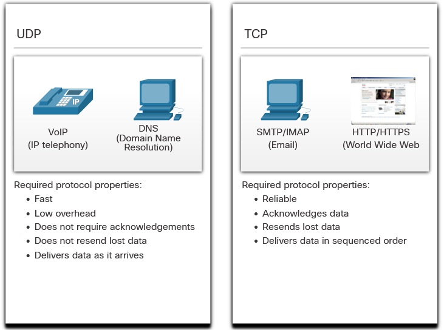

# TCP Overview
TCP packets take a path from the source to the destination. However, each of the packets has a sequence number.

 TCP breaks up a message into small pieces known as segments. The segments are numbered in sequence and passed to the IP process for assembly into packets. 
 
 TCP keeps track of the number of segments that have been sent to a specific host from a specific application. If the sender does not receive an acknowledgment within a certain period of time, it assumes that the segments were lost and retransmits them. 
 
 Only the portion of the message that is lost is resent, not the entire message.

In addition to supporting the basic functions of data segmentation and reassembly, TCP also provides the following services:

- **Establishes a Session** - TCP is a **connection-oriented** protocol that negotiates and establishes a permanent connection (or session) between source and destination devices prior to forwarding any traffic. Through session establishment, the devices negotiate the amount of traffic that can be forwarded at a given time, and the communication data between the two can be closely managed.
- **Ensures Reliable Delivery** - TCP ensures that each segment that is sent by the source arrives at the destination.
- **Provides Same-Order Delivery** - By numbering and sequencing the segments, TCP ensures segments are reassembled into the proper order.
- **Supports Flow Control** - Network hosts have limited resources (i.e., memory and processing power). When TCP is aware that these resources are overtaxed, it can request that the sending application reduce the rate of data flow. This is done by TCP regulating the amount of data the source transmits. Flow control can prevent the need for retransmission of the data when the resources of the receiving host are overwhelmed.

## TCP Header 
TCP is a stateful protocol which means it keeps track of the state of the communication session.
The stateful session begins with the session establishment and ends with the session termination.

A TCP segment adds 20 bytes (i.e., 160 bits) of overhead when encapsulating the application layer data. 

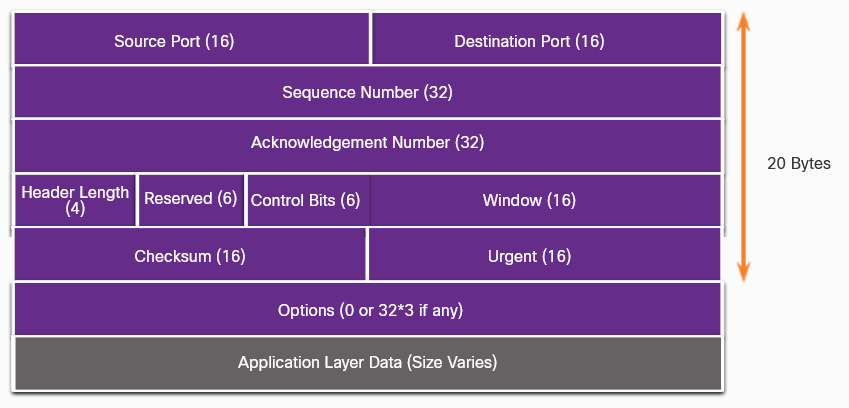

|   TCP Header Field       |   Description                                                                                                                         |
|--------------------------|---------------------------------------------------------------------------------------------------------------------------------------|
|   Source Port            |   A 16-bit field used to identify the source application by port number.                                                              |
|   Destination Port       |   A 16-bit field used to identify the destination application by port number.
|   Sequence Number        |   A 32-bit field used for data reassembly purposes.                                                                                   
|   Acknowledgment Number  |   A 32-bit field used to indicate that data has been received and the next byte expected from the source. 
|   Header Length          |   A 4-bit field known as "data offset" that indicates the length of the TCP segment header.   
|   Reserved               |   A 6-bit field that is reserved for future use.  
|   Control bits           |   A 6-bit field that includes bit codes, or flags, which indicate the purpose and function of the TCP segment.   
|   Window size            |   A 16-bit field used to indicate the number of bytes that can be accepted at one time.  
|   Checksum               |   A 16-bit field used for error checking of the segment header and data.     
|   Urgent                 |   A 16-bit field used to indicate if the contained data is urgent.  

### Applications that use TCP 
TCP is a good example of how the different layers of the TCP/IP protocol suite have specific roles. TCP handles all tasks associated with dividing the data stream into segments, providing reliability, controlling data flow, and reordering segments. TCP frees the application from having to manage any of these tasks.

- HTTP
- FTP
- SMTP
- SSH

# UDP Overview
UDP is a best-effort transport protocol. UDP is a lightweight transport protocol that offers the same data segmentation and reassembly as TCP, but without TCP reliability and flow control.

UDP features include the following:

- Data is reconstructed in the order that it is received.
- Any segments that are lost are not resent.
- There is no session establishment.
- The sending is not informed about resource availability.

## UDP Header 
UDP is a stateless protocol, meaning neither the client, nor the server, tracks the state of the communication session. If reliability is required when using UDP as the transport protocol, it must be handled by the application.

One of the most important requirements for delivering live video and voice over the network is that the data continues to flow quickly.

The blocks of communication in UDP are called datagrams, or segments. These datagrams are sent as best effort by the transport layer protocol.

UDP Header only has four fields and requires 8 bytes (i.e., 64 bits). 

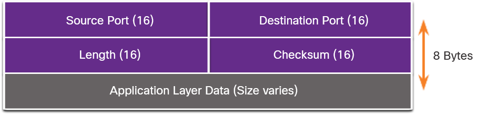

|   UDP Header Field       |   Description                                                                                                                         |
|--------------------------|---------------------------------------------------------------------------------------------------------------------------------------|
|   Source Port            |   A 16-bit field used to identify the source application by port number. 
|   Destination Port       |   A 16-bit field used to identify the destination application by port number.            
|   Length                 |   A 16-bit field that indicates the length of the UDP datagram header.         
|   Checksum               |   A 16-bit field used for error checking of the datagram header and data.                  

### Applications that use UDP 
There are three types of applications that are best suited for UDP:

- **Live video and multimedia applications** - These applications can tolerate some data loss, but require little or no delay. Examples include VoIP and live streaming video.
- **Simple request and reply applications** - For example DNS and DHCP.
- **Applications that handle reliability themselves** - Unidirectional communications where flow control, error detection, acknowledgments, and error recovery is not required, or can be handled by the application. Examples include SNMP and TFTP.

> Although DNS and SNMP use UDP by default, both can also use TCP. DNS will use TCP if the DNS request or DNS response is more than 512 bytes, such as when a DNS response includes many name resolutions. Similarly, under some situations the network administrator may want to configure SNMP to use TCP.

# Port Numbers
A port is a numeric identifier within each segment that is used to keep track of specific conversations between a client and server. Every message that a host sends contains both a source and destination port.

No matter what type of data is being transported, both TCP and UDP use port numbers.

The TCP and UDP transport layer protocols use port numbers to manage multiple, simultaneous conversations. 

- **Source port** - Associated with the originating application on the local host. 
- **Destination port** - Associated with the destination application on the remote host.

> For instance, assume a host is initiating a web page request from a web server. When the host initiates the web page request, the source port number is dynamically generated by the host to uniquely identify the conversation. Each request generated by a host will use a different dynamically created source port number. This process allows multiple conversations to occur simultaneously.

## Socket Pairs
The source and destination ports are placed within the segment. The segments are then encapsulated within an IP packet. The IP packet contains the IP address of the source and destination. The combination of the source IP address and source port number, or the destination IP address and destination port number is known as a socket.

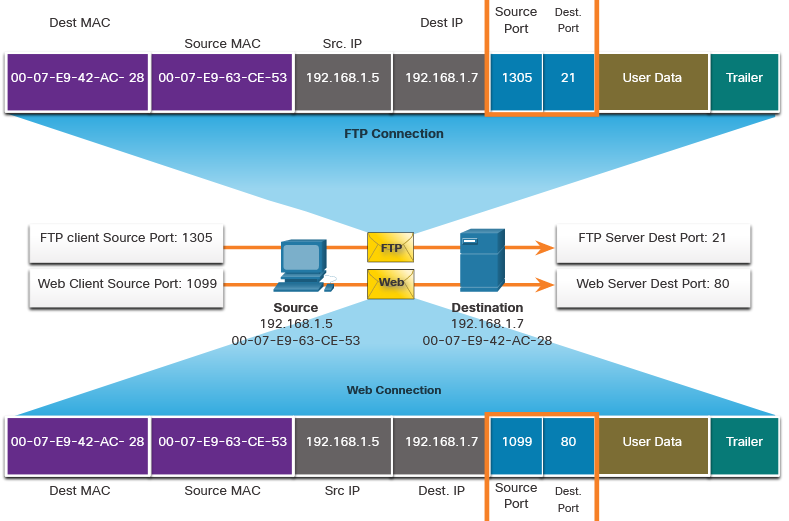

The socket is used to identify the server and service being requested by the client. A client socket might look like this: 

    192.168.1.5:1099

The socket on a web server: 

    192.168.1.7:80

Together, these two sockets combine to form a socket pair: 

    192.168.1.5:1099, 192.168.1.7:80

Sockets enable multiple processes, running on a client, to distinguish themselves from each other, and multiple connections to a server process to be distinguished from each other.

The source port number acts as a return address for the requesting application.

### Port Number Groups 
Ports are assigned and managed by an organization known as the Internet Corporation for Assigned Names and Numbers (ICANN). Ports are broken into three categories and range in number from 1 to 65,535:

| Port Group                   | Number Range          | Description                                                                                                      |
|------------------------------|-----------------------|------------------------------------------------------------------------------------------------------------------|
| Well-known Ports             | 0 to 1,023            | Reserved for common or popular services and applications such as web browsers, email clients, and remote access clients.|
| Registered Ports             | 1,024 to 49,151       | Assigned by IANA to a requesting entity to use with specific processes or applications. These processes are primarily individual applications that a user has chosen to install, rather than common applications that would receive a well-known port number. For example, Cisco has registered port 1812 for its RADIUS server authentication process. |
| Private and/or Dynamic Ports | 49,152 to 65,535      | Known as ephemeral ports. The client’s OS usually assigns port numbers dynamically when a connection to a service is initiated. The dynamic port is then used to identify the client application during communication. |

| Port Number | Transport | Application Protocol                                |
|-------------|-----------|-----------------------------------------------------|
| 20          | TCP       | File Transfer Protocol (FTP) - Data                 |
| 21          | TCP       | FTP - Control                                       |
| 22          | TCP       | Secure Shell (SSH)                                  |
| 23          | TCP       | Telnet                                              |
| 25          | TCP       | Simple Mail Transfer Protocol (SMTP)                |
| 53          | UDP, TCP  | Domain Name Service (DNS)                           |
| 67          | UDP       | Dynamic Host Configuration Protocol (DHCP) - Server |
| 68          | UDP       | DHCP - Client                                       |
| 69          | UDP       | Trivial File Transfer Protocol (TFTP)               |
| 80          | TCP       | Hypertext Transfer Protocol (HTTP)                  |
| 110         | TCP       | Post Office Protocol version 3 (POP3)               |
| 143         | TCP       | Internet Message Access Protocol (IMAP)             |
| 161         | UDP       | Simple Network Management Protocol (SNMP)           |
| 443         | TCP       | Hypertext Transfer Protocol Secure (HTTPS)          |

### The netstat Command 
Unexplained TCP connections can pose a major security threat. They can indicate that something or someone is connected to the local host. Sometimes it is necessary to know which active TCP connections are open and running on a networked host. 

**Netstat** is an important network utility that can be used to verify those connections. 

    C:\Users\Filda>netstat

    Active Connections

    Proto  Local Address          Foreign Address        State
    TCP    127.0.0.1:50440        kubernetes:65001       ESTABLISHED
    TCP    127.0.0.1:54816        kubernetes:54817       ESTABLISHED
    TCP    127.0.0.1:54817        kubernetes:54816       ESTABLISHED
    TCP    127.0.0.1:54818        kubernetes:54819       ESTABLISHED
    TCP    127.0.0.1:54819        kubernetes:54818       ESTABLISHED
    TCP    127.0.0.1:65001        kubernetes:50440       ESTABLISHED
    TCP    192.168.10.248:64751   ec2-52-7-188-225:https  TIME_WAIT

    ...

> By default, the netstat command will attempt to resolve IP addresses to domain names and port numbers to well-known applications. The -n option can be used to display IP addresses and port numbers in their numerical form.

# TCP Communication Process
An individual server cannot have two services assigned to the same port number within the same transport layer services.

An active server application assigned to a specific port is considered open, which means that the transport layer accepts, and processes segments addressed to that port. Any incoming client request addressed to the correct socket is accepted, and the data is passed to the server application. 

### Clients Sending TCP Requests
Client 1 is requesting web services and Client 2 is requesting email service of the same sever.
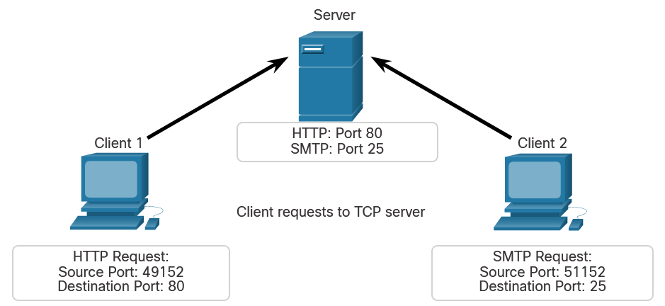

### Request Destination Ports
Client 1 is requesting web services using well-known destination port 80 (HTTP) and Client 2 is requesting email service using well-known port 25 (SMTP).
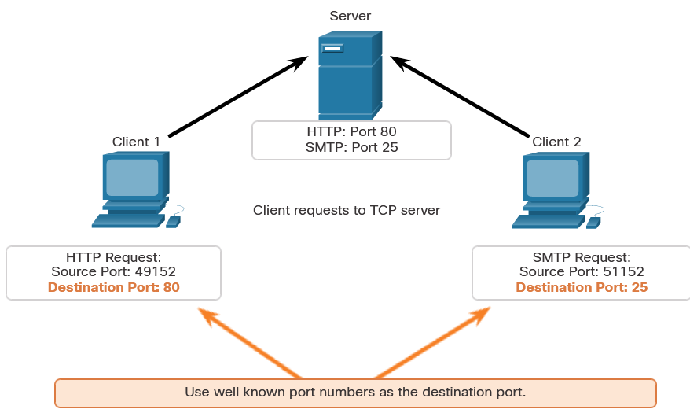

### Request Source Ports
Client requests dynamically generate a source port number. In this case, Client 1 is using source port 49152 and Client 2 is using source port 51152.
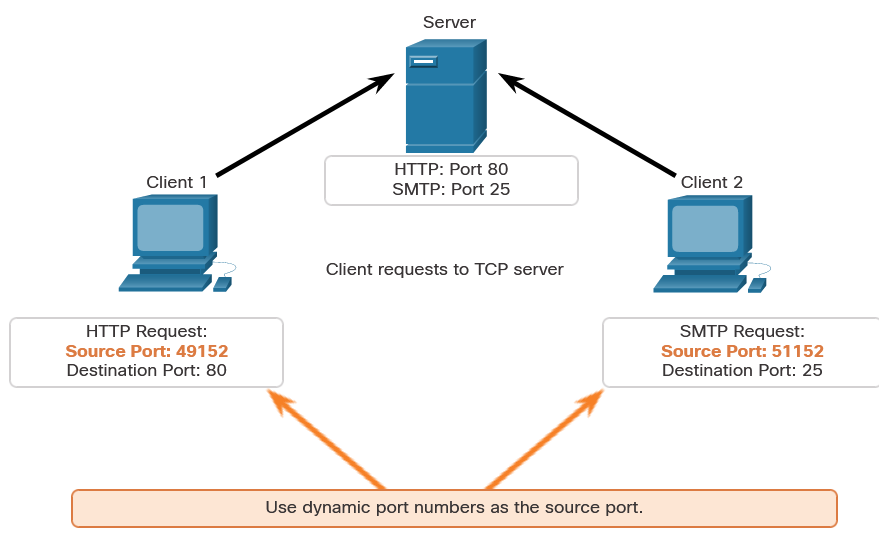

### Response Destination Ports
When the server responds to the client requests, it reverses the destination and source ports of the initial request. Notice that the Server response to the web request now has destination port 49152 and the email response now has destination port 51152.

### Response Source Ports
The source port in the server response is the original destination port in the initial requests.
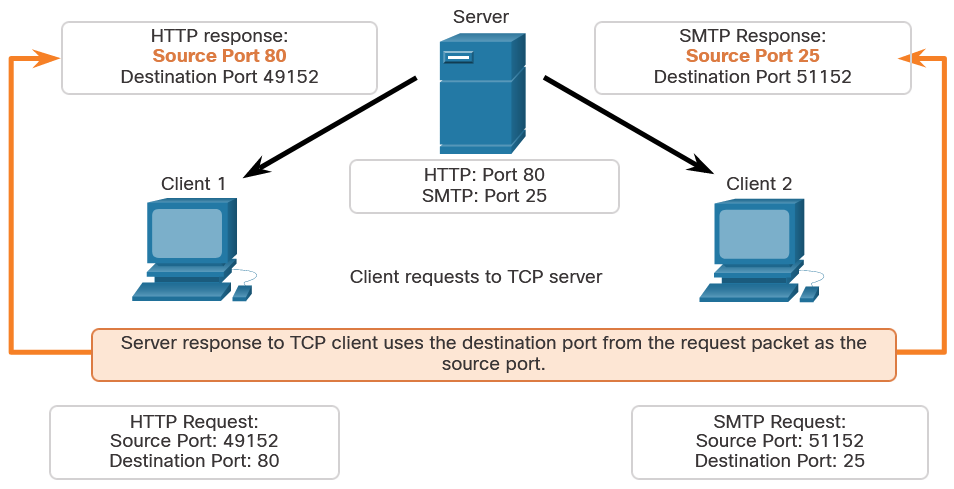

## TCP Connection Establishment 
In TCP connections, the host client establishes the connection with the server using the **three-way handshake** process.

### Step 1. SYN
The initiating client requests a client-to-server communication session with the server.

### Step 2. ACK and SYN 
The server acknowledges the client-to-server communication session and requests a server-to-client communication session.

### Step 3. ACK
The initiating client acknowledges the server-to-client communication session.

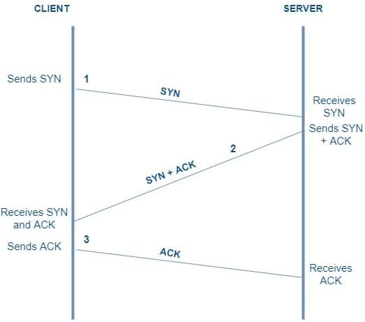

The three-way handshake validates that the destination host is available to communicate.

## Session Termination 
To close a connection, the Finish (FIN) control flag must be set in the segment header. To end each one-way TCP session, a **two-way handshake**, consisting of a FIN segment and an Acknowledgment (ACK) segment, is used. 

### Step 1. FIN
When the client has no more data to send in the stream, it sends a segment with the FIN flag set.

### Step 2. ACK
The server sends an ACK to acknowledge the receipt of the FIN to terminate the session from client to server.

### Step 3. FIN
The server sends a FIN to the client to terminate the server-to-client session.

### Step 4. ACK
The client responds with an ACK to acknowledge the FIN from the server.

When all segments have been acknowledged, the session is closed.

## TCP Three-way Handshake Analysis 
Hosts maintain state, track each data segment within a session, and exchange information about what data is received using the information in the TCP header. TCP is a full-duplex protocol, where each connection represents two one-way communication sessions. To establish the connection, the hosts perform a three-way handshake. 

These are the functions of the three-way handshake:

- It establishes that the destination device is present on the network.
- It verifies that the destination device has an active service and is accepting requests on the destination port number that the initiating client intends to use.
- It informs the destination device that the source client intends to establish a communication session on that port number.

After the communication is completed the sessions are closed, and the connection is terminated. The connection and session mechanisms enable TCP reliability function.

### Control Bits Field

The six bits in the Control Bits field of the TCP segment header are also known as flags. A flag is a bit that is set to either on or off.

The six control bits flags are as follows:

- **URG** - Urgent pointer field significant
- **ACK** - Acknowledgment flag used in connection establishment and session termination
- **PSH** - Push function
- **RST** - Reset the connection when an error or timeout occurs
- **SYN** - Synchronize sequence numbers used in connection establishment
- **FIN** - No more data from sender and used in session termination

## TCP Reliability - Guaranteed and Ordered Delivery 
The reason that TCP is the better protocol for some applications is because, unlike UDP, it resends dropped packets and number of packets to indicate their proper order before delivery. TCP can also help maintain the flow of packets so that devices do not become overloaded.

There may be times when TCP segments do not arrive at their destination or out of order. Sequence numbers are assigned in the header of each packet to achieve this reassemble segments. The sequence number represents the first data byte of the TCP segment.

During session setup, an initial sequence number (ISN) is set. This ISN represents the starting value of the bytes that are transmitted to the receiving application. As data is transmitted during the session, the sequence number is incremented by the number of bytes that have been transmitted. This data byte tracking enables each segment to be uniquely identified and acknowledged. Missing segments can then be identified.

The ISN does not begin at one but is effectively a random number. This is to prevent certain types of malicious attacks.

Segment sequence numbers indicate how to reassemble and reorder received segments.

The receiving TCP process places the data from a segment into a receiving buffer. Segments are then placed in the proper sequence order and passed to the application layer when reassembled. Any segments that arrive with sequence numbers that are out of order are held for later processing. Then, when the segments with the missing bytes arrive, these segments are processed in order.

## TCP Reliability - Data Loss and Retransmission ,
TCP provides methods of managing segment losses.

The sequence (SEQ) number and acknowledgement (ACK) number are used together to confirm receipt of the bytes of data contained in the transmitted segments. The SEQ number identifies the first byte of data in the segment being transmitted. TCP uses the ACK number sent back to the source to indicate the next byte that the receiver expects to receive. This is called **expectational acknowledgement**.

> TCP could only acknowledge the next byte expected. For example, in the figure, using segment numbers for simplicity, host A sends segments 1 through 10 to host B. If all the segments arrive except for segments 3 and 4, host B would reply with acknowledgment specifying that the next segment expected is segment 3. Host A has no idea if any other segments arrived or not. Host A would, therefore, resend segments 3 through 10. If all the resent segments arrived successfully, segments 5 through 10 would be duplicates. This can lead to delays, congestion, and inefficiencies.

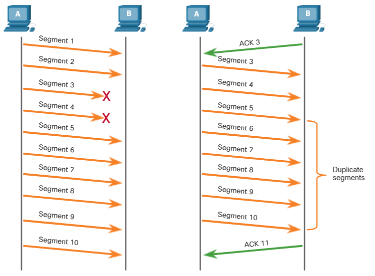

> Host operating systems today typically employ an optional TCP feature called **selective acknowledgment (SACK)**, negotiated during the three-way handshake. If both hosts support SACK, the receiver can explicitly acknowledge which segments (bytes) were received including any discontinuous segments. The sending host would therefore only need to retransmit the missing data. For example, in the next figure, again using segment numbers for simplicity, host A sends segments 1 through 10 to host B. If all the segments arrive except for segments 3 and 4, host B can acknowledge that it has received segments 1 and 2 (ACK 3), and selectively acknowledge segments 5 through 10 (SACK 5-10). Host A would only need to resend segments 3 and 4.

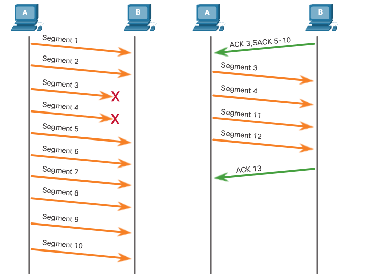

> TCP uses timers to know how long to wait before resending a segment.

## TCP Flow Control - Window Size and Acknowledgments 
TCP also provides mechanisms for flow control. Flow control is the amount of data that the destination can receive and process reliably. Flow control helps maintain the reliability of TCP transmission by adjusting the rate of data flow between source and destination for a given session. To accomplish this, the TCP header includes a 16-bit field called the window size.

The window size determines the number of bytes that can be sent before expecting an acknowledgment. The acknowledgment number is the number of the next expected byte. The initial window size is agreed upon when the TCP session is established during the three-way handshake. The source device must limit the number of bytes sent to the destination device based on the window size of the destination. Only after the source device receives an acknowledgment that the bytes have been received, can it continue sending more data for the session. 

> Note: Devices today use the sliding windows protocol. The receiver typically sends an acknowledgment after every two segments it receives. The number of segments received before being acknowledged may vary. The advantage of sliding windows is that it allows the sender to continuously transmit segments, as long as the receiver is acknowledging previous segments.

## TCP Flow Control - Maximum Segment Size (MSS) 
 The MSS is part of the options field in the TCP header that specifies the largest amount of data, in bytes, that a device can receive in a single TCP segment. The MSS size does not include the TCP header. The MSS is typically included during the three-way handshake. 

 A common MSS is 1,460 bytes when using IPv4. A host determines the value of its MSS field by subtracting the IP and TCP headers from the Ethernet maximum transmission unit (MTU). On an Ethernet interface, the default MTU is 1500 bytes. Subtracting the IPv4 header of 20 bytes and the TCP header of 20 bytes, the default MSS size will be 1460 bytes.

 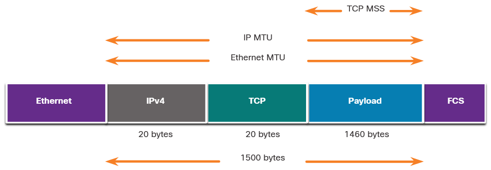

## TCP Flow Control - Congestion Avoidance 
When congestion occurs on a network, it results in packets being discarded by the overloaded router. When packets containing TCP segments do not reach their destination, they are left unacknowledged. By determining the rate at which TCP segments are sent but not acknowledged, the source can assume a certain level of network congestion.

Whenever there is congestion, retransmission of lost TCP segments from the source will occur. If the retransmission is not properly controlled, the additional retransmission of the TCP segments can make the congestion even worse. To avoid and control congestion, TCP employs several congestion handling mechanisms, timers, and algorithms. 

If the source determines that the TCP segments are either not being acknowledged or not acknowledged in a timely manner, then it can reduce the number of bytes it sends before receiving an acknowledgment.

**TCP Congestion Control**
 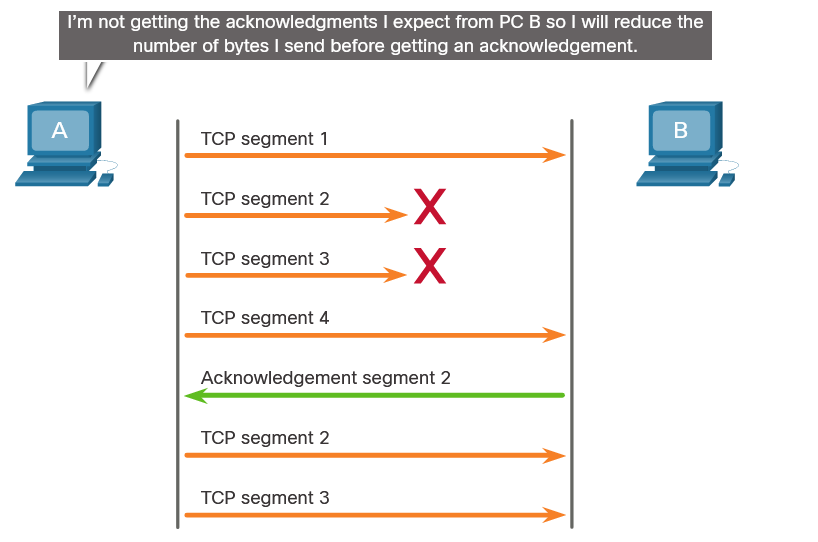

# UDP Communication
## UDP Low Overhead versus Reliability 
UDP does not establish a connection. UDP provides low overhead data transport because it has a small datagram header and no network management traffic. 

## UDP Datagram Reassembly 
Like segments with TCP, when UDP datagrams are sent to a destination, they often take different paths and arrive in the wrong order. UDP does not track sequence numbers the way TCP does. Therefore, UDP simply reassembles the data in the order that it was received and forwards it to the application. 

## UDP Server Processes and Requests 
UDP-based server applications are assigned well-known or registered port numbers. When UDP receives a datagram destined for one of these ports, it forwards the application data to the appropriate application based on its port number.

## UDP Client Processes 
As with TCP, client-server communication is initiated by a client application that requests data from a server process. The UDP client process dynamically selects a port number from the range of port numbers and uses this as the source port for the conversation. The destination port is usually the well-known or registered port number assigned to the server process.

After a client has selected the source and destination ports, the same pair of ports are used in the header of all datagrams in the transaction. For the data returning to the client from the server, the source and destination port numbers in the datagram header are reversed.

### Clients Sending UDP Requests 
Client 1 is sending a DNS request while Client 2 is requesting RADIUS authentication services of the same server.
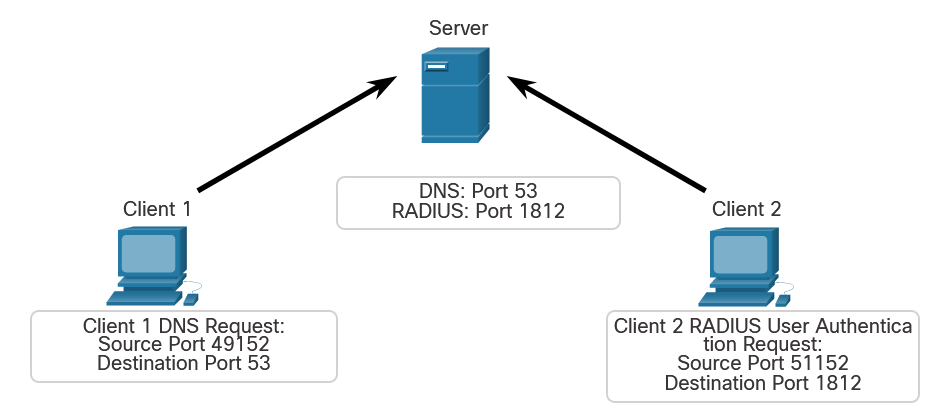

### UDP Request Destination Ports
Client 1 is sending a DNS request using the well-known destination port 53 while Client 2 is requesting RADIUS authentication services using the registered destination port 1812.
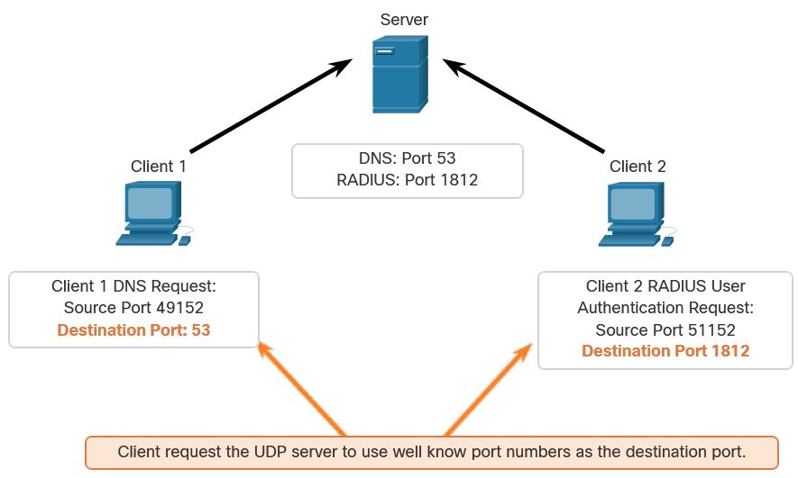

### UDP Request Source Ports
The requests of the clients dynamically generate source port numbers. In this case, Client 1 is using source port 49152 and Client 2 is using source port 51152.
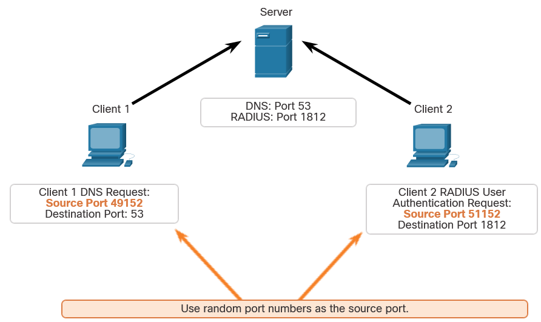

### UDP Response Destination
When the server responds to the client requests, it reverses the destination and source ports of the initial request. In the Server response to the DNS request is now destination port 49152 and the RADIUS authentication response is now destination port 51152.
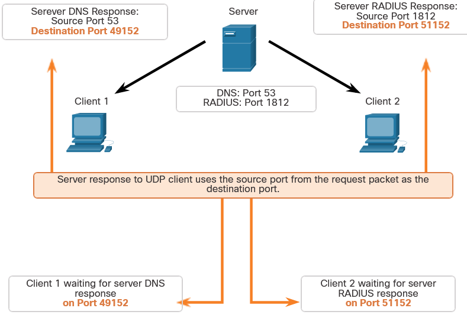

### UDP Response Source Ports
The source ports in the server response are the original destination ports in the initial requests.
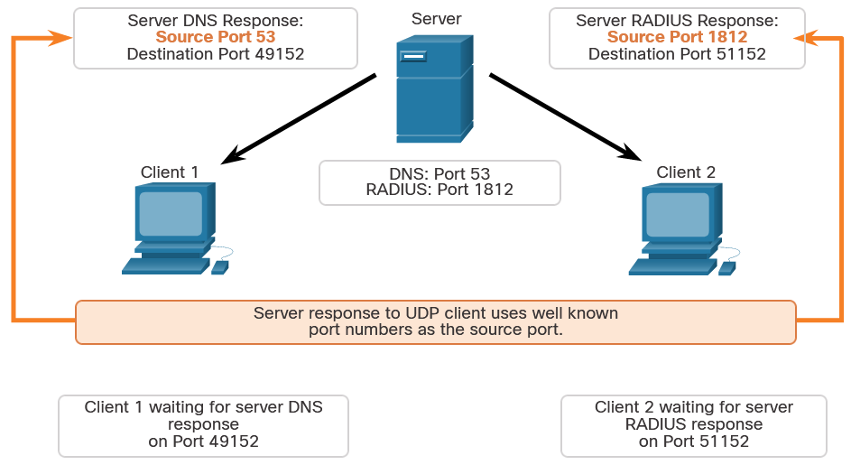
