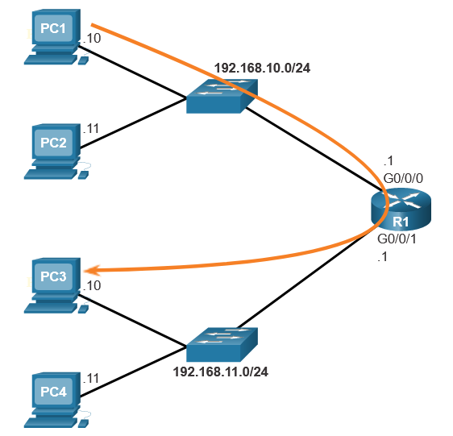

# Cisco IOS Command Line

# IOS Navigation
The Cisco IOS command line interface (CLI) is a text-based program that enables entering and executing Cisco IOS commands to configure, monitor, and maintain Cisco devices.

When the router has completed the power-up sequence and the Router> prompt appears, the CLI can be used to enter Cisco IOS commands.

    Router con0 is now available

    Press RETURN to get started!

    Router> enable
    Router# configure terminal
    Enter configuration commands, one per line. End with CNTL/Z.
    Router(config)# hostname R1
    R1(config)# interface gigabitethernet 0/0/0
    R1(config-if)#

##  Primary Command Modes 
As a security feature, the Cisco IOS software separates management access into the following two command modes:

- **User EXEC Mode** - This mode has limited capabilities but is useful for basic operations. It allows only a limited number of basic monitoring commands but does not allow the execution of any commands that might change the configuration of the device. The user EXEC mode is identified by the CLI prompt that ends with the > symbol.
- **Privileged EXEC Mode** - To execute configuration commands, a network administrator must access privileged EXEC mode. Higher configuration modes, like global configuration mode, can only be reached from privileged EXEC mode. The privileged EXEC mode can be identified by the prompt ending with the # symbol.

The table summarizes the two modes and displays the default CLI prompts of a Cisco switch and router.

| Command Mode           | Description                                                                                          | Default Device Prompt |
|------------------------|------------------------------------------------------------------------------------------------------|-----------------------|
| User EXEC Mode         | Mode allows access to only a limited number of basic monitoring commands. It is often referred to as "view-only" mode. | Switch> Router>      |
| Privileged EXEC Mode   | Mode allows access to all commands and features. The user can use any monitoring commands and execute configuration and management commands. | Switch# Router#    |

### Commands

To list available commands in User EXEC mode or privileged EXEC mode

    Switch>?

Enter privileged EXEC mode using the enable command.

    Switch>enabled

Return to user EXEC mode using the disable command.

    Switch#disable

Enter global configuration mode using the configure terminal command.

    Switch#configure terminal

Exit global configuration mode and return to privileged EXEC mode using the exit command.

    Switch(config)#exit

Enter line subconfiguration mode for the console port using the line console 0 command.

    Switch(config)#line console 0
    Switch(config-line)#

Return to global configuration mode using the exit command.

    Switch(config-line)#exit

Enter VTY line subconfiguration mode using the line vty 0 15 command.

    Switch(config)#line vty 0 15
    Switch(config-line)#

Return to global configuration mode.

    Switch(config-line)# exit
    Switch(config)#

Enter the VLAN 1 interface subconfiguration mode using the interface vlan 1 command.

    Switch(config)#interface vlan 1
    Switch(config-if)#

From interface configuration mode, switch to line console subconfiguration mode using the line console 0 global configuration command.

    Switch(config-if)#line console 0
    Switch(config-line)#

Return to privileged EXEC mode using the end command.

    Switch(config-line)#end
    Switch>

# Basic IOS Command Structure 
A Cisco IOS device supports many commands. Each IOS command has a specific format, or syntax, and can only be executed in the appropriate mode.

    Switch>show ip protocols
    Prompt><Command> <Keyword(s) or Arguments(s)>

- **Keyword** - This is a specific parameter defined in the operating system
- **Argument** - This is not predefined; it is a value or variable defined by the user

## IOS Command Syntax 
The syntax provides the pattern, or format, that must be used when entering a command.

As identified in the table, boldface text indicates commands and keywords that are entered as shown. Italic text indicates an argument for which the user provides the value.

| Convention  | Description                                                                                                   |
|-------------|---------------------------------------------------------------------------------------------------------------|
| boldface    | Boldface text indicates commands and keywords that you enter literally as shown.                           |
| italics     | Italic text indicates arguments for which you supply values.                                                |
| [x]         | Square brackets indicate an optional element (keyword or argument).                                        |
| {x}         | Braces indicate a required element (keyword or argument).                                                   |
| [x {y | z}] | Braces and vertical lines within square brackets indicate a required choice within an optional element. Spaces are used to clearly delineate parts of the command. |

The following examples demonstrate conventions used to document and use IOS commands:

- ping ip-address - The command is ping and the user-defined argument of ip-address is the IP address of the destination device. For example, ping 10.10.10.5.
- traceroute ip-address - The command is traceroute and the user-defined argument of ip-address is the IP address of the destination device. For example, traceroute 192.168.254.254.

If a command is complex with multiple arguments, you may see it represented like this:

    Switch(config-if)# switchport port-security aging { static | time time | type {absolute | inactivity}}

## View Device Information
The Cisco IOS CLI show commands display relevant information about the configuration and operation of the device. 

Commonly used show commands:
| Command               | Used to                                                   |
|-----------------------|------------------------------------------------------------|
| show running-config   | Verify the current configuration and settings.            |
| show interfaces       | Verify the interface status and see if there are any error messages. |
| show ip interface     | Verify the Layer 3 information of an interface.          |
| show arp              | Verify the list of known hosts on the local Ethernet LANs. |
| show ip route         | Verify the Layer 3 routing information.                   |
| show protocols        | Verify which protocols are operational.                   |
| show version          | Verify the memory, interfaces, and licenses of the device. |

# Build a Small CISCO network

## Basic Switch Configuration 
The Cisco switch only needs to be assigned basic security information before being connected to the network. Elements that are usually configured on a LAN switch include: host name, management IP address information, passwords, and descriptive information.

The switch host name is the configured name of the device.

A management IP address is only necessary if you plan to configure and manage the switch through an in-band connection on the network. A management address enables you to reach the device through Telnet, SSH, or HTTP clients.

In order to secure a Cisco LAN switch, it is necessary to configure passwords on each of the various methods of access to the command line. The minimum requirements include assigning passwords to remote access methods, such as Telnet, SSH and the console connection. You must also assign a password to the privileged mode in which configuration changes can be made.

> Note: Telnet sends the username and password in plaintext and is not considered secure. SSH encrypts the username and password and is, therefore, a more secure method.

Configure the device name.

    hostname name

Secure user EXEC mode.

    line console 0
    password password
    login

Secure remote Telnet / SSH access.

    line vty 0 15
    password password
    login

Secure privileged EXEC mode.

    enable secret password

Secure all passwords in the config file.

    service password-encryption

Provide legal notification.

    banner motd delimiter message delimiter

Configure the management SVI.

    interface vlan 1
    ip address ip-address subnet-mask
    no shutdown

Save the configuration.

    copy running-config startup-config

#### Sample Switch Configuration
    Switch> enable
    Switch# configure terminal
    Switch(config)# hostname S1
    S1(config)# enable secret class
    S1(config)# line console 0
    S1(config-line)# password cisco
    S1(config-line)# login
    S1(config-line)# line vty 0 15
    S1(config-line)# password cisco
    S1(config-line)# login
    S1(config-line)# exit
    S1(config)# service password-encryption
    S1(config)# banner motd #No unauthorized access allowed!#
    S1(config)# interface vlan1
    S1(config-if)# ip address 192.168.1.20 255.255.255.0
    S1(config-if)# no shutdown
    S1(config-if)# end
    S1# copy running-config startup-config
    Destination filename [startup-config]?
    Building configuration...
    [OK]
    S1#

## Switch Virtual Interface Configuration 
To access the switch remotely, an IP address and a subnet mask must be configured on the **switch virtual interface (SVI)**. To configure an SVI on a switch, use the interface vlan 1 global configuration command. Vlan 1 is not an actual physical interface but a virtual one. Next, assign an IPv4 address using the ip address ip-address subnet-mask interface configuration command. Finally, enable the virtual interface using the no shutdown interface configuration command.

    Sw-Floor-1# configure terminal
    Sw-Floor-1(config)# interface vlan 1
    Sw-Floor-1(config-if)# ip address 192.168.1.20 255.255.255.0
    Sw-Floor-1(config-if)# no shutdown
    Sw-Floor-1(config-if)# exit
    Sw-Floor-1(config)# ip default-gateway 192.168.1.1

## Configure Initial Router Settings
The following tasks should be completed when configuring initial settings on a router.

**Step 1. Configure the device name.**

    Router(config)# hostname hostname

**Step 2. Secure privileged EXEC mode.**

    Router(config)# enable secret password

**Step 3. Secure user EXEC mode.**

    Router(config)# line console 0
    Router(config-line)# password password
    Router(config-line)# login

**Step 4. Secure remote Telnet / SSH access.**

    Router(config-line)# line vty 0 4
    Router(config-line)# password password
    Router(config-line)# login
    Router(config-line)# transport input {ssh | telnet | none | all}

**Step 5. Secure all passwords in the config file.**

    Router(config-line)# exit
    Router(config)# service password-encryption

**Step 6. Provide legal notification.**

    Router(config)# banner motd delimiter message delimiter

**Step 7. Save the configuration.**

    Router(config)# copy running-config startup-config

### Basic Router Configuration Example 
In this example, router R1 will be configured with initial settings. 

    Router> enable
    Router# configure terminal
    Enter configuration commands, one per line.
    End with CNTL/Z.
    Router(config)# hostname R1
    R1(config)#

All router access should be secured. Privileged EXEC mode provides the user with complete access to the device and its configuration, so you must secure it.

The following commands secure privileged EXEC mode and user EXEC mode, enable Telnet and SSH remote access, and encrypt all plaintext (i.e., user EXEC and vty line) passwords.

    R1(config)# enable secret class
    R1(config)#
    R1(config)# line console 0
    R1(config-line)# password cisco
    R1(config-line)# login
    R1(config-line)# exit
    R1(config)#
    R1(config)# line vty 0 4
    R1(config-line)# password cisco
    R1(config-line)# login
    R1(config-line)# transport input ssh telnet
    R1(config-line)# exit
    R1(config)#
    R1(config)# service password-encryption
    R1(config)#

The legal notification warns users that the device should only be accessed by permitted users. Legal notification is configured as follows:

    R1(config)# banner motd #
    Enter TEXT message. End with the character '#'.
    ***********************************************
    WARNING: Unauthorized access is prohibited!
    ***********************************************
    R1(config)#

If the router were to be configured with the previous commands and it accidently lost power, the router configuration would be lost. For this reason, it is important to save the configuration when changes are implemented. The following command saves the configuration to NVRAM:

    R1# copy running-config startup-config
    Destination filename [startup-config]?
    Building configuration...
    [OK]
    R1#

## Secure the Devices
To protect network devices, it is important to use strong passwords.

On Cisco routers, leading spaces are ignored for passwords, but spaces after the first character are not. Therefore, one method to create a strong password is to use the space bar and create a phrase made of many words. This is called a passphrase. A passphrase is often easier to remember than a simple password. It is also longer and harder to guess.

### Secure Remote Access 
There are multiple ways to access a device to perform configuration tasks. One of these ways is to use a PC attached to the console port on the device. This type of connection is frequently used for initial device configuration.

Setting a password for console connection access is done in global configuration mode. These commands prevent unauthorized users from accessing user mode from the console port.

    Switch(config)# line console 0
    Switch(config-line)# password password
    Switch(config-line)# login

When the device is connected to the network, it can be accessed over the network connection using SSH or Telnet. SSH is the preferred method because it is more secure. When the device is accessed through the network, it is considered a vty connection. The password must be assigned to the vty port. The following configuration is used to enable SSH access to the switch.

    Switch(config)# line vty 0 15
    Switch(config-line)# password password
    Switch(config-line)# transport input ssh
    Switch(config-line)# login

An example configuration is shown in the command window.

    S1(config)# line console 0
    S1(config-line)# password cisco
    S1(config-line)# login
    S1(config-line)# exit
    S1(config)#
    S1(config)# line vty 0 15
    S1(config-line)# password cisco
    S1(config-line)# login
    S1(config-line)#

By default, many Cisco switches support up to 16 vty lines that are numbered 0 to 15. The number of vty lines supported on a Cisco router varies.

Five is the most common number of vty lines configured on a router. These lines are numbered 0 to 4 by default, though additional lines can be configured. A password needs to be set for all available vty lines. The same password can be set for all connections.

To verify that the passwords are set correctly, use the **show running-config** command. These passwords are stored in the running-configuration in plaintext. It is possible to set encryption on all passwords stored with command **service password-encryption** ensures that all passwords are encrypted.

### Enable SSH 
Before configuring SSH, the switch must be minimally configured with a unique hostname and the correct network connectivity settings.

**Step 1. Verify SSH support.**

To see if switch supports SSH use:

    show ip ssh

**Step 2. Configure the IP domain.**

Configure the IP domain name of the network using:

    ip domain-name domain-name

**Step 3. Generate RSA key pairs.**

Not all versions of the IOS default to SSH version 2, and SSH version 1 has known security flaws. To configure SSH version 2, issue: 

    ip ssh version 2 

Generating an RSA key pair automatically enables SSH. To enable the SSH server on the switch and generate an RSA key pair:

    crypto key generate rsa 

When generating RSA keys, the administrator is prompted to enter a modulus length. 

To delete the RSA key pair use: 

    crypto key zeroize rsa 

After the RSA key pair is deleted, the SSH server is automatically disabled.

**Step 4. Configure user authentication.**

The SSH server can authenticate users locally or use an authentication server. To use the local authentication method, create a username and password pair with:

    username <username> secret <password> 

**Step 5. Configure the vty lines.**

Enable the SSH protocol on the vty lines using: 

    transport input ssh

The **Catalyst 2960** has vty lines ranging from 0 to 15. This configuration prevents non-SSH (such as Telnet) connections and limits the switch to accept only SSH connections. 

To require authentication for SSH connections from the local username database use:

    line vty

and then the login 

    local line 

**Step 6. Enable SSH version 2.**

By default, SSH supports both versions 1 and 2. When supporting both versions, this is shown in the:

    show ip ssh
 
It is recommended to enable only version 2. Enable SSH version using the 

    ip ssh version 2 

#### Example configuration

    S1# show ip ssh
    SSH Disabled - version 1.99
    %Please create RSA keys (of at least 768 bits size) to enable SSH v2.
    Authentication timeout: 120 secs; Authentication retries: 3
    S1# configure terminal
    S1(config)# ip domain-name cisco.com
    S1(config)# crypto key generate rsa
    The name for the keys will be: S1.cisco.com
    ...
    How many bits in the modulus [512]: 1024
    ...
    S1(config)# username admin secret ccna
    S1(config-line)# line vty 0 15
    S1(config-line)# transport input ssh
    S1(config-line)# login local
    S1(config-line)# exit
    S1(config)# ip ssh version 2
    S1(config)# exit
    S1#

To check the SSH connections to the device use: 

    show ssh command.

## Configure the Default Gateway
If your local network has only one router, it will be the gateway router and all hosts and switches on your network must be configured with this information. If your local network has multiple routers, you must select one of them to be the default gateway router.

The default gateway is only used when the host wants to send a packet to a device on another network. The default gateway address is generally the router interface address attached to the local network of the host. The IP address of the host device and the router interface address must be in the same network.

What if PC1 sent a packet to PC3? PC1 would address the packet with the IPv4 address of PC3, but would forward the packet to its default gateway, which is the G0/0/0 interface of R1. The router accepts the packet and accesses its routing table to determine that G0/0/1 is the appropriate exit interface based on the destination address. R1 then forwards the packet out of the appropriate interface to reach PC3.

The same process would occur on an IPv6 network, although this is not shown in the topology. Devices would use the IPv6 address of the local router as their default gateway.

### Default Gateway on a Switch 
A switch that interconnects client computers is typically a Layer 2 device. As such, a Layer 2 switch does not require an IP address to function properly. However, an IP configuration can be configured on a switch to give an administrator remote access to the switch.

To connect to and manage a switch over a local IP network, it must have a switch virtual interface (SVI) configured. The SVI is configured with an IPv4 address and subnet mask on the local LAN. The switch must also have a default gateway address configured to remotely manage the switch from another network.

To configure an IPv4 default gateway on a switch, use: 

    ip default-gateway <ip-address>

The ip-address that is configured is the IPv4 address of the local router interface connected to the switch.

> Note: Packets originating from host computers connected to the switch must already have the default gateway address configured on their host computer operating systems.

Enter global configuration mode.

    S1#configure terminal

Enter configuration commands, one per line. End with CNTL/Z.
Configure 192.168.10.1 as the default gateway for S1.

    S1(config)#ip default-gateway 192.168.10.1
    S1(config)#