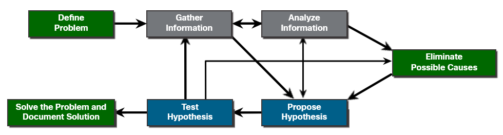
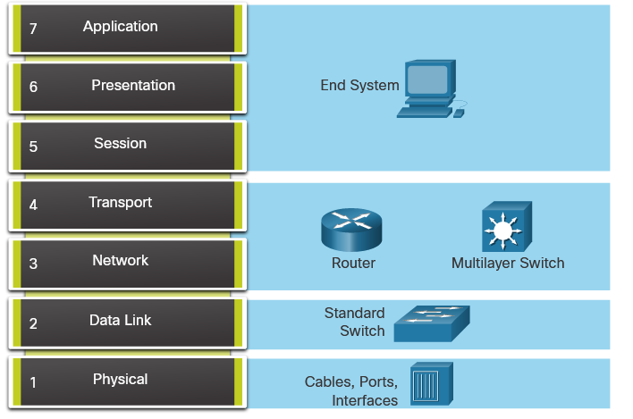
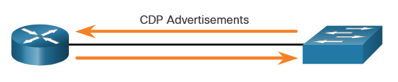
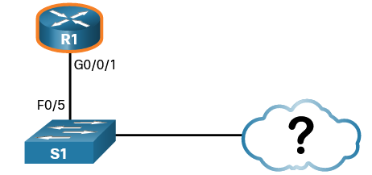
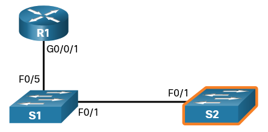
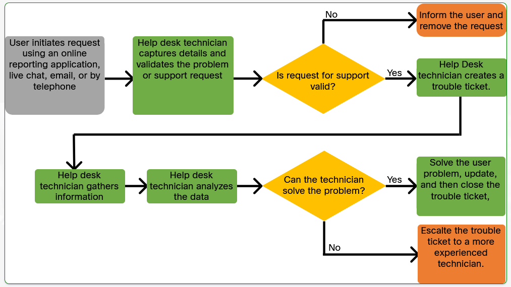

# Network Support

## Diagnostics and Troubleshooting Methodologies
Troubleshooting is a process that should be applied systematically. One approach uses a seven-step process in which the technician defines the problem, gathers relevant information, analyzes the information, eliminates possible causes, proposes a hypothesis about the most likely cause of the problem, and then tests the hypothesis and solves the problem. Another approach is to follow the layers of the OSI model.

Structured troubleshooting can include the use of seven different methods, bottom–up, top-down, divide-and-conquer, follow-the-path, comparison, and the educated guess approach.

The choice of method sometimes depends on the type of issue that is being addressed and the experience of the technician. It is important to always document the issue according to company procedures, including providing information of the eventual resolution of the problem.

## Seven-Step Troubleshooting Process 
The figure displays a more detailed seven-step troubleshooting process. 

## Troubleshooting with Layered Models 
The OSI and TCP/IP models can be applied to isolate network problems when troubleshooting.

The picture shows some common devices and the OSI layers that must be examined during the troubleshooting process for that device.

> Notice that routers and multilayer switches are shown at Layer 4, the transport layer. Although routers and multilayer switches usually make forwarding decisions at Layer 3, ACLs on these devices can be used to make filtering decisions using Layer 4 information.

## Document Findings, Actions, and Outcomes 
After troubleshooting and resolving all issues, it is important to complete the troubleshooting process by documenting all information.

A technician must document the:

- **Problem** - Includes the initial report of the problem, a description of the symptoms, information gathered and any other information that would help resolve similar problems.
- **Solution** - Includes the steps taken to resolve the problem.
- **Commands and Tools Used** - Include the commands and tools used in diagnosing the problem and solving the problem.

Verify the solution with the customer. If the customer is available, demonstrate how the solution has corrected their problem. Have the customer test the solution and try to reproduce the problem. When the customer can verify that the problem has been resolved, you can update the documentation with any new information provided by the customer.

# Network Documentation
Accurate and complete network documentation is required to effectively monitor and troubleshoot networks.

Common network documentation includes the following:

- Physical and logical network topology diagrams
- Network device documentation that records all pertinent device information
- Network performance baseline documentation

## Network Topologies and Descriptions 
Networks vary in size depending on the networking requirement. A technician must be knowledgeable about the different types of networks available to connect end devices and corporate sites.

### PAN
A personal area network (PAN) is a network that connects devices, such as mice, keyboards, printers, smartphones, and tablets within the range of an individual person using Bluetooth.

### LAN
Traditionally, a local area network (LAN) is defined as a network that connects devices using wire cables in a small geographical area. However, the distinguishing characteristic for LANs today is that they are typically owned by an individual, such as in a home or small business, or wholly managed by an IT department, such as in a school or corporation.

### VLAN
Virtual LANs (VLANs) allow an administrator to segment the ports on a single switch as if it were multiple switches. This provides more efficient forwarding of data by isolating traffic to only those ports where it is required. VLANs also allow end devices to be grouped together for administrative purposes.

### WLAN
A wireless LAN (WLAN) is similar to a LAN but wirelessly connects users and devices in a small geographical area instead of using a wired connection. A WLAN uses radio waves to transmit data between wireless devices.

### WMN
A wireless mesh network (WMN) uses multiple access points to extend the WLAN. 
The two wireless APs extend the reach of the WLAN within the home. Similarly, businesses and municipalities can use WMNs to quickly add new areas of coverage.

### CAN
A campus area network (CAN) is a group of interconnected LANs, belonging to the same organization and operating in a limited geographical area. These can be both academic campuses and business or corporate campuses. Campus area networks typically consist of several buildings interconnected by high-speed Ethernet links using fiber optic cabling.

### MAN
A metropolitan area network (MAN) is a network that spans across a large campus or a city. The network consists of various buildings connected through wireless or fiber optic media.

### WAN
A wide area network (WAN) connects multiple networks that are in geographically separated locations. Individuals and organizations contract for WAN access from a service provider. Your service provider for your home or mobile device connects you to the largest WAN, the internet.

### VPN
A virtual private network (VPN) is used to securely connect to another network over an insecure network, such as the internet. The most common type of VPN is used by teleworkers to access a corporate private network. Teleworkers are network users that are offsite or remote. 

## Network Cloud Services and Applications 
There are three basic types of cloud computing:

### **SaaS** - Software as a Service 
SaaS applications are focused on the end-user. Instead of the application being installed locally on the end-user's computer, the application is accessed over the network usually using a web browser. 

Other SaaS applications include:
- Google Sheets
- Google Maps
- Office 365

### **PaaS** - Platform as a Service 
PaaS is used primarily by software developers. PaaS allows developers to focus on their code and not on the underlying software and hardware needed to run their programs. The PaaS cloud provides the servers, storage, security, tools, database and other services to host the consumer's application. 

Some examples if PaaS services include:
- Microsoft Azure
- Saleforce Lightning
- AWS Lambda
- AWS Elastic Beanstalk

### **IaaS** - Infrastructure as a Service 
IaaS is service where computing resources are supplied by a cloud services provider. The IaaS cloud provides the virtual machines (VMs) for storage, networking and other services. The cloud provider is responsible for the uptime requirements, power, and security of the VMs.

Some examples if IaaS services include:
- Cisco Metacloud
- Microsoft Azure
- DigitalOcean
- Google Compute Engine
- Rackspace

### XaaS (Anything/Everything as a Service)
variety of solutions and technologies can be delivered by cloud providers to clients as a service. XaaS is not a specific cloud service but is defined as the delivery of anything and everything as a service. XaaS includes Saas, PaaS and IaaS.

Other examples of XaaS include:

- Disaster recovery as a service (DRaaS) 
- Communications as a service (CaaS) 
- Monitoring as a service (MaaS) 
- Desktop as a service (DaaS) 

## Wireless Standards 
Wireless standards define the operating characteristics of wireless operations, including signaling specifications, data rates, and power efficiency.

| IEEE WLAN Standard | Radio Frequency | Description |
|--------------------|-----------------|-------------|
| 802.11             | 2.4 GHz         | Speeds of up to 2 Mbps |
| 802.11a            | 5 GHz           | Speeds of up to 54 Mbps; Small coverage area; Less effective at penetrating building structures; Not interoperable with 802.11b and 802.11g |
| 802.11b            | 2.4 GHz         | Speeds of up to 11 Mbps; Longer range than 802.11a; Better able to penetrate building structures |
| 802.11g            | 2.4 GHz         | Speeds of up to 54 Mbps; Backward compatible with 802.11b with reduced bandwidth capacity |
| 802.11n            | 2.4 GHz, 5 GHz  | Data rates range from 150 Mbps to 600 Mbps with a distance range of up to 70 m (230 feet); APs and wireless clients require multiple antennas using MIMO technology; Backward compatible with 802.11a/b/g devices with limiting data rates |
| 802.11ac           | 5 GHz           | Provides data rates ranging from 450 Mbps to 1.3 Gbps (1300 Mbps) using MIMO technology; Up to eight antennas can be supported; Backwards compatible with 802.11a/n devices with limiting data rates |
| 802.11ax           | 2.4 GHz, 5 GHz  | Released in 2019 – latest standard; Also known as High-Efficiency Wireless (HEW); Higher data rates; Increased capacity; Handles many connected devices; Improved power efficiency; 1 GHz and 7 GHz capable when those frequencies become available; Search the internet for Wi-Fi Generation 6 for more information; Wi-Fi 6 – Uses 2.4 GHz and 5 GHz bands; Wi-Fi 6E – Uses 6 GHz band |

###  Licensed and Unlicensed Bands
Various communications channels transmit signals over the electromagnetic spectrum. The licensed spectrum refers to the bands (range of frequency) that are reserved for radio stations, cellular companies, and broadcast television stations. Media and cellular companies typical pay for the right to transmit over a specific frequency within the licensed spectrum.

The unlicensed spectrum is open for anyone to use. The unlicensed spectrum is where we find IEEE 802.11 Wi-Fi technologies and is available free to the public. Anyone can transmit over the unlicensed spectrum.

## Network Device Documentation 
Device documentation differs depending on the type of devices. It will often include device operating system and software, licensing information, interface status, addressing, and routing protocols, etc.

## Establish a Network Baseline 
Network baselines are a series of measurements of network performance taken during different types of network usage. The baselines help to understand the parameters of a properly working network so that network performance or security problems can be identified when performance deviates significantly from previous baseline measurements.

## Cisco Discovery Protocol (CDP) Overview 
CDP is a Cisco proprietary Layer 2 protocol that is used to gather information about Cisco devices which share the same data link. CDP is media and protocol independent and runs on all Cisco devices, such as routers, switches, and access servers.

The device sends periodic CDP advertisements to connected devices.

These advertisements share information about the type of device that is discovered, the name of the devices, and the number and type of the interfaces.

### Discover Devices Using CDP 
With CDP enabled on the network, the **show cdp neighbors** command can be used to determine the network layout:

    R1# show cdp neighbors
    Capability Codes: R - Router, T - Trans Bridge, B - Source Route Bridge
                    S - Switch, H - Host, I - IGMP, r - Repeater, P - Phone,
                    D - Remote, C - CVTA, M - Two-port Mac Relay
    
    Device ID        Local Intrfce     Holdtme    Capability  Platform  Port ID
    S1               Gig 0/0/1           179         S I      WS-C3560- Fas 0/5

No information is available regarding the rest of the network. The show cdp neighbors command provides helpful information about each CDP neighbor device, including the following:

- **Device identifiers** - This is the host name of the neighbor device (S1).
    Port identifier - This is the name of the local and remote port (G0/0/1 and F0/5, respectively).
- **Capabilities list** - This shows whether the device is a router or a switch (S for switch; I for IGMP is beyond scope for this course). 
- **Platform** - This is the hardware platform of the device (WS-C3560 for Cisco Catalyst 3560 switch).

The output shows that there is another Cisco device, S1, connected to the G0/0/1 interface on R1. Furthermore, S1 is connected through its F0/5 port, as shown in the updated topology.

The address for S1 is 192.168.1.2:

    R1# show cdp neighbors
    -------------------------
    Device ID: S1
    Entry address(es):
    IP address: 192.168.1.2
    Platform: cisco WS-C3560-24TS, Capabilities: Switch IGMP
    Interface: GigabitEthernet0/0/1, Port ID (outgoing port): FastEthernet0/5
    Holdtime : 136 sec
    
    Version :
    Cisco IOS Software, C3560 Software (C3560-LANBASEK9-M), Version 15.0(2)SE7, R
    RELEASE SOFTWARE (fc1)
    Technical Support: http://www.cisco.com/techsupport
    Copyright (c) 1986-2014 by Cisco Systems, Inc.
    Compiled Thu 23-Oct-14 14:49 by prod_rel_team
    
    advertisement version: 2
    Protocol Hello: OUI=0x00000C, Protocol ID=0x0112; payload len=27,
    value=00000000FFFFFFFF010221FF000000000000002291210380FF0000
    VTP Management Domain: ''
    Native VLAN: 1
    Duplex: full
    Management address(es):
    IP address: 192.168.1.2
    
    Total cdp entries displayed : 1

By accessing S1 either remotely through SSH, or physically through the console port, the network administrator can determine what other devices are connected to S1, as displayed in the output of the show cdp neighbors in the figure.

    S1# show cdp neighbors
    Capability Codes: R - Router, T - Trans Bridge, B - Source Route Bridge
                    S - Switch, H - Host, I - IGMP, r - Repeater, P - Phone,
                    D - Remote, C - CVTA, M - Two-port Mac Relay
    Device ID        Local Intrfce     Holdtme    Capability  Platform  Port ID
    S2               Fas 0/1           150              S I   WS-C2960- Fas 0/1
    R1               Fas 0/5           179             R S I  ISR4331/K Gig 0/0/1

The output displays the specifics of the connection with R1. It also displays S2, another switch that S1 is connected to. Specifically, the output specifies that S2 is a Catalyst 2960 switch using F0/1 to connect to the F0/1 interface on S1.

Again, the network administrator can use show cdp neighbors detail to discover the IP address for S2, and then remotely access it. After a successful login, the network administrator uses the show cdp neighbors command to discover if there are more devices.

    S2# show cdp neighbors
    Capability Codes: R - Router, T - Trans Bridge, B - Source Route Bridge
                    S - Switch, H - Host, I - IGMP, r - Repeater, P - Phone,
                    D - Remote, C - CVTA, M - Two-port Mac Relay
    Device ID        Local Intrfce     Holdtme    Capability  Platform  Port ID
    S1               Fas 0/1           141              S I   WS-C3560- Fas 0/1

The only device connected to S2 is S1. Therefore, there are no more devices to discover in the topology. The network administrator can now update the documentation to reflect the discovered devices.

# Help Desks
A help desk is a specialized team of IT professionals that are the central point of contact for employees and customers who need technical assistance.

## The Security Policy 
The “Security Policy” document contains policies that inform users, IT staff, and managers of the requirements for protecting technology and information assets. As shown in the figure, there are policies for:

- Specifying how users are identified and authenticated
- Setting password length, complexity, and refresh interval
- Defining what behavior is acceptable on the corporate network
- Specifying remote access requirements, etc.

**The Security Policy document** is a constantly evolving document that reacts to changes in the threat landscape, new vulnerabilities, and business and employee requirements. 

**Standard operating procedures (SOP)** - define procedures that must be followed for replacing network devices, installing or removing software applications, new employee onboarding, and employee termination.

**Guidelines** - These cover the areas where there are no SOPs defined.

## Ticketing Systems 
Help desk ticketing systems help organizations manage user problems or requests. Ticketing software is specifically designed to ensure that corporate users or clients receive support in a timely and systematic manner. They also ensure that all tickets get noticed and addressed.

## Know, Relate, and Understand
The table summarizes three general guidelines that help to develop the know, relate, and understand skillset when dealing with customer request:

| Rule       | Suggestion                                                   | Example                                                                                                                                     |
|------------|--------------------------------------------------------------|---------------------------------------------------------------------------------------------------------------------------------------------|
| Know       | Call the user by his or her name.                           | If a user tells you her name is Mrs. Johnson, ask if that is what she prefers to be called by you. She may say yes, or she may give you her first name. In any case, only use the preferred name with your customer. |
| Relate     | Attempt to create a one-to-one connection with the user.    | Try to find something you may have in common. If you hear a pet in the background, briefly ask them about it. If you have had to call customer support for your own computer, mention that you understand how frustrating this can be and that you will do everything you can to help them. Do not lose control of the call. |
| Understand | Determine the user’s level of technical knowledge.            | A customer who is very new to computers will not be likely to know all the jargon that you use every day, so you should use the most common words you can think of to describe aspects of their computer. A more experienced customer probably knows some of the same jargon that you use. |

When interviewing the user, guide the conversation and use effective questioning techniques to quickly ascertain the problem. Two common methods to do so, include using:

**Open-ended questions** - These types of questions allow users to explain the details of the problem in their own words and are useful to obtain general information.

**Closed-ended questions** - These are simple yes, no, or single word answers that can be used to discover important facts about the network problem.

##  Active Listening 
Tips for Using Active Listening with a Customer

- Allow the customer to tell their problem.
- Occasionally interject some small word or phrase such as “I understand,” “Yes,” “I see,” or “Okay.” to let the customer know that you are listening.
- Summarize the customer’s problem when they are done so that you both are certain that you understand.
- Ask clarifying questions.
- Do not interrupt the customer the moment you realize you have a question.

## Gather Information for Host-Related Tickets 
The ticketing system often includes sections for entering host-related information. 

Useful host-related information include:

    - Host manufacturer, model, serial number 
    - Operating system version 
    - Network environment (i.e., wired, wireless, …) 
    - Network connectivity test results (ping, tracert, …) 

Additional information that can be captured from a host include:

    - Beep codes 
    - Event Viewer logs 
    - Device Manager settings
    - Task Manager data
    - Diagnostic tool results

## Gather Information for Cisco Device-Related Tickets 
To gather symptoms from a networking device that is suspected to have issues, use Cisco IOS commands and other tools such as packet captures and device logs.

**Cisco IOS Commands for Gathering Information**
| Command                                     | Description                                                                                               |
|---------------------------------------------|-----------------------------------------------------------------------------------------------------------|
| `ping {host ip-address}`                  | Sends an echo request packet to an address, then waits for a reply. The host or ip-address variable is the IP alias or IP address of the target system. |
| `traceroute destination`                    | Identifies the path a packet takes through the networks. The destination variable is the hostname or IP address of the target system.                 |
| `telnet {host ip-address}`                | Connects to an IP address using the Telnet application. Use SSH whenever possible instead of Telnet.    |
| `ssh -l user-id ip-address`                 | Connects to an IP address using SSH. SSH is more secure than Telnet.                                      |
| `show ip interface brief` `show ipv6 interface brief` | Displays a summary status of all interfaces on a device. Useful for quickly identifying IP addressing on all interfaces.       |
| `show ip route` `show ipv6 route`       | Displays the current IPv4 and IPv6 routing tables, which contain the routes to all known network destinations.          |
| `show protocols`                            | Displays the configured protocols and shows the global and interface-specific status of any configured Layer 3 protocol. |

##  Analyze the Information 
Now that the trouble ticket has been created and information has been gathered, the technician must analyze the information.

Knowledge bases that can be searched include:

- Ticketing software databases - Most ticketing systems build a repository of previous tickets that can be searched to see if another technician resolved an identical or similar problem.
- Vendor resources - Vendors maintain Frequently Asked Questions (FAQs) documents that can be searched and may also offer online tools to help resolve problems. Some offer live chats to solve problems faster.
- Online internet searches - Using search engines to see if a problem has been encountered before.

If the problem cannot be solved, then the ticket must be escalated to a more experienced IT staff member.

# Troubleshoot Endpoint Connectivity
## Windows Network Setup 
Host and IOS commands can help you determine if the problem is with the IP addressing of your devices, which is a common network problem.

Checking the IP addressing on host devices is a common practice in networking for verifying and troubleshooting end-to-end connectivity. In Windows 10, you can access the IP address details from the **Network and Sharing Center > interface > Details**

The preferred method used by technicians to view the IP addressing information on a Windows host is to use the ipconfig Windows command as shown in the sample output.

    C:\Users\PC-A> ipconfig
    Windows IP Configuration
    (Output omitted)
    Wireless LAN adapter Wi-Fi:
    Connection-specific DNS Suffix   . :
    Link-local IPv6 Address . . . . . :
    fe80::a4aa:2dd1:ae2d:a75e%16
    IPv4 Address. . . . . . . . . . . : 192.168.10.10
    Subnet Mask . . . . . . . . . . . : 255.255.255.0
    Default Gateway . . . . . . . . . : 192.168.10.1
    (Output omitted)

The **ipconfig /all** command is used to view additional addressing details as shown in the example output.

    C:\Users\PC-A> ipconfig /all
    Windows IP Configuration
    Host Name . . . . . . . . . . . . : PC-A-00H20
    Primary Dns Suffix . . . . . . . : cisco.com
    Node Type . . . . . . . . . . . . : Hybrid
    IP Routing Enabled. . . . . . . . : No
    WINS Proxy Enabled. . . . . . . . : No
    DNS Suffix Search List. . . . . . : cisco.com
    (Output omitted)
    Wireless LAN adapter Wi-Fi:
    Connection-specific DNS Suffix   . :
    Description . . . . . . . . . . . : Intel(R) Dual Band Wireless-AC 8265
    Physical Address. . . . . . . . . : F8-94-C2-E4-C5-0A
    DHCP Enabled. . . . . . . . . . . : Yes
    Autoconfiguration Enabled . . . . : Yes
    Link-local IPv6 Address . . . . . :
    fe80::a4aa:2dd1:ae2d:a75e%16(Preferred)
    IPv4 Address. . . . . . . . . . . : 192.168.10.10(Preferred)
    Subnet Mask . . . . . . . . . . . : 255.255.255.0
    Lease Obtained. . . . . . . . . . : August 17, 2019 1:20:17 PM
    Lease Expires . . . . . . . . . . : August 18, 2019 1:20:18 PM
    Default Gateway . . . . . . . . . : 192.168.10.1
    DHCP Server . . . . . . . . . . . : 192.168.10.1
    DHCPv6 IAID . . . . . . . . . . . : 100177090
    DHCPv6 Client DUID. . . . . . . . : 00-01-00-01-21-F3-76-75-54-E1-AD-DE-DA-9A
    DNS Servers . . . . . . . . . . . : 192.168.10.1
    NetBIOS over Tcpip. . . . . . . . : Enabled

### Verify Connectivity in Windows 
The ping command is an effective way to quickly test Layer 3 connectivity between a source and destination IP address.

    C:\Users\PC-A> ping 10.1.1.10
    Pinging 10.1.1.10 with 32 bytes of data:
    Reply from 10.1.1.10: bytes=32 time=47ms TTL=51
    Reply from 10.1.1.10: bytes=32 time=60ms TTL=51
    Reply from 10.1.1.10: bytes=32 time=53ms TTL=51
    Reply from 10.1.1.10: bytes=32 time=50ms TTL=51
    Ping statistics for 10.1.1.10:
        Packets: Sent = 4, Received = 4, Lost = 0 (0% loss),
    Approximate round trip times in milli-seconds:
        Minimum = 47ms, Maximum = 60ms, Average = 52ms
    C:\Users\PC-A>

The traceroute or Windows tracert commands can help locate Layer 3 problem areas in a network. A trace returns a list of hops as a packet is routed through a network. It could be used to identify the point along the path where the problem can be found.

## Linux Network Setup 
Technicians most often prefer to use the ifconfig terminal windows command to display the status of the currently active interfaces and their IP configuration, as shown in the output.

    ubuntu@ubuntu2004:~$ ifconfig
    enp0s3    Link encap:Ethernet HWaddr 08:00:27:b5:d6:cb
            inet addr: 10.0.2.15  Bcast:10.0.2.255  Mask: 255.255.255.0
            inet6 addr: fe80::57c6:ed95:b3c9:2951/64 Scope:Link
            UP BROADCAST RUNNING MULTICAST  MTU:1500 Metric:1
            RX packets:1332239 errors:0 dropped:0 overruns:0 frame:0
            TX packets:105910 errors:0 dropped:0 overruns:0 carrier:0
            collisions:0 txqueuelen:1000
            RX bytes:1855455014 (1.8 GB)  TX bytes:13140139 (13.1 MB)
    lo: flags=73 mtu 65536
            inet 127.0.0.1  netmask 255.0.0.0
            inet6 ::1  prefixlen 128  scopeid 0x10
            loop  txqueuelen 1000  (Local Loopback)
            RX packets 0  bytes 0 (0.0 B)
            RX errors 0  dropped 0  overruns 0  frame 0
            TX packets 0  bytes 0 (0.0 B)
            TX errors 0  dropped 0 overruns 0  carrier 0  collisions 0

The Linux ip address command is used to display addresses and their properties. It can also be used to add or delete IP addresses.

### Verify Connectivity in Linux 
There are several other Linux command line tools that are available for most Linux distributions including:

- **speedtest** - This is a tool that tests the bandwidth of your connectivity with your internet provider.

- **ncat** - Ncat is a networking utility which is part of the nmap suite of networking tools. Ncat or nc, has many uses including verifying connectivity to a device using a specific port.  

        ubuntu@ubuntu2004:~$ nc -z -v www.google.com 443
        Connection to www.google.com (142.250.138.105) 443 port [tcp/https] succeeded!
        ubuntu@ubuntu2004:~$
        ubuntu@ubuntu2004:~$ nc -z -v 10.0.0.122 443
        nc: connect to 10.0.0.122 port 443 (tcp) failed: Connection refused
        ubuntu@ubuntu2004:~$

## MacOS Network Setup  
In the GUI of a Mac host, open **Network Preferences > Advanced** to get the IP addressing information.

However, the ifconfig command can also be used to verify the interface IP configuration a shown in the output.

    MacBook-Air:~ Admin$ ifconfig en0
    en0: flags=8863 mtu 1500
            ether c4:b3:01:a0:64:98
            inet6 fe80::c0f:1bf4:60b1:3adb%en0 prefixlen 64 secured scopeid 0x5
            inet 10.10.10.113 netmask 0xffffff00 broadcast 10.10.10.255
            nd6 options=201
            media: autoselect
            status: active
    MacBook-Air:~ Admin$ 

Other useful macOS commands to verify the host IP settings include networksetup -listallnetworkservices and the **networksetup -getinfo < network service >**, as shown in the following output.

    MacBook-Air:~ Admin$ networksetup -listallnetworkservices
    An asterisk (*) denotes that a network service is disabled.
    iPhone USB
    Wi-Fi
    Bluetooth PAN
    Thunderbolt Bridge
    MacBook-Air:~ Admin$
    MacBook-Air:~ Admin$ networksetup -getinfo Wi-Fi
    DHCP Configuration
    IP address: 10.10.10.113
    Subnet mask: 255.255.255.0
    Router: 10.10.10.1
    Client ID:
    IPv6: Automatic
    IPv6 IP address: none
    IPv6 Router: none
    Wi-Fi ID: c4:b3:01:a0:64:98
    MacBook-Air:~ Admin$

### Verify Connectivity in MacOS 
The ping and traceroute commands to verify network connectivity are also available on MacOS. Like Linux, MacOS is based on the UNIX operating system and therefore shares many of the same network connectivity commands including ncat and speedtest.

The MacOS Wireless Diagnostics application can be used to troubleshoot and monitor Wi-Fi connectivity. When selecting the option to monitor the network, the application will generate a diagnostics report.

## Setup and Verify Networking in iOS 
Network connectivity on an Apple iOS device can be easily verified by attempting to reach a website or an online application.

You can also verify the IPv4 and IPv6 addressing information including the default gateway (router) on an Apple IOS device. To do so, go to **Settings > Wi-Fi > Select the information icon** 

## Setup and Verify Networking in Android 
IPv4 and IPv6 addressing information including the default gateway (router) can be verified by going to **Settings > About phone > Status**

# Troubleshoot a network

## Network Devices as Sources of Network Information 
When documenting or diagnosing a network problem, it is often necessary to gather information directly from routers and switches. Obvious useful network commands include ping, traceroute, and telnet. There are also many show commands available to help verify a device operation.

The table lists some of the most common Cisco IOS show commands used for data collection.

| Command                                       | Description                                                                                                          |
|-----------------------------------------------|----------------------------------------------------------------------------------------------------------------------|
| `show version`                                | Displays uptime, version information, and licensing information for the device software and hardware.              |
| `show ip interface [brief]` `show ipv6 interface [brief]` | Displays all the configuration options that are set on an interface. Use the brief keyword to only display status and IP address of the IP interfaces. |
| `show interfaces`                             | Displays detailed output for each interface. To display detailed output for only a single interface, include the interface type and number in the command (e.g., Gigabit Ethernet 0/0/0). |
| `show ip route` `show ipv6 route`           | Displays the routing table content listing directly connected networks and learned remote networks.               |
| `show cdp neighbors detail`                   | Displays detailed information about directly connected Cisco neighbor devices. Useful to validate that Layers 1 and 2 are operational. |
| `show arp` `show ipv6 neighbors`           | Displays the contents of the ARP table (IPv4) and the neighbor table (IPv6).                                          |
| `show running-config`                         | Displays the current device configuration.                                                                           |
| `show vlan`                                   | Displays the status of VLANs on a switch.                                                                           |
| `show port`                                   | Displays the status of ports on a switch.                                                                           |
| `show mac-address table`                     | Displays contents of the switch's MAC address table.                                                                |
| `show interface status`                       | Displays statistics and status information for network interfaces.                                                    |
| `show inventory`                              | Displays inventory information about the specific components in a Cisco device.                                       |
| `show switch`                                | Displays the switch stack status when switches are grouped together using Cisco Stackwise.                           |
| `show tech-support`                           | This command is useful for collecting a large amount of information about the device for troubleshooting purposes. It executes multiple show commands which can be provided to technical support representatives when reporting a problem. |

Some of these show commands would require privilege EXEC mode access.

As a security feature, the Cisco IOS software separates management access into two privilege level:

- **User EXEC Mode** - This is privilege level 1 and indicated by a device prompt ending with a greater than (>) symbol (e.g., Router> or Switch>). It provides access to limited commands useful to a technician when verifying the basic operation of a device.
- **Privileged EXEC Mode** – This is privilege level 15 and indicated by a prompt ending with a number (#) symbol (e.g., Router# or Switch#). It is the highest level available and should only be accessible by a network administrator. In this mode, all device commands are available including the ability to configure or change the configuration settings on the device. Use the enable command to enter the mode.

## Packet Capture and Protocol Analysis 
Protocol analyzers can investigate packet content while flowing through the network. A protocol analyzer decodes the various protocol layers in a recorded frame and presents this information in a relatively easy to use format.

- Wireshark protocol analyzer.

## Measuring Network Throughput 
**Bandwidth** is the theoretical amount of data that can be transmitted from one device to another in an amount of time. Bandwidth is typically measured in the number of bits per second.

**Throughput** is the measurement of the actual number of bits per second that are being transmitted across the media. Throughput is always lower than the specified bandwidth because traffic can encounter latency or delay during transmission.

**Latency** may be caused by any number of issues specifically the physical distance between the source and destination. There are other factors as well, including the number of network devices encountered between source and destination. As data crosses multiple networks, it must be processed and forwarded by switches and routers.

**iPerf** is a downloadable Windows tool to measure throughput between a client and a server. iPerf is required to be running on both end devices. The following example shows the throughput between a client and public iPerf server, speedtest.masnet.ec.

    C:\tools\iperf> iperf3 -c speedtest.masnet.ec
    Connecting to host speedtest.masnet.ec, port 5201
    [  7] local 10.0.0.129 port 58350 connected to 170.83.216.19 port 5201
    [ ID] Interval           Transfer     Bitrate
    [  7]   0.00-1.00   sec  576 KBytes   4.72 Mbits/sec
    [  7]   1.00-2.00   sec  393 KBytes   3.22 Mbits/sec
    [  7]   2.00-3.00   sec  775 KBytes   6.35 Mbits/sec
    [  7]   3.00-4.00   sec  713 KBytes   5.83 Mbits/sec
    [  7]   4.00-5.00   sec  677 KBytes   5.55 Mbits/sec
    [  7]   5.00-6.00   sec  701 KBytes   5.75 Mbits/sec
    [  7]   6.00-7.00   sec  718 KBytes   5.89 Mbits/sec
    [  7]   7.00-8.00   sec  621 KBytes   5.08 Mbits/sec
    [  7]   8.00-9.00   sec  749 KBytes   6.13 Mbits/sec
    [  7]   9.00-10.00  sec  738 KBytes   6.05 Mbits/sec 
    - - - - - - - - - - - - - - - - - - - - - - - - -
    [ ID] Interval           Transfer     Bitrate
    [  7]   0.00-10.00  sec  6.50 MBytes  5.46 Mbits/sec    sender
    [  7]   0.00-10.18  sec  6.38 MBytes  5.26 Mbits/sec    receiver
    
    iperf Done.
    C:\tools\iperf>

The relevant output is:

- Interval: The time interval iPerf periodically reports throughput. By default, the time interval is 1 second.
- Transfer: The amount of data transferred during each time interval.
- Bitrate: The measured throughput in in each time interval.

# Troubleshoot Connectivity Remotely

## Supporting Remote Users 
Remote access technologies enable support technicians to take control of a user’s desktop to view and configure settings on the user’s computer. During a remote desktop session, the user is often unable to control their PC. However, they can watch everything that the technician does.

Remote desktop applications use a client-server model. The remote desktop client is used to connect to the remote system, which acts as a server. Remote access applications can retrieve system data, transfer files to systems, and initiate secure chat sessions with users. Some remote access applications require the user to be present to authorize access or can access systems without user participation. Other remote access systems can access the system if it is unattended.

- Microsoft Remote Desktop
- Apple Remote Desktop
- TeamViewer
- Zoho Assist

## Remote Access with Telnet, SSH, and RDP 
**Telnet** provides a standard method of emulating text-based terminal devices over the data network.

A Telnet connection is called a virtual terminal (vty) session. Rather than using a physical device to connect to the server, Telnet uses software to create a virtual device that provides features of a terminal session with access to the server’s command line interface (CLI). Does not support transporting encrypted data. 

**The Secure Shell (SSH) protocol** offers an alternate and secure method for server access. SSH provides the structure for secure remote login and other secure network services. It also provides stronger authentication than Telnet and supports transporting session data using encryption. SSH servers listen for client requests on TCP port 22

**Remote Desktop Protocol (RDP)** was created by Microsoft. It uses a client-server model in which the client can connect to an RDP server that is running on a remote system to display the graphical user interface of the remote device. RDP servers and clients are included with Windows, and are available for OS X, Linux, and Unix via xrdp, which is a free and open-source implementation of the Microsoft RDP server. 

## VPNs
A VPN uses dedicated secure connections, routed through the internet, from the corporate private network to the remote user. When connected to the corporate private network, remote access VPN users become part of that network and have access to all services and resources as if they were physically connected to it. VPNs are also used to connect branch offices and other facilities to the corporate network.

VPNs are commonly deployed in one of the following configurations: site-to-site or remote-access.

### **- Site-to-Site VPN**
A site-to-site VPN is created when VPN terminating devices, also called VPN gateways, are preconfigured with information to establish a secure tunnel. VPN traffic is only encrypted between these devices. Internal hosts have no knowledge that a VPN is being used.

### **- Remote-Access VPNs**
A remote-access VPN is dynamically created to establish a secure connection between a client and a VPN terminating device. For example, a remote access SSL VPN is used when you check your banking information online.

The VPN software encrypts data before sending it over the internet to the VPN gateway at the corporate private network. VPN gateways establish, manage, and control VPN connections, also known as VPN tunnels. 

## Network Management Systems 
Network management refers to two related concepts. First is the process of configuring, monitoring, and managing the performance of a network. Second is the platform that IT and network operations teams use to complete these tasks. Modern network management platforms provide advanced analytics, machine learning, and intelligent automation to continually optimize network performance. As organizations adapt to a more distributed workforce, these network management systems are increasingly deployed in cloud and hosted environments.

Network management systems collect data from connected network devices such as switches, routers, access points, and client devices. They also give network administrators control over how those devices operate and interact with one another.

Network management systems are deployed using two operational models, as shown in the table.

| Cloud-Based | On-Premises |
---------------------------------------------------------------------------------------------------------------------------------------------------------------------------------------------------------------------------------------------------------------------------------------------------------------------------------------------------------------------------------------------------------------------------------------------------------------------------------------------------------------------------------------------------------------------------------------------------------------------------------------------------------|-------------------------------------------------------------------------------------------------------------------------------------------------------------------------------------------------------------------------------------------------------------------------------------------------------------------------------------------------------------------------------------------------------------------------------------------------------------------------------------------------------------------------------------------------------------------------------------------------------------------------------------------------------------------------------------------------------------------------------------------------------------------------------------------------------------------------------------------------------------------------------------------------------------------------------------------------------------------------------|
| Cloud-based systems are designed to provide flexibility and wide-ranging access to networks that are geographically dispersed. These platforms offer easy access and monitoring across highly distributed networks and make provisioning of remote sites simple. They also provide a high level of configurability and customization through open APIs and robust application ecosystems. These platforms also support advanced analytics, automation, and optimization use cases, through large data lakes and the power of cloud computing to support sophisticated machine learning applications. | On-premises network management systems can be used for large campus networks that require greater performance and scalability. They also provide advanced features such as analytics, assurance, and artificial intelligence (AI) and machine learning (ML). Some organizations must keep close control over their data assets and are prohibited from housing data in dispersed locations. On-premises network management servers avoid such compliance issues because all data can be stored onsite. Because large networks can generate a lot of management data, on-premises systems are usually larger servers that have enough power to process the data so that it can be used to provide the insights IT needs to manage the network. This is one reason an on-premises server is usually located in the core of the network. Although it can be accessed from the internet, remote access requires a VPN connection. |
