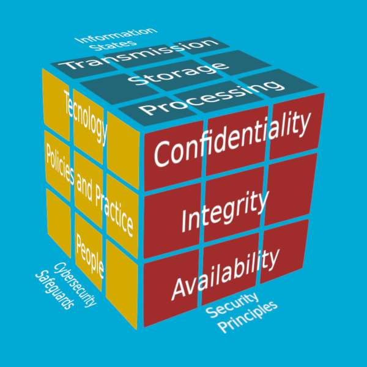
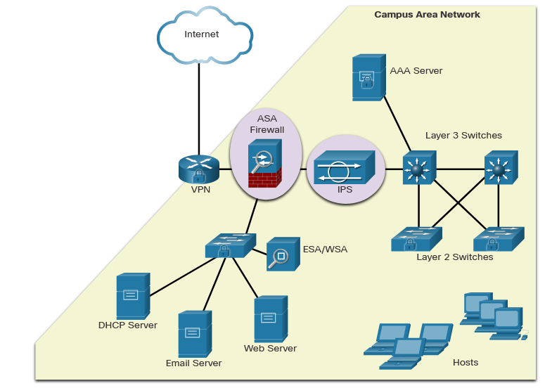
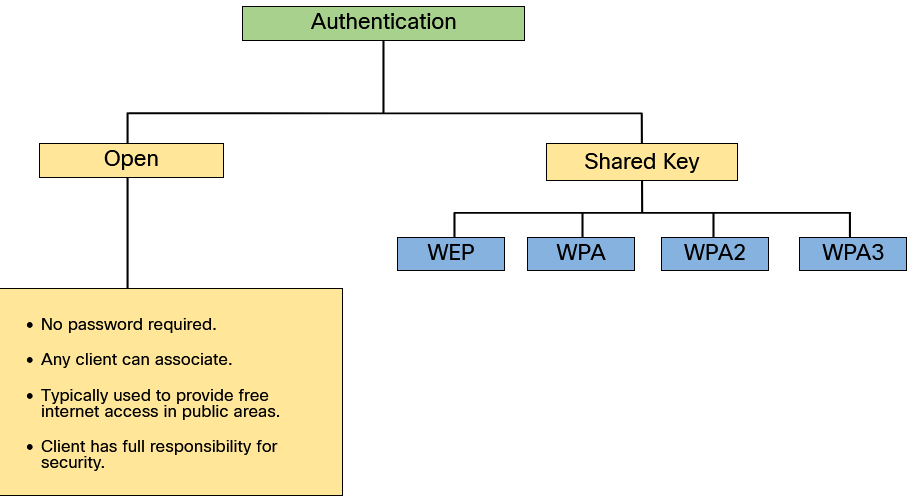

# Network Security
Network security consists of protecting information and information systems from unauthorized access, use, disclosure, disruption, modification, or destruction. 
# Security Foundations
Most organizations follow the **CIA information security triad**. 

- **Confidentiality** - Only authorized individuals, entities, or processes can access sensitive information. It may require using cryptographic encryption algorithms such as **AES** to encrypt and decrypt data.
- **Integrity** - Refers to protecting data from unauthorized alteration. It requires the use of cryptographic hashing algorithms such as **SHA**.
- **Availability** - Authorized users must have uninterrupted access to important resources and data. It requires implementing redundant services, gateways, and links.

## The Cybersecurity Cube 

### 1. Security Principles
- **Data confidentiality** prevents the disclosure of information to unauthorized people, resources, or processes.
- **Data integrity** refers to the accuracy, consistency, and trustworthiness of data.
- **Data availability** ensures that information is accessible by authorized users when needed.

### 2. Data States
The second dimension of the cybersecurity cube represents the three possible data states:
- Data in transit.
- Data at rest or in storage.
- Data in process.

### 3. Safeguards
The third dimension of the cybersecurity cube defines the pillars on which we need to base our cybersecurity defenses in order to protect data and infrastructure in the digital realm.

These are technology, policy and practices, and improving education, training and awareness in people.

## CIA Triad - The Principle of Confidentiality 
To accomplish confidentiality without using encryption, tokenization is a substitution technique that can isolate data elements from exposure to other data systems. Tokenization can preserve the data format (its type and data length), which makes it useful for databases and card payment processing.

Rights management covers both **digital rights management (DRM)** and **information rights management (IRM)**. Both protect data from unauthorized access by using encryption.

## Data Integrity 
Integrity is the accuracy, consistency, and trustworthiness of data across its entire lifecycle.

Data undergoes several operations, such as capture, storage, retrieval, update, and transfer. Data must remain unaltered by unauthorized entities during all these operations.

Methods used to ensure data integrity include hashing, data validation checks, data consistency checks, and access controls. 

- **Critical level of need** - All data is continuously validated, tested and verified.
- **High level of need** - All data is validated and verified at frequent intervals.
- **Mid level of need** - Little verification is performed, and data is not completely trustworthy.
- **Low level of need** - Data may not be verified at all, and there is a low level of trust in the content.

## Availability
The need to make data accessible to all authorized users whenever they need it.

### Ensuring Availability 
- **Equipment maintenance**
- **Operating systems and software updates and patches**
- **Backup testing**
- **Disaster planning**
- **New technology implementations**
- **Activity monitoring**
- **Availability testing**

# Access Control

## Physical Access Controls 
Physical access controls are actual barriers deployed to prevent direct physical contact with systems. The goal is to prevent unauthorized users from gaining physical access to facilities, equipment, and other organizational assets.

## Logical Access Controls 
Logical access controls are the hardware and software solutions used to manage access to resources and systems. 
- Encryption is the process of taking plaintext and creating ciphertext.
- Smart cards have an embedded microchip.
- Passwords are protected strings of characters.
- Biometrics are users’ physical characteristics.
- Access control lists (ACLs) define the type of traffic allowed on a network.
- Protocols are sets of rules that govern the exchange of data between devices.
- Firewalls prevent unwanted network traffic.
- Routers connect at least two networks.
- Intrusion detection systems monitor a network for suspicious activities.
- Clipping levels are certain allowed thresholds for errors before triggering a red flag.

## Administrative Access Controls 
Administrative access controls are the policies and procedures defined by organizations to implement and enforce all aspects of controlling unauthorized access.
- Policies are approved ideas or actions that guide behavior.
- Procedures are the detailed steps required to perform an activity.
- Hiring practices define the steps an organization takes to find qualified employees.
- Background checks
- Data classification categorizes data based on its sensitivity.
- Security training educates employees about the security policies at an organization.
- Reviews evaluate an employee’s job performance.

The concept of administrative access controls involves three security services: **authentication, authorization, and accounting (AAA)**.

### Authentication
Authentication is the verification of the identity of each user, to prevent unauthorized access. 

### Authorization
Authorization services determine which resources users can access, along with the operations that users can perform.

Some systems accomplish this by using an access control list, or an ACL. An ACL determines whether a user has certain access privileges once the user authenticates. 

### Accounting (AAA) 
Not related to financial accounting, accounting in AAA keeps track of what users do — including what they access, the amount of time they access it, and any changes they make.

Cybersecurity accounting tracks and monitors user activities in real time.

## Identification
Identification enforces the rules established by the authorization policy. Every time access to a resource is requested, the access controls determine whether to grant or deny access.

## Federated Identity Management 
**Federated identity management (FIM)** refers to multiple enterprises that let their users use the same identification credentials to gain access to the networks of all enterprises in the group.

# Defending Systems and Devices
##  Operating System Security 
What does an organization need to do to harden an operating system and keep it secure?
- **Good administration**
- **A systematic aproach**
- **A baseline**

## Patch Management 
Keep systems secure and up to date by regularly installing patches.

- **Patches** are code updates that prevent a new virus, worm, or other malware from making a successful attack. Patches and upgrades are often combined into a service pack. 

## Endpoint Security 
A host-based security solution is a software application that runs on a local device (or endpoint) to protect it. The software works with the operating system to help prevent attacks.

### Host-based firewalls
Runs on a device to restrict incoming and outgoing network activity for that device. The software firewall inspects and filters data packets to protect the device from becoming infected. 

### Host intrusion detection systems (HIDS)
Installed on a device or server to monitor suspicious activity. It monitors system calls and file system access to detect malicious requests. HIDS stores all log data locally.

### Host intrusion prevention system (HIPS)
Software that monitors a device for known attacks and anomalies (deviations in bandwidth, protocols and ports), or finds red flags by assessing the actual protocols in packets. HIPS tool can send  an alarm, log the malicious activity, reset the connection, and/or drop the packets.

### Endpoint detection and response (EDR)
Integrated security solution that continuously monitors and collects data from an endpoint device. It then analyzes the data and responds to any threats it detects.

### Data loss prevention (DLP)
DLP tools provide a centralized way to ensure that sensitive data is not lost, misused, or accessed by unauthorized users.

### Next-generation firewall (NGFW)
Network security device that combines a traditional firewall with other network-device-filtering functions. An example is an application firewall using **in-line deep packet inspection (DPI)** on an **intrusion protection system (IPS)**.

## Host Encryption 
The **Windows Encrypting File System (EFS)** feature allows users to encrypt files, folders or an entire hard drive. **Full-disk encryption (FDE)** encrypts the entire contents of a drive (including temporary files and memory). Microsoft Windows uses **BitLocker** for FDE.

To use **BitLocker**, the user needs to enable a **Trusted Platform Module (TPM) in the BIOS**. A TPM is a specialized chip on the motherboard that stores information about the host system, such as encryption keys, digital certificates, and system integrity measurements. 

Similarly, BitLocker To Go is a tool that encrypts removable drives. It does not use a TPM chip, but still encrypts the data, requiring a password to decrypt it.

Self-encrypting drives (SEDS) automatically encrypt all data in the drive to prevent attackers from accessing the data through their operating system. SEDS encryption is implemented in the drive hardware by the manufacturer.

## Boot Integrity 
Boot integrity ensures that the system can be trusted and has not been altered while the operating system loads.

- **Firmware** — software instructions about basic computer functions — is stored on a small memory chip on the motherboard. The **basic input/output system (BIOS)** is the first program that runs when you turn on the computer. 

    **Unified Extensible Firmware Interface (UEFI)**, a newer version of BIOS, defines a standard interface between the operating system, firmware and external devices. A system that uses UEFI is preferred over one that uses BIOS because a UEFI system can run in 64-bit mode.

- **Secure Boot** is a security standard to ensure that a device boots using trusted software.

- **Measured Boot** provides stronger validation than Secure Boot. Measured Boot measures each component starting with the firmware through to the boot start drivers, and stores the measurements in the TMP chip to create a log. 

## Apple System Security Features 
Apple provides system hardware and macOS security features that offer robust endpoint protection as well.

- **Security-focused hardware** - The hardware platform has enhanced security features such as a special security processor, boot integrity, and a dedicated AES encryption engine. These features are included in a special system on a chip called **the Secure Enclave**.
- **Encrypted storage** - Apple Data Protection and FileVault data storage encryption are supported by the hardware-based AES encryption engine.
- **Secure boot** - The Boot ROM protects low-level hardware and only allows genuine and unaltered Apple OS software to run.
- **Secure biometric data**
- **Find my Mac**
- **XProtect** - XProtect antimalware technology prevents the execution of malware through signature-based malware detection.
- **Malware Removal Tool (MRT)** - The Malware Removal Tool (MRT) detects and removes existing malware infections when detection rules are automatically updated by Apple.
- **Gatekeeper** - Gatekeeper ensures that only authentic, digitally-signed software that has been created by an Apple-notarized software developer is permitted to be installed.

# Antimalware Protection
## Endpoint Security
Various network security devices are required to protect the network perimeter from outside access.

As shown in the figure, these devices could include a hardened router that is providing VPN services, a next generation firewall (ASA, in the figure), an IPS appliance, and an authentication, authorization, and accounting (AAA) services server (AAA Server, in the figure).

There are two internal LAN elements to secure:

- **Endpoints** - Hosts commonly consist of laptops, desktops, printers, servers, and IP phones, all of which are susceptible to malware-related attacks.
- **Network infrastructure** - LAN infrastructure devices interconnect endpoints and typically include switches, wireless devices, and IP telephony devices. Most of these devices are susceptible to LAN-related attacks including MAC address table overflow attacks, spoofing attacks, DHCP related attacks, LAN storm attacks, STP manipulation attacks, and VLAN attacks.

## Host-Based Malware Protection 
### Antivirus/Antimalware Software
This is software that is installed on a host to detect and mitigate viruses and malware. Examples are Windows Defender Virus & Threat Protection, Cisco AMP for Endpoints, Norton Security, McAfee, Trend Micro, and others. Antimalware programs may detect viruses using three different approaches:

-  **Signature-based** - This approach recognizes various characteristics of known malware files.
-  **Heuristics-based** - This approach recognizes general features shared by various types of malware.
- **Behavior-based** - This approach employs analysis of suspicious behavior.

Many antivirus programs are able to provide real-time protection by analyzing data as it is used by the endpoint. These programs also scan for existing malware that may have entered the system prior to it being recognizable in real time.

**Host-based antivirus protection** is also known as **agent-based**. 

- **Agent-based** antivirus runs on every protected machine. Agentless antivirus protection performs scans on hosts from a centralized system. 
- **Agentless systems** have become popular for virtualized environments in which multiple OS instances are running on a host simultaneously. Agentless antivirus for virtual hosts involves the use of a special security virtual appliance that performs optimized scanning tasks on the virtual hosts. An example of this is VMware’s vShield.

### Host-based Firewall
- Windows defender
### Host-base Security Suites
Host-based security suites include antivirus, anti-phishing, safe browsing, Host-based intrusion prevention system, and firewall capabilities. These various security measures provide a layered defense that will protect against most common threats.

The independent testing laboratory AV-TEST provides high-quality reviews of host-based protections, as well as information about many other security products.

## Network-Based Malware Protection 
The following are examples of devices and techniques that implement host protections at the network level.

- **Cisco Secure Endpoint** - This provides endpoint protection from viruses and malware.
- **Cisco Secure Email** - This provides filtering of SPAM and potentially malicious emails before they reach the endpoint. An example is the Cisco ESA.
- **Cisco Umbrella** - This uses DNS requests to provide filtering of websites and blocklisting to prevent hosts from reaching dangerous locations on the web. Cisco Umbrella provides control over how users access the internet and can enforce acceptable use policies, control access to specific sites and services, and scan for malware.
- **Network Admission Control (NAC)** - This permits only authorized and compliant systems to connect to the network.

# Firewalls and Host-Based Intrusion Prevention
## Firewalls
A firewall is a system, or group of systems, that enforces an access control policy between networks.

### Common Firewall Properties 
All firewalls share some common properties:

- Firewalls are resistant to network attacks.
- Firewalls are the only transit point between internal corporate networks and external networks because all traffic flows through the firewall.
- Firewalls enforce the access control policy.

### Firewall Benefits
There are several benefits of using a firewall in a network:

- They prevent the exposure of sensitive hosts, resources, and applications to untrusted users.
- They sanitize protocol flow, which prevents the exploitation of protocol flaws.
- They block malicious data from servers and clients.
- They reduce security management complexity by off-loading most of the network access control to a few firewalls in the network.

### Firewall Limitations
Firewalls also have some limitations:

- A misconfigured firewall can have serious consequences for the network, such as becoming a single point of failure.
- The data from many applications cannot be passed over firewalls securely.
- Users might proactively search for ways around the firewall to receive blocked material, which exposes the network to potential attack.
- Network performance can slow down.
- Unauthorized traffic can be tunneled or hidden as legitimate traffic through the firewall.

## Types of Firewalls 
### Packet Filtering (Stateless) Firewall
Packet filtering firewalls are usually part of a router firewall, which permits or denies traffic based on Layer 3 and Layer 4 information. They are stateless firewalls that use a simple policy table look-up that filters traffic based on specific criteria.

### Stateful Firewall
Stateful firewalls are the most versatile and the most common firewall technologies in use. Stateful firewalls provide stateful packet filtering by using connection information maintained in a state table. Stateful filtering is a firewall architecture that is classified at the network layer. It also analyzes traffic at OSI Layer 4 and Layer 5.

### Application Gateway Firewall
An application gateway firewall (proxy firewall), filters information at Layers 3, 4, 5, and 7 of the OSI reference model. Most of the firewall control and filtering is done in software. When a client needs to access a remote server, it connects to a proxy server. The proxy server connects to the remote server on behalf of the client. 

### Next Generation Firewall
**Next-generation firewalls (NGFW)** go beyond stateful firewalls by providing:
- Integrated intrusion prevention
- Application awareness and control to see and block risky apps
- Upgrade paths to include future information feeds
- Techniques to address evolving security threats

Other methods of implementing firewalls include:
-  **Host-based (server and personal) firewall** - A PC or server with firewall software running on it.
- **Transparent firewall** - Filters IP traffic between a pair of bridged interfaces.
- **Hybrid firewall** - A combination of the various firewall types. For example, an application inspection firewall combines a stateful firewall with an application gateway firewall.

## Packet Filtering Firewall Benefits and Limitations 
Packet filtering firewalls are usually part of a router firewall, which permits or denies traffic based on Layer 3 and Layer 4 information. They are stateless firewalls that use a simple policy table look-up that filters traffic based on specific criteria.

Advantages of using a packet filtering firewall:

- Packet filters implement simple permit or deny rule sets.
- Packet filters have a low impact on network performance.
- Packet filters are easy to implement, and are supported by most routers.
- Packet filters provide an initial degree of security at the network layer.
- Packet filters perform almost all the tasks of a high-end firewall at a much lower cost.

Packet filters do not represent a complete firewall solution, but they are an important element of a firewall security policy. There are several disadvantages of using a packet filtering firewall:

- Packet filters are susceptible to IP spoofing. Threat actors can send arbitrary packets that meet ACL criteria and pass through the filter.
- Packet filters do not reliably filter fragmented packets. Because fragmented IP packets carry the TCP header in the first fragment and packet filters filter on TCP header information, all fragments after the first fragment are passed unconditionally. Decisions to use packet filters assume that the filter of the first fragment accurately enforces the policy.
- Packet filters use complex ACLs, which can be difficult to implement and maintain.
- Packet filters cannot dynamically filter certain services. For example, sessions that use dynamic port negotiations are difficult to filter without opening access to a whole range of ports.

Packet filters are stateless. They examine each packet individually rather than in the context of the state of a connection.

## Stateful Firewall Benefits and Limitations 
| Benefits                               | Limitations                             |
|----------------------------------------|----------------------------------------|
| Primary means of defense               | No Application Layer inspection        |
| Strong packet filtering                | Limited tracking of stateless protocols|
| Improved performance over packet filters| Difficult to defend against dynamic port negotiation|
| Defends against spoofing and DoS attacks| No authentication support               |
| Richer data log                        |                                        |

## Host-Based Firewalls 
Host-based personal firewalls are standalone software programs that control traffic entering or leaving a computer. Firewall apps are also available for Android phones and tablets.

Host-based firewalls may use a set of predefined policies, or profiles, to control packets entering and leaving a computer. They also may have rules that can be directly modified or created to control access based on addresses, protocols, and ports. Host-based firewall applications can also be configured to issue alerts to users if suspicious behavior is detected. They can then offer the user the ability to allow an offending application to run or to be prevented from running in the future.

**Distributed firewalls** combine features of host-based firewalls with centralized management. The management function pushes rules to the hosts and may also accept log files from the hosts.

**Examples of host-based firewalls:**
- **Windows Defender Firewall** - Windows Firewall (now Windows Defender Firewall) uses a profile-based approach to firewall functionality. Access to public networks is assigned the restrictive Public firewall profile. The Private profile is for computers that are isolated from the internet by other security devices, such as a home router with firewall functionality. 
- **iptables** - This is an application that allows Linux system administrators to configure network access rules that are part of the Linux kernel Netfilter modules.
- **nftables** - Linux firewall application that uses a simple virtual machine in the Linux kernel. Code is executed within the virtual machine that inspects network packets and implements decision rules regarding packet acceptance and forwarding.
- **TCP Wrappers** - This is a rule-based access control and logging system for Linux. Packet filtering is based on IP addresses and network services.

## Antimalware Programs 
The following types of antimalware programs are available:
- **Antivirus protection**
- **Adware protection**
- **Phishing protection**
- **Spyware protection**
- **Trusted/untrusted sources**

# Secure Wireless Access
## Wireless Security Overview 
A WLAN is open to anyone within range of a wireless access point (AP) and the appropriate credentials to associate to it. 

Wireless networks are specifically susceptible to a number of threats, including:

- **Interception of data** - Wireless data should be encrypted to prevent it from being read by eavesdroppers.
- **Wireless intruders** - Unauthorized users attempting to access network resources can be deterred through effective authentication techniques.
- **Denial of Service (DoS) Attacks** - Access to WLAN services can be compromised either accidentally or maliciously. Various solutions exist depending on the source of the DoS attack.
- **Rogue APs** - Unauthorized APs installed by a well-intentioned user, or for malicious purposes, can be detected using wireless network management software.

### Rogue Access Points 
A rogue AP is an AP or wireless router that has been connected to a corporate network without explicit authorization and against corporate policy.

Once connected, the rogue AP can be used by an attacker to capture MAC addresses, capture data packets, gain access to network resources, or launch a man-in-the-middle attack.

To prevent the installation of rogue APs, organizations must configure wireless LAN controllers (WLCs) with rogue AP policies.

### Man-in-the-Middle Attack 
In a man-in-the-middle (MITM), attack, the hacker is positioned in between two legitimate entities in order to read or modify the data that passes between the two parties. There are many ways in which to create a MITM attack.

A popular wireless MITM attack is called the “evil twin AP” attack, where an attacker introduces a rogue AP and configures it with the same SSID as a legitimate AP.

MITM attacks and their variations are frequently referred to as on-path attacks.

## SSID Cloaking and MAC Address Filtering 
- **SSID Cloaking** - APs and some wireless routers allow the SSID beacon frame to be disabled. 
- **MAC Addresses Filtering** - An administrator can manually permit or deny clients wireless access based on their physical MAC hardware address.

## 802.11 Original Authentication Methods 
The best way to secure a wireless network is to use authentication and encryption systems.

Two types of authentication were introduced with the original 802.11 standard:

- **Open system authentication** - Any wireless client will easily be able to connect. Open system authentication should only be used in situations where security is of no concern, such as those providing free internet access like cafes, hotels, and in remote areas. The wireless client is responsible for providing security such as by using a virtual private network (VPN) to connect securely. VPNs provide authentication and encryption services.
- **Shared key authentication** - This provides mechanisms such as WEP, WPA, WPA2, and WPA3 to authenticate and encrypt data between a wireless client and AP. However, the password must be pre-shared between both parties to connect.

The following chart summarizes these authentication methods.

| Authentication Method| Description|
|---------------------------------|--------------------------------------------------------------------------------------------------------------------------------------------------------------------------------------------------------------------------------------------------------------------|
| Wired Equivalent Privacy (WEP)  | The original 802.11 specification designed to secure the data using the Rivest Cipher 4 (RC4) encryption method with a static key. However, the key never changes when exchanging packets. This makes it easy to hack. WEP is no longer recommended and should never be used.                      |
| Wi-Fi Protected Access (WPA)    | A Wi-Fi Alliance standard that uses WEP, but secures the data with the much stronger Temporal Key Integrity Protocol (TKIP) encryption algorithm. TKIP changes the key for each packet, making it much more difficult to hack.                                            |
| WPA2                            | WPA2 is the current industry standard for securing wireless networks. It uses the Advanced Encryption Standard (AES) for encryption. AES is currently considered the strongest encryption protocol.                                                                        |
| WPA3                            | This is the next generation of Wi-Fi security. All WPA3-enabled devices use the latest security methods, disallow outdated legacy protocols, and require the use of Protected Management Frames (PMF). However, devices with WPA3 are not yet readily available.        |

## Authenticating a Home User 
WPA2 authentication methods:
- **Personal** - Intended for home or small office networks, users authenticate using a pre-shared key (PSK). Wireless clients authenticate with the wireless router using a pre-shared password. No special authentication server is required.
- **Enterprise** - Intended for enterprise networks but requires a **Remote Authentication Dial-In User Service (RADIUS)** authentication server. The device must be authenticated by the RADIUS server and then users must authenticate using 802.1X standard, which uses the Extensible Authentication Protocol (EAP) for authentication.

## Authentication in the Enterprise 
The Enterprise security mode choice requires an Authentication, Authorization, and Accounting (AAA) RADIUS server.

- **RADIUS Server IP address** - This is the reachable address of the RADIUS server.
- **UDP port numbers** - Officially assigned UDP ports 1812 for RADIUS Authentication, and 1813 for RADIUS Accounting, but can also operate using UDP ports 1645 and 1646.
- **Shared key** - Used to authenticate the AP with the RADIUS server.

The shared key is not a parameter that must be configured on a wireless client. It is only required on the AP to authenticate with the RADIUS server. User authentication and authorization is handled by the 802.1X standard, which provides a centralized, server-based authentication of end users.

The 802.1X login process uses EAP to communicate with the AP and RADIUS server. EAP is a framework for authenticating network access. It can provide a secure authentication mechanism and negotiate a secure private key which can then be used for a wireless encryption session using TKIP or AES encryption.

## Encryption Methods 
Encryption is used to protect data. 

The WPA and WPA2 standards use the following encryption protocols:

- **Temporal Key Integrity Protocol (TKIP)** - TKIP is the encryption method used by WPA. It provides support for legacy WLAN equipment by addressing the original flaws associated with the 802.11 WEP encryption method. It makes use of WEP, but encrypts the Layer 2 payload using TKIP, and carries out a Message Integrity Check (MIC) in the encrypted packet to ensure the message has not been altered.
- **Advanced Encryption Standard (AES)** - AES is the encryption method used by WPA2. It is the preferred method because it is a far stronger method of encryption. It uses the Counter Cipher Mode with **Block Chaining Message Authentication Code Protocol (CCMP)** that allows destination hosts to recognize if the encrypted and non-encrypted bits have been altered.

## WPA3
WPA3, if available, is the recommended 802.11 authentication method. WPA3 includes four applications:

- **WPA3-Personal** - WPA3-Personal thwarts this attack by using Simultaneous Authentication of Equals (SAE), a feature specified in the IEEE 802.11-2016.
- **WPA3-Enterprise** - Uses 802.1X/EAP authentication. WPA3-Enterprise adheres to the Commercial National Security Algorithm (CNSA) Suite which is commonly used in high security Wi-Fi networks.
- **Open Networks** - 
Open networks in WPA2 send user traffic in unauthenticated, clear text. In WPA3, open or public Wi-Fi networks still do not use any authentication. However, they do use Opportunistic Wireless Encryption (OWE) to encrypt all wireless traffic.

- **Internet of Things (IoT) Onboarding** - 
Uses The Device Provisioning Protocol (DPP). Each headless device has a hardcoded public key. The key is typically stamped on the outside of the device or its packaging as a Quick Response (QR) code. The network administrator can scan the QR code and quickly onboard the device. Although not strictly part of the WPA3 standard, DPP will replace WPS over time.
